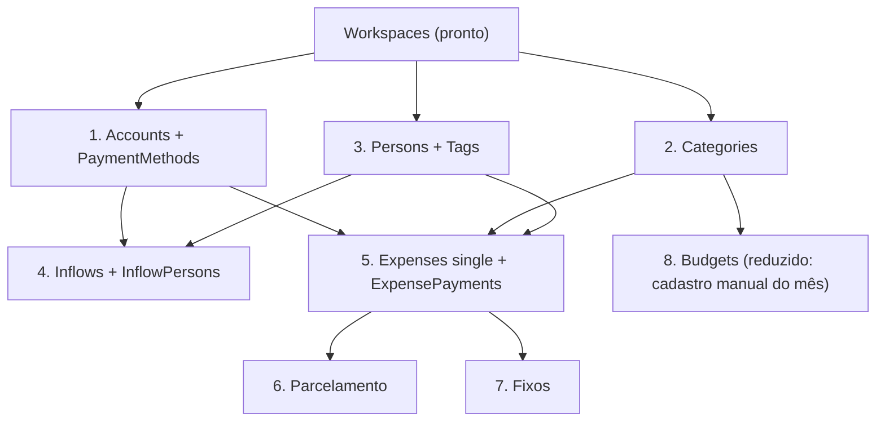

# Roadmap das rotas — leva MVP

Mapeamento do desenvolvimento das rotas, etapa a etapa, **restrito às tabelas que já existem
nas migrations**. Nada aqui pede tabela nova.

**Alvo desta leva:** ao final, um usuário novo consegue se cadastrar, montar os próprios
cadastros (contas, formas de pagamento, categorias, pessoas, tags), lançar entradas e lançar
gastos nos três formatos — simples, parcelado e fixo. É o fluxo de um mês de uso, fim a fim.

---

## Onde estamos

Das 22 tabelas do banco, 16 têm código — **a leva MVP está fechada**: cadastro, entradas, gastos nos três formatos e orçamento.

| Tabela | Estado |
| --- | --- |
| `Users` | rotas de cadastro, login, getSelf, update, troca de senha |
| `Workspaces` / `WorkspaceMembers` | getSelf, update, **switch** (escolhe o workspace da sessão); nasce junto com o usuário. **Entrar em workspace existente pelo cadastro está aberto sem convite — ver etapa 9** |
| `UsersAuth` / `TrustedDevices` | biometria (WebAuthn) completa |
| `Accounts` / `PaymentMethods` | **etapa 1 pronta**: CRUD das duas, `pix` e `debit` nascendo com a conta, saldo de abertura travado depois do primeiro lançamento |
| `Categories` | **etapa 2 pronta**: CRUD escopado, globais somente leitura, lista plana (a hierarquia foi derrubada) |
| `Persons` / `Tags` | **etapa 3 pronta**: CRUD de pessoas com nome único por workspace e a `Person` do dono nascendo com o usuário; **a tag não tem cadastro** — nasce com o gasto, e a feature tem só busca e delete |
| `Inflows` / `InflowPersons` | **etapa 4 pronta**: entradas e transferências, recebimento, rateio, e o saldo calculado estreando |
| `Expenses` / `ExpensePayments` / `ExpensePersons` / `ExpenseTags` | **etapas 5, 6 e 7 prontas**: gasto simples, parcelado e fixo; dois eixos de rateio; `Status` derivado; quitar por perna |
| `Budgets` / `BudgetPeriods` | **etapa 8 parcial**: teto por categoria e mês com o comprometido calculado. **O cadastro do mês é manual** — a rotina que materializa o mês é a etapa 8b |

**O `IdWorkspace` saiu da URL e passou a viajar dentro do token.** Isso vale para toda rota
escopada por tenant — ver a decisão 0 abaixo.

Ficam sem código, e de propósito, as quatro de plataforma (`UserDevices`, `Notifications`,
`Plans`, `Subscriptions`). E a etapa 9 (compartilhamento de workspace) continua aberta, **com a
pendência de segurança do cadastro descrita no fim deste documento**.

---

## Ordem das etapas e por quê

A ordem não é preferência: é a das chaves estrangeiras. Nada que aponta para uma tabela pode
ser construído antes dela.



`ExpensePayments` aponta para `PaymentMethods` com `ON DELETE RESTRICT`, e `Inflows` aponta
para `Accounts` do mesmo jeito. Por isso a etapa 1 vem antes de tudo que é movimento: sem
conta cadastrada não existe gasto nem entrada que o banco aceite.

---

## Decisões transversais — as quatro fechadas

Quatro coisas atravessam várias etapas. **As quatro estão decididas e implementadas**; o
registro fica aqui porque a razão de cada uma é o que impede a próxima pessoa de desfazê-la
sem querer.

### 0. Como o workspace chega na rota — DECIDIDO: assinado dentro do token

Começou na URL (`/Accounts/IdWorkspace=:IdWorkspace`), passou por um cookie próprio e
terminou **dentro do próprio token**, ao lado do `IdUser`. As tabelas de rota deste documento
já estão na forma final: **nenhuma rota das etapas 2 a 7 leva `IdWorkspace` no caminho.**

```
login  → AcessControl.startSession → SelectDefault escolhe o workspace
       → token assinado { id, IdWorkspace } → cookie httpOnly 'token'
requisição → acessMiddleware lê o cookie → res.locals.IdUser + res.locals.IdWorkspace
       → controller passa adiante → section confere no banco
```

**Por que saiu da URL.** Um id no caminho é dado do cliente num lugar que convida a confiar
nele, e ele se repetia em toda rota de toda feature sem nunca variar dentro de uma sessão —
sete rotas na etapa 1, mais de vinte até o fim da leva.

**Por que dentro do token e não num cookie só dele.** Um segundo cookie continuaria sendo dado
do cliente: os ids são sequenciais, e reescrever `IdWorkspace=2` é trivial. Dentro do token
assinado essa porta fecha, e a sessão inteira passa a viver e morrer como uma coisa só.
Cuidado: o payload de um JWT é base64, **assinado não é criptografado** — qualquer um que
tenha o token lê os dois ids. Nunca colocar segredo ali.

**Assinado não é o mesmo que ainda verdadeiro — o `assertMember` fica.** O token é uma
fotografia da autorização no instante do login e vale 24h. A etapa 9 vai permitir remover
membro e rebaixar papel, então entre a emissão e o uso a matrícula pode ter mudado.
Autenticação (quem é) o token resolve; autorização (ainda pode?) só o banco responde. Isso
não custa consulta extra: a maioria das chamadas é `assertRole`, que precisa do papel
**atual** e teria que ir ao banco de qualquer jeito.

**A convenção que vale para toda section nova:** o parâmetro que chega se chama
`SelectedIdWorkspace`, e o `IdWorkspace` usado nas queries é o que **volta da matrícula**.

```ts
public async run(SelectedIdWorkspace: number, IdUser: number, body: ...) {
    let { IdWorkspace } = await WorkspacesAcessControl.assertRole(SelectedIdWorkspace, IdUser, ["owner", "editor"])
    //  daqui para baixo, só o IdWorkspace conferido existe
}
```

O nome diferente é de propósito: com os dois se chamando `IdWorkspace`, o valor não conferido
chegaria numa query por descuido e ninguém veria na revisão.

**Trocar de workspace reemite o token** (`POST /Workspaces/switch`) — é a única rota que
recebe um `IdWorkspace` escrito pelo cliente, e por isso confere a matrícula antes de assinar
qualquer coisa. O token anterior segue válido até expirar, apontando para o workspace antigo:
correto, porque prova a mesma identidade e uma seleção que na época era legítima. **Quando a
etapa 9 permitir remover membro, é o `assertMember` que fecha a porta — não o token**, que
continua circulando até as 24h acabarem.

Token sem workspace (usuário sem nenhuma matrícula) responde 406 "Nenhum workspace
selecionado", com mensagem própria porque o conserto é chamar o `switch`, não pedir acesso.

**Junto veio o fim do header `authorization`:** a sessão é lida do cookie httpOnly e só dele.
Front e API saem do mesmo domínio (`www.gastosmensais.com.br` e `.../api` pelo nginx), então
são a mesma origem — sem CORS, sem preflight. Dois caminhos de autenticação significariam que
o mais fraco decide, e um header aceito de qualquer lugar escapa do `sameSite: strict`, que é
toda a defesa contra CSRF hoje. Detalhes de deploy no `CLAUDE.md`.

### 1. Saldo da conta — DECIDIDO: calcular na fonte, sem cache

`Accounts.CurrentBalance` era cache e **não vai ser usado**. O saldo é sempre calculado a
partir dos lançamentos:

```
saldo do mês M = InitialBalance                              (se InitialBalanceDate <= fim de M)
      + Inflows recebidos com IdToAccount   = conta
      − Inflows recebidos com IdFromAccount = conta      (transferência que saiu)
      − ExpensePayments pagos cujo PaymentMethod é da conta

      ... tudo com data de lançamento até o fim de M:
          CompetenceDate na entrada, coalesce(DueDate, ExpenseDate) na perna de gasto
```

Por que não cache: o custo de manter é toda rota que mexe em dinheiro lembrar de recalcular
(criar, editar, cancelar, receber, estornar, quitar, desquitar, mudar `InitialBalance`).
Errar uma não quebra nada — só faz o saldo divergir devagar, e saldo plausível e errado é a
pior falha possível aqui. O ganho seria performance, que não existe neste volume: os índices
para essa query já estão no banco (`ExpensePayments["IdWorkspace","IdPaymentMethod","Paid"]`,
`Inflows["IdToAccount"]`, `Inflows["IdFromAccount"]`).

Quatro consequências:

- **O saldo é sempre o saldo *de um mês*** — `GET /Accounts?ReferenceMonth=YYYY-MM`, default o
  mês corrente. **Estado não é data:** nada impede marcar como recebida uma entrada de
  setembro, e sem corte esse dinheiro apareceria no saldo de agosto. O corte lê a data do
  lançamento, nunca `ReceivedAt`/`PaidAt` — aqueles são o instante do clique, e quitar hoje a
  fatura de setembro jogaria a saída no mês errado. Mês, e não o `From`/`To` das listagens de
  movimento, porque saldo é posição e não recorte — e é o que faz "quanto eu tinha em julho"
  ser uma pergunta respondível.
- **`InitialBalance` e `InitialBalanceDate` continuam** — são dado de origem, não cache.
  Nenhum lançamento do sistema deriva o saldo de abertura. A `InitialBalanceDate`, quando
  preenchida, obedece ao mesmo corte: uma conta aberta em agosto não tinha saldo em março.
- **Transferência conta nos dois sentidos no saldo**, ao contrário do total de "quanto
  entrou", que exclui `Kind='transfer'`. Duas regras opostas sobre a mesma coluna: é o ponto
  mais fácil de conflatar do modelo.
- **Um lugar só** (`AccountBalance.section.ts`). Sem isso viram cinco queries parecidas
  espalhadas e o problema de divergência volta sem nem ter coluna para culpar.

De brinde, realizado vs. previsto é o mesmo `SUM` trocando o filtro (`Status='received'` /
`Paid=true`), sem dobrar pontos de escrita como um cache exigiria.

### 2. Quem escreve `Expenses.Status` — DECIDIDO: só o `ExpenseStatus.section.ts`

O `Status` é derivado das pernas de `ExpensePayments`: `'paid'` só quando **todas** estão
pagas. Nunca pode ser editado direto por rota. Ficou numa section única
(`Expenses/sections/ExpenseStatus.section.ts`), chamada **dentro da mesma transaction** de
qualquer escrita em pernas — criar, editar, quitar, desquitar —, e o schema do PUT não aceita
`Status` no body (o Joi recusa campo desconhecido, então mandar `Status` é 406).

Dois detalhes que o teste crava: gasto **sem perna nenhuma** não pode nascer pago (`every` sobre
lista vazia é `true`, então a guarda é explícita), e gasto **cancelado** não é recalculado — sem
isso, quitar/desquitar ressuscitaria como `'pending'` o que acabou de ser cancelado.

### 3. Padrão de filtro por período — DECIDIDO: `?From=YYYY-MM-DD&To=YYYY-MM-DD`

Intervalo, inclusivo nas duas pontas, sobre a `CompetenceDate` da entrada e a `ExpenseDate` do
gasto. Mora em `periodQuery` (`Utils/joiSchemas.ts`) e as duas features importam de lá.

**Por que intervalo e não `ReferenceMonth=YYYY-MM`:** o mês se escreve como intervalo
(`From=2026-08-01&To=2026-08-31`), mas o contrário não — o período de uma fatura vai de
fechamento a fechamento e nunca coincide com o mês civil. As duas pontas são opcionais.

Junto veio o tipo `CalendarDate` (`Utils/database.ts`): as colunas `date` passaram a ser tipadas
como **string**, não `Datetime`. Agora um `new Date()` acidental sobre uma data de calendário é
erro de compilação, e não um dia a menos em UTC-3 descoberto em produção.

A aritmética dessas datas é feita com **moment**, para não haver duas formas de somar mês no
projeto: `Utils.addMonthsToDate`/`setDayOfMonth` fazem parse estrito de "YYYY-MM-DD" e devolvem
string formatada, então nenhum instante escapa. O `add` do moment já grampeia no fim do mês
(31/01 + 1 mês = 28/02); o `date()` **não** grampeia, e por isso o `setDayOfMonth` faz o clamp
na mão — é o que a recorrência do dia 31 e o vencimento da parcela precisam.

---

## Etapa 1 — Contas e formas de pagamento

**Tabelas:** `Accounts`, `PaymentMethods`
**Pastas:** `routes/Accounts/`, `routes/PaymentMethods/`

> **Correção do que este documento previa.** A ideia era manter `PaymentMethods` dentro da
> pasta de `Accounts`, por ser filha dela. Não é a convenção do projeto: **tabela com rota
> própria tem pasta própria em `routes/`**, mesmo sendo filha de outra. A ligação continua
> forte nos dois sentidos — a conta nasce com pix e débito, e o GET dela embute as formas de
> pagamento — só que agora atravessa a fronteira por import explícito.
>
> Vale reler as etapas 4 e 5 com isso em mente: `ExpensePayments` tem rota própria (o `pay`),
> então é pasta. `InflowPersons`, `ExpensePersons` e `ExpenseTags` são montadas junto com o
> pai e não têm rota nenhuma — pelo critério acima ficam como segundo model dentro da pasta
> do pai, do mesmo jeito que `WorkspaceMembers` e `TrustedDevices` estão hoje. **Confirmar
> antes de começar a etapa 4.**

| Rota | O que faz |
| --- | --- |
| `GET /Accounts` | lista contas ativas com as formas de pagamento embutidas (`joinTables`) |
| `POST /Accounts` | cria conta **e gera `pix` + `debit` na mesma transaction** |
| `PUT /Accounts/IdAccount=:IdAccount` | edita nome, cor, ícone, posição |
| `DELETE /Accounts/IdAccount=:IdAccount` | `Active = false` |
| `POST /PaymentMethods` | cadastra cartão de crédito |
| `PUT /PaymentMethods/IdPaymentMethod=:IdPaymentMethod` | edita |
| `DELETE /PaymentMethods/IdPaymentMethod=:IdPaymentMethod` | `Active = false` |

**Pontos de atenção**

- Conta nasce com `pix` e `debit` automáticos: é regra do modelo, não conveniência. As duas
  escritas na mesma transaction, como o cadastro de usuário faz com o workspace.
- `DueDay`/`ClosingOffsetDays` **só** em `Kind='credit_card'`. Validar no Joi (`when`) e na
  section — o banco não tem CHECK para isso.
- **O cartão é descrito pelo vencimento, não pelo fechamento.** `ClosingOffsetDays` é a folga
  em dias antes do vencimento (default 7), porque é isso que o emissor pede ao cliente — e
  porque um fechamento guardado como dia do mês teria que ser grampeado onde o dia não existe,
  desencontrando-se da comparação que decide a fatura.
- Não existe conta do tipo `credit_card`: cartão é forma de pagamento, não conta.
- `InitialBalance` só pode mudar enquanto a conta não tem movimento, senão o saldo histórico
  muda debaixo de lançamento já feito. **DECIDIDO: trava.** Não há o que recalcular — o saldo
  nunca é guardado, é sempre lido dos lançamentos, então "recalcular" seria só deixar o
  extrato do mês passado mudar sozinho. A pergunta mora em `AccountMovement.section.ts`, num
  lugar só, porque são duas tabelas e três pontas de FK: esquecer a transferência que *saiu*
  liberaria a troca numa conta que tem movimento.
- Apagar forma de pagamento com gasto lançado esbarra no `RESTRICT` da FK: capturar e
  responder 406, não deixar virar 500. **Como ficou:** o `DELETE` é `Active = false`, então o
  `RESTRICT` nunca chega a disparar — arquivar tira o cartão das listas de escolha sem tocar
  no histórico, que é o que a FK está ali para proteger. Arquivar a conta arquiva as formas
  de pagamento dela na mesma transaction: um `pix` que sobrevive à conta continuaria sendo
  oferecido como pagamento de uma conta que sumiu.

---

## Etapa 2 — Categorias

**Tabelas:** `Categories` · **Pasta:** `routes/Categories/`

| Rota | O que faz |
| --- | --- |
| `GET /Categories` | `where(IdWorkspace = X or IdWorkspace is null)`, numa lista só |
| `POST /Categories` | cria categoria do workspace |
| `PUT /Categories/IdCategory=:IdCategory` | edita |
| `DELETE /Categories/IdCategory=:IdCategory` | `Active = false` |

**Pontos de atenção**

- **Categoria global (`IdWorkspace IS NULL`) é somente leitura.** Editar ou apagar tem que
  responder 406. Sem essa trava, um usuário apaga a categoria de todos os outros — é a falha
  mais séria possível nesta etapa, e ela não aparece em teste feliz.
- As 13 globais já vêm da migration `20260731003200_seed_categories`.
- ~~`IdParentCategory`: validar que o pai é do mesmo workspace (ou global) e que não fecha
  ciclo.~~ **A hierarquia foi derrubada — ver abaixo.**
- `Categories` cobre **gasto apenas**. Entrada não tem categoria.

**Como ficou** — o que a implementação decidiu além do que estava previsto aqui:

- **Somente leitura da global mora numa section própria** (`sections/CategoryOwnership.section.ts`),
  chamada pelo `PUT` e pelo `DELETE`. O `getUnique` **acha** a global de propósito, em vez de
  filtrá-la fora: assim a resposta é "é pré-definida do sistema" e não "não encontrada" — a
  categoria existe e o cliente a está vendo na lista, então o conserto é criar uma própria.
- **A hierarquia foi derrubada** (migration `20260829010000_drop_categories_parent`): **não
  existe categoria filha de outra.** A árvore chegou a ser implementada e cobrava três coisas —
  conferir que o pai enviado pelo cliente era visível ao workspace, recusar ciclo (que deixa o
  ramo sem raiz, some da montagem e continua lançável por id) e arrastar a subárvore no
  arquivamento. Nenhuma delas se paga com uma dúzia de categorias por workspace, e a lista plana
  não tem essas falhas para ter.

  A coluna foi derrubada em migration nova, e não editando a original, do mesmo jeito que o
  `CurrentBalance` de `Accounts`: quem já rodou a migration anterior não pode ficar com um
  schema diferente de quem rodar agora.
- **A suíte semeia a própria categoria global.** O `truncate(["Users"])` das outras suítes
  cascateia por `Workspaces` até `Categories` e leva as 13 globais do seed junto — o
  `globalSetup` só remigra uma vez por execução, então depender do seed deixaria o teste
  dependente da ordem de execução. Vale para toda suíte futura que precisar de categoria global
  (etapa 5 em diante).

---

## Etapa 3 — Pessoas e tags

**Tabelas:** `Persons`, `Tags` · **Pastas:** `routes/Persons/`, `routes/Tags/`

CRUD simples nas duas, escopado por workspace:
`GET`/`POST /<Feature>` e
`PUT`/`DELETE /<Feature>/Id<Singular>=:Id<Singular>`.

**Pontos de atenção**

- `Persons` tem `unique(IdWorkspace, Name)` e `unique(IdUser)`: nome repetido e usuário
  virando duas pessoas viram 406, não 500.
- **Decisão que volta na etapa 0:** criar automaticamente a `Person` do próprio dono no
  cadastro do usuário. Sem isso o primeiro rateio exige um cadastro manual que não faz
  sentido para quem acabou de entrar. É uma linha a mais na transaction do signup.
- Pessoa não precisa de login — é esse o motivo da tabela existir em vez de usar `Users`.
- `Tags` tem `unique(IdWorkspace, Name)`.
- `ExpenseTags` (o vínculo) **não** ganha rota própria: é montado junto com o gasto, na etapa 5.

> **Correção do que este documento previa.** A ideia era CRUD simples nas duas features. **Não
> é o caso de `Tags`: a tag não tem cadastro próprio.** Ela nasce junto com o gasto, a partir
> do texto que o usuário digitou no input, e a feature tem **duas rotas só** — a busca (a
> sugestão do input) e o delete.
>
> Não há `POST` porque cadastrar a etiqueta antes de usá-la seriam dois passos para uma palavra.
> Não há `PUT` porque renomear mudaria a etiqueta de **todos** os gastos já marcados — quem quer
> outro nome digita outro nome no próximo gasto.

**Como ficou** — o que a implementação decidiu além do que estava previsto aqui:

- **A `Person` do dono nasce no cadastro, e é o único lugar que escreve o `IdUser` dela**
  (`Persons/sections/POST/createSelf.ts`, dentro da transaction do signup). O `IdUser` **não é
  aceito em rota nenhuma**: ele é `unique` no banco inteiro e sequencial, então aceitá-lo do
  cliente deixaria chutar um id e consumir para sempre a vaga de Person daquele usuário. Quem
  vai escrevê-lo de novo é a etapa 9, ao aceitar um convite.
- **Cadastro que entra em workspace já existente com nome repetido não cria a pessoa** — pula.
  O `unique(IdWorkspace, Name)` derrubaria a transaction inteira, ou seja, um xará impediria o
  cadastro. Inventar "Fulano (2)" viraria nome esquisito na tela e recusar o cadastro seria
  pior. É outro item para a etapa 9 resolver junto com o convite.
- **A pessoa vinculada a um login não é arquivável** (406). Seria irreversível: não há rota que
  reconstrua o vínculo, então o usuário sairia de qualquer rateio futuro para sempre. Quem
  desfaz o vínculo é a saída do membro, na etapa 9.
- **O nome é conferido antes de escrever nas duas features**, e as duas conferências são mais
  estritas que o índice: enxergam o arquivado (o índice ignora o `Active`) e comparam sem
  diferenciar maiúscula de minúscula, porque "Maria" e "maria" no mesmo rateio são erro de
  digitação. **O que elas fazem com o arquivado é que difere, e isso vem de quem dá o nome:**
  pessoa é cadastro, então o nome continua ocupado e o 406 diz isso (se incomodar, o conserto é
  uma rota de restore); tag é texto digitado, então digitar de novo traz a linha de volta — e
  esse é o único caminho de reativação que existe nas duas tabelas.
- **A tag é resolvida por texto** (`Tags/sections/POST/resolveByName.ts`), dentro da transaction
  do gasto: nome existente é reaproveitado, arquivado volta ao ar, novo é inserido. Tag criada
  não pode sobreviver a um gasto que falhou.
- **A busca é o input de sugestão**, com `ILIKE` e os curingas (`%`, `_`) escapados — sem isso,
  digitar `%` listaria tudo — e teto de resultados, porque ela responde a cada tecla.
- **`Tags.DELETE` é `Active = false` por um motivo diferente do resto da leva.** Nas outras
  tabelas o `RESTRICT` recusaria o delete físico; aqui `ExpenseTags` é `ON DELETE CASCADE`, ou
  seja, o delete **passaria** e levaria em silêncio a marcação de todos os gastos da viagem.
- **Atenção ao `IdUser` das duas tabelas: são coisas opostas.** Em `Tags` é autoria (quem
  cadastrou), como em `Accounts`; em `Persons` é vínculo de identidade. Mesmo nome de coluna,
  sentidos diferentes — é o ponto mais fácil de conflatar da etapa.
- **A `UsersFactory` passou a semear a `Person` do dono**, porque o cadastro real a cria: uma
  fábrica que produzisse usuário sem pessoa arranjaria um estado que o app não alcança.

---

## Etapa 4 — Entradas e transferências

**Tabelas:** `Inflows`, `InflowPersons` · **Pasta:** `routes/Inflows/`

| Rota | O que faz |
| --- | --- |
| `GET /Inflows` | lista por período e status |
| `GET /Inflows/IdInflow=:IdInflow` | uma entrada com o rateio |
| `POST /Inflows` | cria entrada **ou** transferência |
| `PUT /Inflows/IdInflow=:IdInflow` | edita |
| `POST /Inflows/IdInflow=:IdInflow/receive` | `pending` → `received`, grava `ReceivedAt`, recalcula saldo |
| `DELETE /Inflows/IdInflow=:IdInflow` | `Status = 'canceled'` |

**Pontos de atenção**

- **`Kind` discrimina duas coisas diferentes na mesma tabela.** `'inflow'` exige
  `IdToAccount` e `IdFromAccount` nulo; `'transfer'` exige as duas contas, diferentes entre
  si. Os dois CHECK do banco são a rede; o Joi (`when`) tem que recusar antes, com mensagem.
- **Transferência é soma zero.** Toda leitura de "quanto entrou" filtra `Kind <> 'transfer'`.
  Vale já nascer como método do model (`getTotalReceived`), porque esquecer esse filtro conta
  o mesmo dinheiro de novo a cada vez que ele muda de conta — e o número fica plausível.
- `InflowPersons` só existe em `Kind='inflow'`; a soma dos `Value` tem que fechar com
  `TotalValue` (o banco não valida isso, a section valida).
- Recebimento é tudo ou nada: não há `'partial'` nem coluna `ReceivedValue`.
- É aqui que a decisão sobre `CurrentBalance` estreia.

**Como ficou** — o que a implementação decidiu além do que estava previsto aqui:

- **A entrada nasce sempre `'pending'`.** Lançar e receber são coisas diferentes, e é o
  recebimento que entra no saldo. Deixar o cliente lançar já recebido misturaria as duas.
- **Editar entrada já recebida é permitido**, e é exatamente o que a decisão de não guardar
  saldo compra: não há cache para consertar, o extrato é recalculado na próxima leitura. É o
  oposto do `InitialBalance` da conta, que trava — aquele é dado de origem, este é o próprio
  lançamento. **Cancelada, não**: é estado terminal, e editar seria ressuscitar sem conferência.
- **`Kind` e as contas não entram no `PUT`.** Trocar qualquer um dos três reescreveria o que o
  lançamento significa e mexeria no saldo de duas contas de uma vez.
- **O rateio é conferido contra o total novo mesmo quando não vem no corpo.** Quando só o
  `TotalValue` muda, é o rateio antigo que deixa de fechar — sem essa conferência o `PUT` seria
  a porta dos fundos do invariante.
- **Cancelar entrada recebida é o estorno**, e não precisa desfazer escrita nenhuma: a linha sai
  da soma sozinha. O mesmo vale do lado do gasto, mas lá foi preciso uma cláusula a mais — ver
  a etapa 5.
- **O saldo saiu no `GET /Accounts`, como `Balance`.** Uma section só
  (`Accounts/sections/AccountBalance.section.ts`), três consultas agrupadas para a lista inteira
  em vez de três por conta. Depois ganhou o corte por mês (`?ReferenceMonth`, default o
  corrente) — ver a decisão 1.
- **Não existe `getTotalReceived` ainda.** O ROADMAP sugeria já nascer com ele; como nenhum
  relatório existe nesta leva, ele seria código morto. A regra (`Kind <> 'transfer'` em todo
  total de "quanto entrou") está gravada no cabeçalho do model, que é onde a próxima pessoa a
  escrever um total vai passar.

---

## Etapa 5 — Gasto simples

**Tabelas:** `Expenses`, `ExpensePayments`, `ExpensePersons`, `ExpenseTags`
**Pasta:** `routes/Expenses/`

| Rota | O que faz |
| --- | --- |
| `GET /Expenses` | lista por período, status, categoria |
| `GET /Expenses/IdExpense=:IdExpense` | gasto com pernas, rateio e tags |
| `POST /Expenses` | cria `Kind='single'` com pernas, rateio e tags numa transaction |
| `PUT /Expenses/IdExpense=:IdExpense` | edita |
| `POST /Expenses/.../IdExpensePayment=:IdExpensePayment/pay` | quita uma perna, recalcula `Status` e saldo |
| `DELETE /Expenses/IdExpense=:IdExpense` | `Status = 'canceled'` |

**Pontos de atenção**

- **Dois eixos de rateio que nunca se misturam.** `ExpensePayments` é o eixo financeiro (move
  saldo); `ExpensePersons` é o analítico (quem consumiu). Duas formas de pagamento e duas
  pessoas geram **2 + 2 linhas, nunca 4**. Se o código produzir 4, o modelo foi entendido errado.
- Soma das pernas `== TotalValue`, soma do rateio `== TotalValue`. Nenhuma das duas é
  garantida pelo banco.
- `ClosingDate`/`DueDate` saem do `DueDay`/`ClosingOffsetDays` da forma de pagamento quando é
  cartão, e ficam nulas em pix e débito. Isolar numa section (`InvoiceDates`) porque a etapa 6
  vai reusar — um dia de diferença na compra vira um mês de diferença no caixa. A compra entra
  na **primeira fatura que ainda não fechou**, e não basta uma rolagem: com folga grande perto
  do dia de vencer, a fatura do mês seguinte também já fechou.
- `Status` nunca no body do `PUT`.

**Como ficou** — o que a implementação decidiu além do que estava previsto aqui:

- **`ExpensePayments` virou pasta própria** (`routes/ExpensePayments/`), porque tem rota — o
  quitar. `ExpensePersons` e `ExpenseTags` não têm rota nenhuma e ficaram como model dentro de
  `routes/Expenses/`, como o documento previa.
- **A categoria é obrigatória; as tags são opcionais e chegam como texto.** A categoria é o que
  responde "com o que eu gasto", que é a pergunta do app — gasto sem ela vira linha que nenhum
  relatório soma e que ninguém volta para arrumar. A coluna continua nullable no banco por causa
  do `ON DELETE SET NULL`, mas nenhuma rota aceita gasto sem categoria.
- **O POST é três sections, não uma.** `create.ts` orquestra (confere e abre a transaction),
  `createOne.ts` escreve um gasto completo e `createSeries.ts` monta a corrente do fixo. Antes
  era tudo privado dentro do `Create`, e privado chamando privado é sinal de section faltando —
  a montagem das pernas é assunto de quem escreve a linha, não de quem orquestra.
- **A perna aceita `Paid` no cadastro.** O gasto no débito costuma já sair pago no ato; o do
  cartão nasce em aberto. O `Status` derivado acompanha sozinho.
- **Existe `unpay`.** Sem ele, um clique errado no quitar tiraria dinheiro da conta sem volta —
  mesmo raciocínio que barrou o arquivamento da pessoa vinculada a um login.
- **Cancelar gasto quitado precisou de uma cláusula no saldo.** O `Paid` da perna é fato
  histórico e continua gravado; quem tira o dinheiro de volta é o `join` com `Expenses` no
  cálculo do saldo, filtrando `Status <> 'canceled'`. **Sem ele o estorno não existiria** — o
  dinheiro ficaria fora da conta para sempre. É o espelho do `Status='received'` das entradas.
- **Quitar parcela de gasto cancelado é 406.** A perna não sabe do `Status` do gasto; quem sabe
  é o gasto.
- **O `PUT` recusa mexer nas pernas de uma compra parcelada**: seria reparcelar sem dizer, e
  faturas já lançadas mudariam de mês. Cancelar e lançar de novo é a operação honesta.
- **Os dois eixos são conferidos contra o total novo mesmo quando não vêm no corpo**, como nas
  entradas.

---

## Etapa 6 — Parcelamento

**Tabelas:** as mesmas · sem rota nova, é `Kind='installment'` no `POST` da etapa 5.

600 em 6× vira **6 linhas de `ExpensePayments`** de 100, cada uma com `InstallmentNumber`,
`InstallmentTotal` e a sua própria `ClosingDate`/`DueDate` avançando mês a mês.

**Pontos de atenção**

- `TotalValue` é o total da compra, não o valor da parcela.
- **Arredondamento:** 100 em 3× não fecha. Decidir onde vai a sobra de centavos (primeira ou
  última parcela) e cravar em teste — a soma das pernas precisa bater exatamente com
  `TotalValue`, que é uma invariante do modelo.
- O CHECK do banco garante `1 <= InstallmentNumber <= InstallmentTotal`.
- Cancelar uma compra parcelada cancela a série inteira; quitar uma parcela não torna o gasto
  pago (o `Status` derivado já resolve isso sozinho, se ninguém escrever nele à mão).

**Como ficou**

- **A sobra de centavos vai na primeira parcela** (100 em 3x = 33,34 + 33,33 + 33,33), que é o
  que a operadora faz e é a parcela que fecha primeiro — pôr na última seria mexer no valor que
  só vence daqui a meses. Cravado em teste, com a soma batendo exatamente com o total.
- **Parcelamento exige uma forma de pagamento só — mas ela não precisa ser cartão.** Com duas,
  não haveria como dizer qual parcela saiu de onde sem inventar um segundo eixo dentro do eixo
  financeiro. Já **carnê, crediário e o racha com um amigo** caem em pix ou débito e continuam
  sendo parcela mensal: fora do cartão não há fatura, então a parcela fica sem `ClosingDate`,
  mas **ganha `DueDate`** no mesmo dia dos meses seguintes — sem ele não haveria como responder
  quanto vence em novembro.
- **`InstallmentTotal` mínimo é 2**: "parcelado em 1x" é compra à vista.
- **Cancelar a compra cancela tudo naturalmente** — as 6 parcelas são pernas de **uma** linha de
  `Expenses`, então não existe meia compra cancelada.

---

## Etapa 7 — Gasto fixo

**Tabelas:** as mesmas · `Kind='fixed'`.

Gasto fixo é uma **corrente de ocorrências reais**, não molde + instâncias. A raiz tem
`IdParentExpense` nulo e carrega `RecurrenceDay`/`RecurrenceEndDate`; cada ocorrência gerada
aponta para ela e é um gasto de verdade.

| Rota | O que faz |
| --- | --- |
| `POST /Expenses` | `Kind='fixed'` cria a raiz e as ocorrências |
| `PUT /Expenses/.../IdExpense=:IdExpense/series` | edita a série — **só daqui para a frente** |
| `DELETE /Expenses/.../IdExpense=:IdExpense/series` | encerra a série |

**Ponto de atenção principal — decidir antes de começar**

**Quem gera as ocorrências?** Duas saídas, e elas dão APIs diferentes:

- **Gerar N meses à frente na criação** (ex.: 12). Simples, testável sem agendador, e o mês
  seguinte já aparece na consulta. Precisa de um ponto que estenda a série quando a janela
  encurtar.
- **Rotina mensal** que materializa o mês corrente. É o que o comentário da migration prevê e
  o que escala, mas exige agendador e a suíte passa a depender de disparar a rotina na mão.

Para MVP a primeira entrega valor mais rápido. Seja qual for, editar a série muda **só o
futuro**: ocorrência passada guarda o valor que realmente valeu.

**Como ficou** — DECIDIDO: gerar a janela na criação, sem agendador.

- **`Occurrences` (padrão 12, teto 60) diz quantas ocorrências nascem de uma vez**, contando a
  raiz, e `RecurrenceEndDate` corta antes se for o caso. O teto existe para um erro de digitação
  não criar dez anos de gasto. Estender a série é uma edição, não uma rotina — quando a rotina
  mensal aparecer (etapa 8), ela materializa a partir da mesma raiz.
- **A raiz é a primeira ocorrência**, não um molde: ela é um gasto de verdade e carrega
  `RecurrenceDay`/`RecurrenceEndDate`. As geradas apontam para ela.
- **"Daqui para a frente" é a data da ocorrência escolhida, nunca o relógio.** As duas rotas de
  série agem sobre a ocorrência em que foram chamadas e todas as posteriores — é como um
  calendário trata "este e os seguintes". Sem relógio no meio, não há fuso para errar nem teste
  que dependa do dia em que roda, e "quanto eu pagava em agosto" continua tendo resposta.
- **O dia da recorrência é grampeado no fim do mês** (`Utils.setDayOfMonth`): a série do dia 31
  cai no dia 28 em fevereiro em vez de sumir ou pular para março.
- **A ocorrência futura nasce em aberto** mesmo quando a raiz é lançada já paga.
- **Gasto fixo usa uma forma de pagamento só**, pelo mesmo motivo do parcelamento. Se alguém
  editar uma ocorrência à parte e deixá-la com duas, a edição de série recusa dizendo qual
  ocorrência — ela não adivinha como distribuir.
- **Encerrar a série grava o fim na raiz** (`RecurrenceEndDate` = a última ocorrência que
  sobrou), e cancela da escolhida para a frente. O passado fica: cancelar a assinatura em
  outubro não apaga o que se pagou de agosto a setembro.

---

## Etapa 8 — Orçamento (entregue em versão reduzida)

**Tabelas:** `Budgets`, `BudgetPeriods` · **Pastas:** `routes/Budgets/`, `routes/BudgetPeriods/`

O orçamento entrou na leva porque sem ele o MVP não responde "quanto ainda posso gastar", que é
metade da razão de o app existir. **O que ficou de fora é só a automação:** hoje o usuário
cadastra o teto mês a mês; a rotina que materializa o mês corrente a partir da definição é a
etapa 8b.

| Rota | O que faz |
| --- | --- |
| `GET /Budgets?ReferenceMonth=YYYY-MM` | o mês inteiro: cada teto com a categoria e **quanto já foi comprometido** |
| `POST /Budgets` | orça uma categoria num mês — resolve a definição e cria o mês, numa transaction |
| `PUT /BudgetPeriods/IdBudgetPeriod=:IdBudgetPeriod` | muda o teto **daquele mês só** |
| `DELETE /BudgetPeriods/IdBudgetPeriod=:IdBudgetPeriod` | tira o teto daquele mês |

**Pontos de atenção**

- **`BudgetPeriods.IdBudget` é `NOT NULL`**, então não dá para entregar só a tabela do mês: o
  período não existe sem a definição. É por isso que o POST escreve as duas.
- **A definição é única por categoria** (`unique(IdWorkspace, IdCategory)`), então o cadastro do
  segundo mês reencontra a linha e a atualiza para o teto novo — ela é *a definição vigente*.
  Os meses já cadastrados não se mexem: é exatamente para isso que existem duas tabelas.
- **O segundo passo do POST mora em `BudgetPeriods/sections/POST/createForMonth.ts`** de
  propósito: é a section que a rotina vai chamar sem alterar nada, trocando o mês informado pelo
  mês corrente.
- **O comprometido é calculado a cada leitura** (`Budgets/sections/BudgetSpent.section.ts`), como
  o saldo da conta, e três decisões dele mudam o número:
  - **soma perna, não gasto**: 600 em 6x custa 100 ao teto de agosto, não 600 — o resto é
    problema dos meses seguintes, e somar o total na data da compra estouraria agosto por uma
    dívida de meio ano;
  - **a data que vale é a da saída** (`coalesce(DueDate, ExpenseDate)`), então a compra no cartão
    pesa no mês em que a fatura vence;
  - **conta pendente junto com pago**, ao contrário do saldo: orçamento é comprometido, saldo é
    realizado.
- **O alerta fica com o cliente.** A resposta devolve `LimitValue`, `Spent` e `AlertPercent`;
  comparar os três é trabalho de quem desenha a barra.
- **`ReferenceMonth` é `YYYY-MM`, e não `From`/`To`.** Aqui o mês *é* a unidade — um teto vale
  para o mês civil inteiro, ao contrário das listagens de movimento, em que a fatura nunca
  coincide com o mês. `Utils.monthStart` normaliza para o dia 1, que é o que faz o
  `unique(IdBudget, ReferenceMonth)` funcionar.
- **O `DELETE` do período é físico** — o único do projeto. O período é *plano*, não lançamento:
  nada aponta para ele, nenhum dinheiro passou por ele, e guardá-lo deixaria na tela um teto que
  o usuário disse não querer. A definição sobrevive, porque é dela que a rotina vai materializar
  os próximos meses.
- **`Status`/`ClosedAt` nascem `'open'` e nada os move.** Fechar o mês é trabalho da rotina; sem
  rota que aceite `'closed'`, o valor não tem como divergir.
- **`Budgets.Active` é a única coluna que ninguém lê ainda.** Ela é o "parar de orçar esta
  categoria", e só passa a significar alguma coisa quando a rotina existir.

### Etapa 8b — a rotina mensal (o que falta)

Materializar `BudgetPeriods` do mês corrente a partir de `Budgets` ativos, no primeiro dia do
mês. Precisa de agendador, e a suíte passa a depender de disparar a rotina na mão. Junto vem o
fechamento do mês anterior (`Status='closed'`, `ClosedAt`) e o sentido do `Budgets.Active`.

**Cuidado com o que já está pronto:** a rotina não pode recriar o mês que o usuário cadastrou à
mão nem sobrescrever o teto que ele ajustou — o `unique(IdBudget, ReferenceMonth)` barra o
primeiro caso com 23505, então a rotina tem que pular o que já existe, e não tentar inserir.

---

## Etapa 9 — Compartilhamento de workspace (convite)

**Tabelas:** `Workspaces`, `WorkspaceMembers` — as duas já existem, com model pronto.
**Fora da leva MVP**, mas mapeada aqui porque **há uma pendência de segurança aberta hoje**.

### Pendência aberta — fechar nesta etapa

`POST /Users` é rota pública e o schema aceita `IdWorkspace` no body. Quando ele vem
preenchido, `Workspaces/sections/POST/create.ts` pula a criação e insere direto a matrícula
com `Role: "owner"`:

```
POST /Users
{ "Name": "...", "Email": "...", "Password": "...", "Phone": 1, "IdWorkspace": 1 }
```

Sem token, sem convite, sem conferir quem é dono. Como `IdWorkspace` é inteiro sequencial,
basta chutar `1, 2, 3…` para virar **owner** de um workspace alheio e enxergar as finanças
dele. O `assertMember` das outras rotas não protege: ele confere a matrícula, e a matrícula
acabou de ser criada de forma "legítima".

Enquanto esta etapa não chega, **a rota de cadastro não pode ir para produção**. O caminho
curto, se o compartilhamento demorar, é tirar `IdWorkspace` do schema de `create` e do
`CreateUserPayload` — a assinatura opcional em `Workspaces/sections/POST/create.ts` pode
ficar, que ela é interna e é justamente o que esta etapa vai reusar.

### Rotas

| Rota | O que faz |
| --- | --- |
| `POST /Workspaces/invite` | dono gera um convite assinado; devolve o token |
| `GET /Workspaces/members` | lista membros e papéis |
| `PUT /Workspaces/members/IdWorkspaceMember=:IdWorkspaceMember` | muda o papel |
| `DELETE /Workspaces/members/IdWorkspaceMember=:IdWorkspaceMember` | remove membro / sair |
| `POST /Workspaces/join` | usuário **já cadastrado** aceita um convite |
| `POST /Users` | passa a aceitar `InviteToken` **no lugar de** `IdWorkspace` |

### Pontos de atenção

- **O convite é um JWT curto assinado com `JWT_SECRET`**, carregando `{ IdWorkspace, Role }` —
  mesmo padrão do `ChallengeToken` da biometria, que já está no projeto e resolve o mesmo
  problema (provar que um dado veio da API e não do cliente). Quem não tem o token não
  escolhe workspace nenhum.
- **`Role` nunca vem do cliente.** Vem de dentro do convite, e o padrão é `viewer`/`editor`,
  nunca `owner`. Hoje entra `owner` fixo.
- **Convite em JWT puro é reutilizável até expirar.** Se convite de uso único for requisito,
  aí sim precisa de tabela (ou de marcar o consumo) — decidir antes de implementar, porque
  muda o desenho.
- **Um workspace tem um dono.** Transferir propriedade é operação própria, e o último `owner`
  não pode sair sem passar o bastão.
- **Remover membro não invalida o token dele** — consequência direta da decisão 0. O
  `IdWorkspace` vai assinado dentro do token e ele vale 24h, então quem foi removido continua
  com um token que aponta para o workspace. Quem fecha a porta é o `assertMember`, que consulta
  a matrícula a cada requisição: apagada a linha, a próxima chamada já responde 406. **A
  remoção vale na hora; o token é que fica órfão até expirar.** Isso só vira problema se alguém
  um dia decidir confiar no `IdWorkspace` do token sem conferir — e é por isso que a
  convenção do `SelectedIdWorkspace` existe. Mesmo raciocínio para rebaixar papel: o token
  não carrega `Role`, justamente para não haver papel velho circulando.
- **`Persons` tem `unique(["IdUser"])` global, não composto com `IdWorkspace`.** Ou seja, um
  usuário só consegue ser `Person` em **um** workspace no schema atual. Assim que alguém for
  membro de dois workspaces e precisar entrar no rateio dos dois, essa constraint barra. É
  provável que ela precise virar `unique(["IdWorkspace", "IdUser"])` — verificar nesta etapa,
  junto com a decisão da etapa 3 de criar a `Person` do dono no cadastro.

---

## Fora desta leva

| Tabela | Por quê |
| --- | --- |
| `Budgets`, `BudgetPeriods` | ~~orçamento depende de gasto lançado para significar alguma coisa; e `BudgetPeriods` precisa da rotina mensal~~ **Entrou na leva, em versão reduzida — ver a etapa 8 abaixo.** Só a rotina ficou de fora |
| `UserDevices`, `Notifications` | push e avisos não fazem parte do fluxo de um mês |
| `Plans`, `Subscriptions` | cobrança |
| Faturas de cartão, conciliação, relatórios | leitura derivada — só faz sentido com dado lançado |

---

## Como saber que a leva acabou — **acabou**

Os nove passos abaixo estão cobertos por HTTP, distribuídos entre os `Fluxo end to end` das
suítes de cada feature; o passo 9 (ler o mês e os saldos fecharem) fecha em
`Expenses.test.ts`. **338 testes, 10 suítes.**

O que ficou **fora** e é o próximo passo natural: a **etapa 8b** (a rotina mensal que
materializa o orçamento do mês, hoje cadastrado à mão), a etapa 9 (compartilhamento — **com a
pendência de segurança do cadastro ainda aberta**) e as tabelas de plataforma.


Uma suíte `.test.ts` por feature, seguindo o padrão já estabelecido (um `describe` por rota,
mais um `describe("Fluxo end to end")`), e um fluxo que percorre tudo **só por HTTP**:

1. cadastra usuário → recebe `IdUser` + `IdWorkspace`, e o login já devolve a sessão com o
   workspace selecionado (nenhum `switch` no meio — ver a decisão 0)
2. cria conta corrente → `pix` e `debit` vêm juntos
3. cadastra um cartão com fechamento e vencimento
4. cria uma categoria própria e lista junto com as globais
5. lança uma entrada de salário e a recebe
6. lança um gasto simples no débito e quita
7. lança uma compra parcelada em 6× no cartão → confere as 6 pernas e as datas de fatura
8. lança um gasto fixo → confere a raiz e as ocorrências
9. lê o mês e os saldos, e os números fecham

O passo 9 é o que prova que o modelo está de pé: se o saldo fechar sem gambiarra, os dois
eixos de rateio e o `Status` derivado estão certos.
