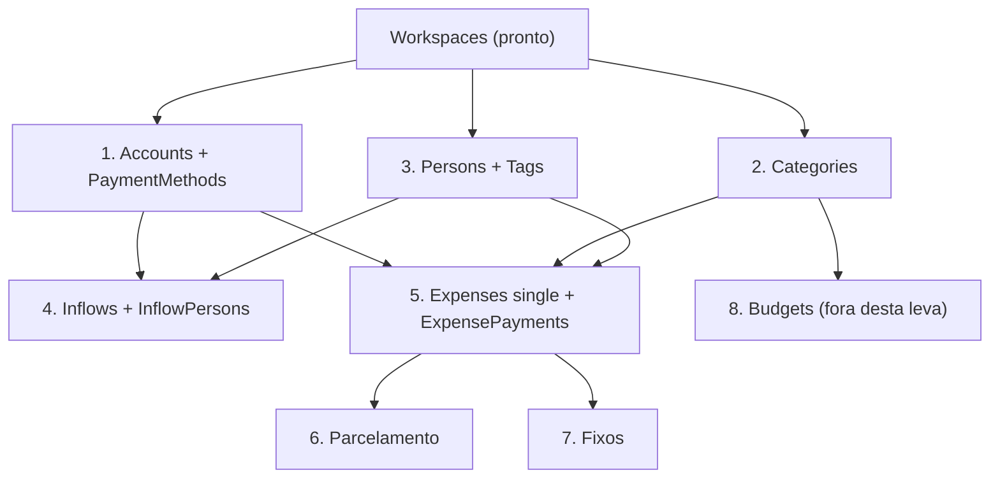

# Roadmap das rotas — leva MVP

Mapeamento do desenvolvimento das rotas, etapa a etapa, **restrito às tabelas que já existem
nas migrations**. Nada aqui pede tabela nova.

**Alvo desta leva:** ao final, um usuário novo consegue se cadastrar, montar os próprios
cadastros (contas, formas de pagamento, categorias, pessoas, tags), lançar entradas e lançar
gastos nos três formatos — simples, parcelado e fixo. É o fluxo de um mês de uso, fim a fim.

---

## Onde estamos

Das 22 tabelas do banco, 7 têm código:

| Tabela | Estado |
| --- | --- |
| `Users` | rotas de cadastro, login, getSelf, update, troca de senha |
| `Workspaces` / `WorkspaceMembers` | getSelf, update, **switch** (escolhe o workspace da sessão); nasce junto com o usuário. **Entrar em workspace existente pelo cadastro está aberto sem convite — ver etapa 9** |
| `UsersAuth` / `TrustedDevices` | biometria (WebAuthn) completa |
| `Accounts` / `PaymentMethods` | **etapa 1 pronta**: CRUD das duas, `pix` e `debit` nascendo com a conta, saldo de abertura travado depois do primeiro lançamento |

**O `IdWorkspace` saiu da URL e passou a viajar dentro do token.** Isso mudou a forma de toda
rota escopada por tenant, inclusive as que ainda não existem — ver a decisão 0 abaixo antes de
escrever a primeira rota da etapa 2.

As outras 15 não têm nada. Quatro delas (`UserDevices`, `Notifications`, `Plans`,
`Subscriptions`) são plataforma e ficam **fora desta leva**.

---

## Ordem das etapas e por quê

A ordem não é preferência: é a das chaves estrangeiras. Nada que aponta para uma tabela pode
ser construído antes dela.



`ExpensePayments` aponta para `PaymentMethods` com `ON DELETE RESTRICT`, e `Inflows` aponta
para `Accounts` do mesmo jeito. Por isso a etapa 1 vem antes de tudo que é movimento: sem
conta cadastrada não existe gasto nem entrada que o banco aceite.

---

## Decisões transversais — tomar ANTES da etapa 4

Quatro coisas atravessam várias etapas. Se ficarem para depois, viram retrabalho em todas elas.
Duas já estão fechadas (0 e 1); as outras duas continuam abertas.

### 0. Como o workspace chega na rota — DECIDIDO: assinado dentro do token

Começou na URL (`/Base/Accounts/IdWorkspace=:IdWorkspace`), passou por um cookie próprio e
terminou **dentro do próprio token**, ao lado do `IdUser`. As tabelas de rota deste documento
já estão na forma final: **nenhuma rota das etapas 2 a 7 leva `IdWorkspace` no caminho.**

```
login  → AcessControl.startSession → SelectDefault escolhe o workspace
       → token assinado { id, IdWorkspace } → cookie httpOnly 'token'
requisição → acessMiddleware lê o cookie → res.locals.IdUser + res.locals.IdWorkspace
       → controller passa adiante → section confere no banco
```

**Por que saiu da URL.** Um id no caminho é dado do cliente num lugar que convida a confiar
nele, e ele se repetia em toda rota de toda feature sem nunca variar dentro de uma sessão —
sete rotas na etapa 1, mais de vinte até o fim da leva.

**Por que dentro do token e não num cookie só dele.** Um segundo cookie continuaria sendo dado
do cliente: os ids são sequenciais, e reescrever `IdWorkspace=2` é trivial. Dentro do token
assinado essa porta fecha, e a sessão inteira passa a viver e morrer como uma coisa só.
Cuidado: o payload de um JWT é base64, **assinado não é criptografado** — qualquer um que
tenha o token lê os dois ids. Nunca colocar segredo ali.

**Assinado não é o mesmo que ainda verdadeiro — o `assertMember` fica.** O token é uma
fotografia da autorização no instante do login e vale 24h. A etapa 9 vai permitir remover
membro e rebaixar papel, então entre a emissão e o uso a matrícula pode ter mudado.
Autenticação (quem é) o token resolve; autorização (ainda pode?) só o banco responde. Isso
não custa consulta extra: a maioria das chamadas é `assertRole`, que precisa do papel
**atual** e teria que ir ao banco de qualquer jeito.

**A convenção que vale para toda section nova:** o parâmetro que chega se chama
`SelectedIdWorkspace`, e o `IdWorkspace` usado nas queries é o que **volta da matrícula**.

```ts
public async run(SelectedIdWorkspace: number, IdUser: number, body: ...) {
    let { IdWorkspace } = await WorkspacesAcessControl.assertRole(SelectedIdWorkspace, IdUser, ["owner", "editor"])
    //  daqui para baixo, só o IdWorkspace conferido existe
}
```

O nome diferente é de propósito: com os dois se chamando `IdWorkspace`, o valor não conferido
chegaria numa query por descuido e ninguém veria na revisão.

**Trocar de workspace reemite o token** (`POST /Base/Workspaces/switch`) — é a única rota que
recebe um `IdWorkspace` escrito pelo cliente, e por isso confere a matrícula antes de assinar
qualquer coisa. O token anterior segue válido até expirar, apontando para o workspace antigo:
correto, porque prova a mesma identidade e uma seleção que na época era legítima. **Quando a
etapa 9 permitir remover membro, é o `assertMember` que fecha a porta — não o token**, que
continua circulando até as 24h acabarem.

Token sem workspace (usuário sem nenhuma matrícula) responde 406 "Nenhum workspace
selecionado", com mensagem própria porque o conserto é chamar o `switch`, não pedir acesso.

**Junto veio o fim do header `authorization`:** a sessão é lida do cookie httpOnly e só dele.
Front e API saem do mesmo domínio (`www.gastosmensais.com.br` e `.../api` pelo nginx), então
são a mesma origem — sem CORS, sem preflight. Dois caminhos de autenticação significariam que
o mais fraco decide, e um header aceito de qualquer lugar escapa do `sameSite: strict`, que é
toda a defesa contra CSRF hoje. Detalhes de deploy no `CLAUDE.md`.

### 1. Saldo da conta — DECIDIDO: calcular na fonte, sem cache

`Accounts.CurrentBalance` era cache e **não vai ser usado**. O saldo é sempre calculado a
partir dos lançamentos:

```
saldo = InitialBalance
      + Inflows recebidos com IdToAccount   = conta
      − Inflows recebidos com IdFromAccount = conta      (transferência que saiu)
      − ExpensePayments pagos cujo PaymentMethod é da conta
```

Por que não cache: o custo de manter é toda rota que mexe em dinheiro lembrar de recalcular
(criar, editar, cancelar, receber, estornar, quitar, desquitar, mudar `InitialBalance`).
Errar uma não quebra nada — só faz o saldo divergir devagar, e saldo plausível e errado é a
pior falha possível aqui. O ganho seria performance, que não existe neste volume: os índices
para essa query já estão no banco (`ExpensePayments["IdWorkspace","IdPaymentMethod","Paid"]`,
`Inflows["IdToAccount"]`, `Inflows["IdFromAccount"]`).

Três consequências:

- **`InitialBalance` e `InitialBalanceDate` continuam** — são dado de origem, não cache.
  Nenhum lançamento do sistema deriva o saldo de abertura.
- **Transferência conta nos dois sentidos no saldo**, ao contrário do total de "quanto
  entrou", que exclui `Kind='transfer'`. Duas regras opostas sobre a mesma coluna: é o ponto
  mais fácil de conflatar do modelo.
- **Um lugar só** (`AccountBalance.section.ts`). Sem isso viram cinco queries parecidas
  espalhadas e o problema de divergência volta sem nem ter coluna para culpar.

De brinde, realizado vs. previsto é o mesmo `SUM` trocando o filtro (`Status='received'` /
`Paid=true`), sem dobrar pontos de escrita como um cache exigiria.

### 2. Quem escreve `Expenses.Status`

O `Status` é derivado das pernas de `ExpensePayments`: `'paid'` só quando **todas** estão
pagas. Nunca pode ser editado direto por rota. Precisa de uma section única
(`ExpenseStatus.section.ts`) chamada depois de qualquer escrita em pernas, e o schema de
update do gasto **não pode aceitar `Status` no body**.

### 3. Padrão de filtro por período

`GET` de entradas e de gastos vai precisar de recorte por mês. Definir uma vez o formato
(`?From=YYYY-MM-DD&To=YYYY-MM-DD` ou `?ReferenceMonth=YYYY-MM`) e usar igual nas duas features
— as datas chegam do Postgres como string `"YYYY-MM-DD"`, não como `Date`.

---

## Etapa 1 — Contas e formas de pagamento

**Tabelas:** `Accounts`, `PaymentMethods`
**Pastas:** `routes/Accounts/`, `routes/PaymentMethods/`

> **Correção do que este documento previa.** A ideia era manter `PaymentMethods` dentro da
> pasta de `Accounts`, por ser filha dela. Não é a convenção do projeto: **tabela com rota
> própria tem pasta própria em `routes/`**, mesmo sendo filha de outra. A ligação continua
> forte nos dois sentidos — a conta nasce com pix e débito, e o GET dela embute as formas de
> pagamento — só que agora atravessa a fronteira por import explícito.
>
> Vale reler as etapas 4 e 5 com isso em mente: `ExpensePayments` tem rota própria (o `pay`),
> então é pasta. `InflowPersons`, `ExpensePersons` e `ExpenseTags` são montadas junto com o
> pai e não têm rota nenhuma — pelo critério acima ficam como segundo model dentro da pasta
> do pai, do mesmo jeito que `WorkspaceMembers` e `TrustedDevices` estão hoje. **Confirmar
> antes de começar a etapa 4.**

| Rota | O que faz |
| --- | --- |
| `GET /Base/Accounts` | lista contas ativas com as formas de pagamento embutidas (`joinTables`) |
| `POST /Base/Accounts` | cria conta **e gera `pix` + `debit` na mesma transaction** |
| `PUT /Base/Accounts/IdAccount=:IdAccount` | edita nome, cor, ícone, posição |
| `DELETE /Base/Accounts/IdAccount=:IdAccount` | `Active = false` |
| `POST /Base/PaymentMethods` | cadastra cartão de crédito |
| `PUT /Base/PaymentMethods/IdPaymentMethod=:IdPaymentMethod` | edita |
| `DELETE /Base/PaymentMethods/IdPaymentMethod=:IdPaymentMethod` | `Active = false` |

**Pontos de atenção**

- Conta nasce com `pix` e `debit` automáticos: é regra do modelo, não conveniência. As duas
  escritas na mesma transaction, como o cadastro de usuário faz com o workspace.
- `ClosingDay`/`DueDay` **só** em `Kind='credit_card'`. Validar no Joi (`when`) e na section —
  o banco não tem CHECK para isso.
- Não existe conta do tipo `credit_card`: cartão é forma de pagamento, não conta.
- `InitialBalance` só pode mudar enquanto a conta não tem movimento, senão o saldo histórico
  muda debaixo de lançamento já feito. **DECIDIDO: trava.** Não há o que recalcular — o saldo
  nunca é guardado, é sempre lido dos lançamentos, então "recalcular" seria só deixar o
  extrato do mês passado mudar sozinho. A pergunta mora em `AccountMovement.section.ts`, num
  lugar só, porque são duas tabelas e três pontas de FK: esquecer a transferência que *saiu*
  liberaria a troca numa conta que tem movimento.
- Apagar forma de pagamento com gasto lançado esbarra no `RESTRICT` da FK: capturar e
  responder 406, não deixar virar 500. **Como ficou:** o `DELETE` é `Active = false`, então o
  `RESTRICT` nunca chega a disparar — arquivar tira o cartão das listas de escolha sem tocar
  no histórico, que é o que a FK está ali para proteger. Arquivar a conta arquiva as formas
  de pagamento dela na mesma transaction: um `pix` que sobrevive à conta continuaria sendo
  oferecido como pagamento de uma conta que sumiu.

---

## Etapa 2 — Categorias

**Tabelas:** `Categories` · **Pasta:** `routes/Categories/`

| Rota | O que faz |
| --- | --- |
| `GET /Base/Categories` | `where(IdWorkspace = X or IdWorkspace is null)`, em árvore |
| `POST /Base/Categories` | cria categoria do workspace |
| `PUT /Base/Categories/IdCategory=:IdCategory` | edita |
| `DELETE /Base/Categories/IdCategory=:IdCategory` | `Active = false` |

**Pontos de atenção**

- **Categoria global (`IdWorkspace IS NULL`) é somente leitura.** Editar ou apagar tem que
  responder 406. Sem essa trava, um usuário apaga a categoria de todos os outros — é a falha
  mais séria possível nesta etapa, e ela não aparece em teste feliz.
- As 13 globais já vêm da migration `20260731003200_seed_categories`.
- `IdParentCategory`: validar que o pai é do mesmo workspace (ou global) e que não fecha ciclo.
- `Utils.buildTree` já existe e monta a árvore.
- `Categories` cobre **gasto apenas**. Entrada não tem categoria.

---

## Etapa 3 — Pessoas e tags

**Tabelas:** `Persons`, `Tags` · **Pastas:** `routes/Persons/`, `routes/Tags/`

CRUD simples nas duas, escopado por workspace:
`GET`/`POST /Base/<Feature>` e
`PUT`/`DELETE /Base/<Feature>/Id<Singular>=:Id<Singular>`.

**Pontos de atenção**

- `Persons` tem `unique(IdWorkspace, Name)` e `unique(IdUser)`: nome repetido e usuário
  virando duas pessoas viram 406, não 500.
- **Decisão que volta na etapa 0:** criar automaticamente a `Person` do próprio dono no
  cadastro do usuário. Sem isso o primeiro rateio exige um cadastro manual que não faz
  sentido para quem acabou de entrar. É uma linha a mais na transaction do signup.
- Pessoa não precisa de login — é esse o motivo da tabela existir em vez de usar `Users`.
- `Tags` tem `unique(IdWorkspace, Name)`.
- `ExpenseTags` (o vínculo) **não** ganha rota própria: é montado junto com o gasto, na etapa 5.

---

## Etapa 4 — Entradas e transferências

**Tabelas:** `Inflows`, `InflowPersons` · **Pasta:** `routes/Inflows/`

| Rota | O que faz |
| --- | --- |
| `GET /Base/Inflows` | lista por período e status |
| `GET /Base/Inflows/IdInflow=:IdInflow` | uma entrada com o rateio |
| `POST /Base/Inflows` | cria entrada **ou** transferência |
| `PUT /Base/Inflows/IdInflow=:IdInflow` | edita |
| `POST /Base/Inflows/IdInflow=:IdInflow/receive` | `pending` → `received`, grava `ReceivedAt`, recalcula saldo |
| `DELETE /Base/Inflows/IdInflow=:IdInflow` | `Status = 'canceled'` |

**Pontos de atenção**

- **`Kind` discrimina duas coisas diferentes na mesma tabela.** `'inflow'` exige
  `IdToAccount` e `IdFromAccount` nulo; `'transfer'` exige as duas contas, diferentes entre
  si. Os dois CHECK do banco são a rede; o Joi (`when`) tem que recusar antes, com mensagem.
- **Transferência é soma zero.** Toda leitura de "quanto entrou" filtra `Kind <> 'transfer'`.
  Vale já nascer como método do model (`getTotalReceived`), porque esquecer esse filtro conta
  o mesmo dinheiro de novo a cada vez que ele muda de conta — e o número fica plausível.
- `InflowPersons` só existe em `Kind='inflow'`; a soma dos `Value` tem que fechar com
  `TotalValue` (o banco não valida isso, a section valida).
- Recebimento é tudo ou nada: não há `'partial'` nem coluna `ReceivedValue`.
- É aqui que a decisão sobre `CurrentBalance` estreia.

---

## Etapa 5 — Gasto simples

**Tabelas:** `Expenses`, `ExpensePayments`, `ExpensePersons`, `ExpenseTags`
**Pasta:** `routes/Expenses/`

| Rota | O que faz |
| --- | --- |
| `GET /Base/Expenses` | lista por período, status, categoria |
| `GET /Base/Expenses/IdExpense=:IdExpense` | gasto com pernas, rateio e tags |
| `POST /Base/Expenses` | cria `Kind='single'` com pernas, rateio e tags numa transaction |
| `PUT /Base/Expenses/IdExpense=:IdExpense` | edita |
| `POST /Base/Expenses/.../IdExpensePayment=:IdExpensePayment/pay` | quita uma perna, recalcula `Status` e saldo |
| `DELETE /Base/Expenses/IdExpense=:IdExpense` | `Status = 'canceled'` |

**Pontos de atenção**

- **Dois eixos de rateio que nunca se misturam.** `ExpensePayments` é o eixo financeiro (move
  saldo); `ExpensePersons` é o analítico (quem consumiu). Duas formas de pagamento e duas
  pessoas geram **2 + 2 linhas, nunca 4**. Se o código produzir 4, o modelo foi entendido errado.
- Soma das pernas `== TotalValue`, soma do rateio `== TotalValue`. Nenhuma das duas é
  garantida pelo banco.
- `ClosingDate`/`DueDate` saem do `ClosingDay`/`DueDay` da forma de pagamento quando é
  cartão, e ficam nulas em pix e débito. Isolar numa section (`InvoiceDates`) porque a etapa 6
  vai reusar — um dia de diferença na compra vira um mês de diferença no caixa.
- `Status` nunca no body do `PUT`.

---

## Etapa 6 — Parcelamento

**Tabelas:** as mesmas · sem rota nova, é `Kind='installment'` no `POST` da etapa 5.

600 em 6× vira **6 linhas de `ExpensePayments`** de 100, cada uma com `InstallmentNumber`,
`InstallmentTotal` e a sua própria `ClosingDate`/`DueDate` avançando mês a mês.

**Pontos de atenção**

- `TotalValue` é o total da compra, não o valor da parcela.
- **Arredondamento:** 100 em 3× não fecha. Decidir onde vai a sobra de centavos (primeira ou
  última parcela) e cravar em teste — a soma das pernas precisa bater exatamente com
  `TotalValue`, que é uma invariante do modelo.
- O CHECK do banco garante `1 <= InstallmentNumber <= InstallmentTotal`.
- Cancelar uma compra parcelada cancela a série inteira; quitar uma parcela não torna o gasto
  pago (o `Status` derivado já resolve isso sozinho, se ninguém escrever nele à mão).

---

## Etapa 7 — Gasto fixo

**Tabelas:** as mesmas · `Kind='fixed'`.

Gasto fixo é uma **corrente de ocorrências reais**, não molde + instâncias. A raiz tem
`IdParentExpense` nulo e carrega `RecurrenceDay`/`RecurrenceEndDate`; cada ocorrência gerada
aponta para ela e é um gasto de verdade.

| Rota | O que faz |
| --- | --- |
| `POST /Base/Expenses` | `Kind='fixed'` cria a raiz e as ocorrências |
| `PUT /Base/Expenses/.../IdExpense=:IdExpense/series` | edita a série — **só daqui para a frente** |
| `DELETE /Base/Expenses/.../IdExpense=:IdExpense/series` | encerra a série |

**Ponto de atenção principal — decidir antes de começar**

**Quem gera as ocorrências?** Duas saídas, e elas dão APIs diferentes:

- **Gerar N meses à frente na criação** (ex.: 12). Simples, testável sem agendador, e o mês
  seguinte já aparece na consulta. Precisa de um ponto que estenda a série quando a janela
  encurtar.
- **Rotina mensal** que materializa o mês corrente. É o que o comentário da migration prevê e
  o que escala, mas exige agendador e a suíte passa a depender de disparar a rotina na mão.

Para MVP a primeira entrega valor mais rápido. Seja qual for, editar a série muda **só o
futuro**: ocorrência passada guarda o valor que realmente valeu.

---

## Etapa 9 — Compartilhamento de workspace (convite)

**Tabelas:** `Workspaces`, `WorkspaceMembers` — as duas já existem, com model pronto.
**Fora da leva MVP**, mas mapeada aqui porque **há uma pendência de segurança aberta hoje**.

### Pendência aberta — fechar nesta etapa

`POST /Base/Users` é rota pública e o schema aceita `IdWorkspace` no body. Quando ele vem
preenchido, `Workspaces/sections/POST/create.ts` pula a criação e insere direto a matrícula
com `Role: "owner"`:

```
POST /Base/Users
{ "Name": "...", "Email": "...", "Password": "...", "Phone": 1, "IdWorkspace": 1 }
```

Sem token, sem convite, sem conferir quem é dono. Como `IdWorkspace` é inteiro sequencial,
basta chutar `1, 2, 3…` para virar **owner** de um workspace alheio e enxergar as finanças
dele. O `assertMember` das outras rotas não protege: ele confere a matrícula, e a matrícula
acabou de ser criada de forma "legítima".

Enquanto esta etapa não chega, **a rota de cadastro não pode ir para produção**. O caminho
curto, se o compartilhamento demorar, é tirar `IdWorkspace` do schema de `create` e do
`CreateUserPayload` — a assinatura opcional em `Workspaces/sections/POST/create.ts` pode
ficar, que ela é interna e é justamente o que esta etapa vai reusar.

### Rotas

| Rota | O que faz |
| --- | --- |
| `POST /Base/Workspaces/invite` | dono gera um convite assinado; devolve o token |
| `GET /Base/Workspaces/members` | lista membros e papéis |
| `PUT /Base/Workspaces/members/IdWorkspaceMember=:IdWorkspaceMember` | muda o papel |
| `DELETE /Base/Workspaces/members/IdWorkspaceMember=:IdWorkspaceMember` | remove membro / sair |
| `POST /Base/Workspaces/join` | usuário **já cadastrado** aceita um convite |
| `POST /Base/Users` | passa a aceitar `InviteToken` **no lugar de** `IdWorkspace` |

### Pontos de atenção

- **O convite é um JWT curto assinado com `JWT_SECRET`**, carregando `{ IdWorkspace, Role }` —
  mesmo padrão do `ChallengeToken` da biometria, que já está no projeto e resolve o mesmo
  problema (provar que um dado veio da API e não do cliente). Quem não tem o token não
  escolhe workspace nenhum.
- **`Role` nunca vem do cliente.** Vem de dentro do convite, e o padrão é `viewer`/`editor`,
  nunca `owner`. Hoje entra `owner` fixo.
- **Convite em JWT puro é reutilizável até expirar.** Se convite de uso único for requisito,
  aí sim precisa de tabela (ou de marcar o consumo) — decidir antes de implementar, porque
  muda o desenho.
- **Um workspace tem um dono.** Transferir propriedade é operação própria, e o último `owner`
  não pode sair sem passar o bastão.
- **Remover membro não invalida o token dele** — consequência direta da decisão 0. O
  `IdWorkspace` vai assinado dentro do token e ele vale 24h, então quem foi removido continua
  com um token que aponta para o workspace. Quem fecha a porta é o `assertMember`, que consulta
  a matrícula a cada requisição: apagada a linha, a próxima chamada já responde 406. **A
  remoção vale na hora; o token é que fica órfão até expirar.** Isso só vira problema se alguém
  um dia decidir confiar no `IdWorkspace` do token sem conferir — e é por isso que a
  convenção do `SelectedIdWorkspace` existe. Mesmo raciocínio para rebaixar papel: o token
  não carrega `Role`, justamente para não haver papel velho circulando.
- **`Persons` tem `unique(["IdUser"])` global, não composto com `IdWorkspace`.** Ou seja, um
  usuário só consegue ser `Person` em **um** workspace no schema atual. Assim que alguém for
  membro de dois workspaces e precisar entrar no rateio dos dois, essa constraint barra. É
  provável que ela precise virar `unique(["IdWorkspace", "IdUser"])` — verificar nesta etapa,
  junto com a decisão da etapa 3 de criar a `Person` do dono no cadastro.

---

## Fora desta leva

| Tabela | Por quê |
| --- | --- |
| `Budgets`, `BudgetPeriods` | orçamento depende de gasto lançado para significar alguma coisa; e `BudgetPeriods` precisa da rotina mensal |
| `UserDevices`, `Notifications` | push e avisos não fazem parte do fluxo de um mês |
| `Plans`, `Subscriptions` | cobrança |
| Faturas de cartão, conciliação, relatórios | leitura derivada — só faz sentido com dado lançado |

---

## Como saber que a leva acabou

Uma suíte `.tests.ts` por feature, seguindo o padrão já estabelecido (um `describe` por rota,
mais um `describe("Fluxo end to end")`), e um fluxo que percorre tudo **só por HTTP**:

1. cadastra usuário → recebe `IdUser` + `IdWorkspace`, e o login já devolve a sessão com o
   workspace selecionado (nenhum `switch` no meio — ver a decisão 0)
2. cria conta corrente → `pix` e `debit` vêm juntos
3. cadastra um cartão com fechamento e vencimento
4. cria uma categoria própria e lista junto com as globais
5. lança uma entrada de salário e a recebe
6. lança um gasto simples no débito e quita
7. lança uma compra parcelada em 6× no cartão → confere as 6 pernas e as datas de fatura
8. lança um gasto fixo → confere a raiz e as ocorrências
9. lê o mês e os saldos, e os números fecham

O passo 9 é o que prova que o modelo está de pé: se o saldo fechar sem gambiarra, os dois
eixos de rateio e o `Status` derivado estão certos.
