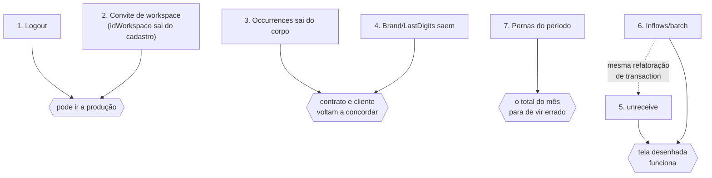

# Plano de desenvolvimento — leva 2: o que sobe com o MVP

Continuação do [1. ROADMAP- MVP.md](1.%20ROADMAP-%20MVP.md), que fechou a leva do MVP. Aqui está
**o que precisa subir junto com ele**: etapas ordenadas por dependência, com as decisões fechadas
e com os arquivos deste repositório que cada uma toca.

O que entra vem de **duas origens**, e vale saber qual é qual ao ler:

- **Etapas 1 a 7** — o levantamento que o front-end fez ao converter o layout contra o contrato
  ([Pendencias Backend.md](../Pendencias%20Backend.md)). Cada uma tem número de pendência.
- **Etapas 8 a 11** — demandas do dono do produto, anotadas em 2026-09-04. Não têm pendência
  para citar, e estão agrupadas no fim, em [Demandas de produto](#demandas-de-produto).

As etapas têm **numeração própria por leva**, como as da leva 1 — "etapa 3 da leva 2" e "etapa 3
da leva 3" são coisas diferentes. Aqui dentro, "etapa 3" sem qualificação é sempre desta leva;
toda referência a outra leva diz qual.

O que fica para depois está em
[3. Plano de Desenvolvimento - Leva 3.md](3.%20Plano%20de%20Desenvolvimento%20-%20Leva%203.md).

**O documento do front diz o que falta e por quê. Este diz em que ordem, com que desenho, e o
que quebra no caminho.** Quando os dois divergirem sobre a *necessidade*, a fonte é o documento
do front; sobre a *forma*, é este.

As onze etapas mudam alguma coisa que o front enxerga — rota nova, campo que sai, valor novo
num enum, número que muda de significado — e por isso cada uma traz entrada no changelog do
contrato, **no mesmo commit da mudança**, como o `CLAUDE.md` exige.

---

## Onde estamos

A leva 1 está fechada e verde: **391 testes, 13 suítes** (era 338 em 10 quando o ROADMAP foi
escrito). É contra essa base que as etapas abaixo entram — cada uma acrescenta os seus testes ao
arquivo da própria feature, nenhuma reescreve os que existem.

Das 16 pendências levantadas, **uma está aplicada**, sete são esta leva e sete são a
[leva 3](3.%20Plano%20de%20Desenvolvimento%20-%20Leva%203.md). Somam-se a elas **quatro demandas
de produto**, que viram as etapas 8 a 11 — duas delas, a 10 e a 11, saídas do debate sobre cartão
de crédito de 2026-09-04.

| # | Pendência | Etapa |
| --- | --- | --- |
| 1 | [Logout](../Pendencias%20Backend.md#1-logout) | 1 |
| 2 | [`IdWorkspace` no cadastro](../Pendencias%20Backend.md#2-idworkspace-no-cadastro-aceito-sem-convite) | 2 |
| 10 | [`Occurrences` fora do POST](../Pendencias%20Backend.md#10-occurrences-fora-do-post-expenses) | 3 |
| 16 | [Bandeira e final do cartão](../Pendencias%20Backend.md#16-bandeira-e-final-do-cartão-saem-do-cadastro) | 4 |
| 14 | [Desfazer recebimento](../Pendencias%20Backend.md#14-desfazer-recebimento-de-entrada) | 5 |
| 15 | [Criação de entradas em lote](../Pendencias%20Backend.md#15-criação-de-entradas-em-lote) | 6 |
| 12 | [Lista de gastos com os filhos](../Pendencias%20Backend.md#12-lista-de-gastos-com-os-filhos) | 7 |
| 11 | [Clonar o mês anterior de Renda](../Pendencias%20Backend.md#11-clonar-o-mês-anterior-de-renda) | **morreu na etapa 6** |
| 13 | [`IncludeCanceled` em `GET /Expenses`](../Pendencias%20Backend.md#13-includecanceled-em-get-expenses) | ✅ **aplicada em 2026-09-03** |

A pendência 11 não vira etapa: ela **já foi substituída** pela 15 no próprio documento do front —
a escolha do que clonar passou para o usuário, e o que sobrou para o servidor é gravar em lote.
Fica registrada aqui só para ninguém implementar `POST /Inflows/clone` mais tarde achando que
ficou esquecida.

---

## Por que estas etapas, e não outras

Três motivos, e nenhum deles é "seria bom ter":

1. **Segurança** — hoje não se sai da sessão (etapa 1) e um cadastro público entra como dono de
   workspace alheio (etapa 2). O ROADMAP da leva 1 já dizia que a rota de cadastro **não pode ir
   para produção** com isso aberto. A etapa 2 fecha esse buraco **entregando o convite**, e não
   apagando o campo: é a maior das sete, com tabela nova e duas migrations, e é a única que
   antecipa parte de uma etapa da leva 1.
2. **Cliente e contrato divergindo agora** — o front já parou de mandar `Occurrences` (etapa 3) e
   `Brand`/`LastDigits` (etapa 4). Enquanto o servidor documenta uma coisa e o cliente faz outra,
   qualquer pessoa lendo o contrato para escrever tela nova escreve errado.
3. **Tela desenhada que não funciona** — desfazer recebimento (etapa 5), clonagem em lote
   (etapa 6) e as colunas de pessoa e forma de pagamento na lista (etapa 7) estão implementadas
   do lado do cliente, esperando rota.

**A etapa 7 é a que merece atenção no corte.** Ela está catalogada como performance no documento
do front, e performance seria motivo para adiar — mas ela carrega o único lugar do MVP em que a
tela mostra número **errado**, e não apenas ausente: uma parcela fora da janela de 24 meses que o
cliente varre simplesmente some do total do mês. Por isso está aqui, e não na leva 3.

Tudo que depende de infra que o projeto não tem — e-mail, agendador, geração de planilha — ou de
especificação que ninguém escreveu ficou na
[leva 3](3.%20Plano%20de%20Desenvolvimento%20-%20Leva%203.md).

---

## Ordem das etapas e por quê

Nenhuma das sete depende de outra para compilar; a ordem é de prioridade, com uma única amarração
real (5 e 6 mexem na mesma refatoração de transaction).



- **1 e 2 primeiro**, e não porque são fáceis: são as duas que seguram o deploy. A 1 é a menor
  do plano e a 2 é a maior — não deixe a ordem sugerir que são do mesmo tamanho.
- **3 e 4 logo depois** — são as mais baratas do plano e param a divergência entre cliente e
  contrato, que é o tipo de problema que cresce sozinho enquanto ninguém olha.
- **7 antes de 5 e 6**, apesar de 5 e 6 serem menores: é a que conserta número errado.
- **5 e 6 juntas**, porque a segunda refatora a transaction que a primeira encosta.

**As etapas 8 a 11 não aparecem no diagrama porque não dependem de nada** — nem umas das
outras. A 8 é pequena e entra em qualquer buraco da fila; a 9 é a única da leva que adiciona
funcionalidade sem consertar nada, e é a candidata natural a escorregar se o prazo apertar.

As duas exceções são de conveniência, não de bloqueio: **a 10 sai mais barata antes da 7** (a
rota das pernas já nasce lendo a `CompetenceDate` em vez de trocar uma linha depois), e **a 11
pressupõe a 10** para o estorno ser quitado junto com a fatura em que ele caiu. Nas duas, a ordem
inversa funciona e custa um ajuste pequeno.

---
## Etapa 1 — Logout

**Pendência 1** · **Pasta:** `routes/Users/`

| Rota | O que faz |
| --- | --- |
| `POST /Users/logout` | sobrescreve o cookie `token`, encerrando a sessão |

**DECIDIDO: a rota não exige token.** `AsyncHandler(..., false)`, como o login e o cadastro. Um
logout que exige sessão responde 401 exatamente no caso em que o usuário mais quer sair — token
expirado, cookie meio apagado, aba velha — e o botão "Sair" trava. Não há o que autorizar: o
efeito da rota é apagar um cookie do próprio chamador. Chamar sem sessão responde `200` também.

**DECIDIDO: sem lista de revogação.** Sobrescrever o cookie basta para o MVP. O token continua
válido até o `exp` para quem tiver copiado o valor — mas ele é `httpOnly` e `sameSite: strict`,
então copiar o valor já exige acesso ao dispositivo. Se algum dia sessão múltipla ou "encerrar
sessões em outros dispositivos" virar requisito, é aí que entra o `jti` numa lista, junto com a
etapa 9 do ROADMAP da leva 1.

**Pontos de atenção**

- **A lógica já está escrita.** `AcessControl.clearTokenCookie` existe em
  `routes/Users/sections/AcessControl.section.ts:73` e **nunca foi chamado** por ninguém. Ele já
  repete `httpOnly`, `secure` e `sameSite` da emissão — que é o que faz o navegador *apagar* o
  cookie em vez de criar um segundo ao lado. Esta etapa liga o fio; não escreve regra nova.
- **O `Path` conta junto.** O navegador casa cookie por (nome, domínio, path). Emissão e remoção
  usam o default (`/`) hoje; se alguém um dia mudar um, tem que mudar o outro — os dois métodos
  ficam lado a lado no mesmo arquivo por esse motivo.
- **O controller chama `AcessControl` direto, sem section nova.** A regra do projeto é que nada
  além de `AcessControl` emite ou apaga sessão; criar `sections/POST/logout.ts` só para repassar
  a chamada daria um segundo lugar por onde a sessão termina.

**Contrato:** 🟢 **Adição** na seção 4 (`/Users`) + entrada no changelog.

**Testes** (`Users.test.ts`, um `describe` novo na posição da rota)

- logout devolve `200` e um `Set-Cookie` que expira o `token`;
- rota protegida depois do logout responde `401` — **este é o teste da etapa**, o resto é forma;
- logout sem sessão nenhuma responde `200`.

---

## Etapa 2 — Convite para o workspace

**Pendência 2** · **Tabela nova:** `WorkspaceInvites` ·
**Pastas:** `routes/Workspaces/`, `routes/Users/`, `routes/Persons/`, `migrations/`

**DECIDIDO: opção 2 — o convite é uma linha no banco, e o que viaja na URL é um hash.** Não o
JWT que a etapa 9 do ROADMAP da leva 1 sugeria, e não a remoção seca do campo. Três razões, e a
primeira sozinha decide:

- **Convite em JWT não se revoga.** Ele vale até expirar, e quem recebeu o link continua entrando
  depois de o dono mudar de ideia. Uma linha tem `Status`: pendente, aceito, revogado.
- **O convite precisa guardar e-mail e papel de qualquer jeito**, para o servidor conferir na
  hora do aceite. Guardados em linha, eles também podem ser **listados** — "quem eu convidei e
  ainda não entrou" —, o que um token opaco não permite.
- O custo é uma tabela e uma migration. É o preço de poder cancelar um convite.

| Rota | Auth | O que faz |
| --- | --- | --- |
| `POST /Workspaces/invite` | 🔒 `owner` | cria o convite com `{ Email, Role }` e devolve `{ Hash, ExpiresAt }` |
| `GET /Workspaces/invites` | 🔒 `owner` | os convites pendentes do workspace |
| `GET /Workspaces/invite/Hash=:Hash` | **público** | descreve o convite para a tela de aceite |
| `POST /Workspaces/join` | 🔒 | usuário **já cadastrado** aceita: `{ Hash }` |
| `DELETE /Workspaces/invite/IdWorkspaceInvite=:IdWorkspaceInvite` | 🔒 `owner` | revoga (`Status = 'revoked'`) |
| `POST /Users` | público | passa a aceitar `InviteHash` **no lugar de** `IdWorkspace` |

**A tabela**

```
WorkspaceInvites
  IdWorkspaceInvite   increments
  IdWorkspace         FK -> Workspaces          ON DELETE CASCADE
  IdInviterUser       FK -> Users               ON DELETE CASCADE
  Email               string(255)               o destinatário, gravado lowercase
  Role                enu ['editor','viewer']   nunca 'owner'
  Hash                string(64)  unique        32 bytes aleatórios em base64url
  Status              enu ['pending','accepted','revoked']  default 'pending'
  ExpiresAt           datetime  notNullable
  AcceptedAt          datetime  nullable
  IdAcceptedUser      FK -> Users  nullable
  CreatedAt / UpdatedAt
  unique(['Hash']) · index(['IdWorkspace','Status']) · index(['Email','Status'])
```

**Sem `Active`**: o ciclo de vida é o `Status`, como em `Inflows` e `Expenses` — a convenção do
projeto é `Active` só em tabela de cadastro.

**O hash é `crypto.randomBytes(32).toString("base64url")`** — o mesmo gerador do `DeviceKey`
(`UsersAuth/sections/DeviceKey.section.ts`), pelo mesmo motivo escrito lá: ele viaja como
parâmetro de URL, e o base64 comum traz `+`, `/` e `=`, que precisam de escape. Fica numa section
própria em `Workspaces/` em vez de importar a da biometria: são features sem relação, e três
linhas duplicadas custam menos que o acoplamento.

**As decisões que sustentam a etapa**

1. **`IdWorkspace` sai do corpo do cadastro de qualquer forma.** O buraco original fecha aqui, e
   não como efeito colateral: o que entra no lugar é o `InviteHash`, e a diferença é toda —
   `IdWorkspace` é inteiro sequencial, que se adivinha contando; o hash são 32 bytes aleatórios,
   que não.
2. **O e-mail é o que impede o link repassado.** O link é compartilhável **por desenho** — é uma
   URL que o usuário manda por WhatsApp —, então o segredo do hash sozinho não basta: quem
   recebesse o encaminhamento entraria. No aceite, a API compara o e-mail do convite com o da
   conta que está aceitando: o do usuário logado no `join`, o do corpo no cadastro. Diferente →
   `406`. A comparação é direta porque os dois lados são gravados em minúsculas — o Joi de
   `Users` já força `lowercase` no e-mail, e o do convite passa a fazer igual.
3. **`Role` nunca vem do cliente no aceite** — vem da linha do convite. E o `POST /invite` só
   aceita `editor` e `viewer`: **`owner` não se convida.** Transferir propriedade é operação
   própria e continua na etapa 9 do ROADMAP.
4. **Só o `owner` convida** (`assertRole(..., ["owner"])`). Um `editor` que pudesse convidar
   promoveria terceiros ao próprio nível sem o dono saber.
5. **Uso único e com prazo.** O aceite grava `Status='accepted'`, `AcceptedAt` e `IdAcceptedUser`
   **na mesma transaction** que cria a matrícula. `ExpiresAt` padrão de 7 dias. Os dois são
   conferidos no aceite — mas a trava de verdade contra aceite duplo é o
   `unique(IdWorkspace, IdUser)` que **já existe** em `WorkspaceMembers`; o `Status` é a resposta
   amigável, o índice é a garantia.
6. **Convite repetido para o mesmo e-mail renova o existente**, com hash e validade novos, em vez
   de criar um segundo. Dois links vivos para o mesmo convite é o pior caso possível: revogar um
   deixa o outro funcionando.

**Pontos de atenção**

- **A `Person` do convidado é metade da etapa, e ela esbarra num índice.** `Persons` tem hoje
  `unique(["IdUser"])` **global** (migration `20260731003350_persons.ts:27`): um usuário só pode
  ser pessoa em **um** workspace. Com convite, isso deixa de ser hipótese — o convidado entra num
  segundo workspace e o índice barra a pessoa dele lá, entregando um membro que **não pode
  receber um centavo de rateio**. Precisa virar `unique(["IdWorkspace","IdUser"])`, em migration
  nova. O ROADMAP da leva 1 registra isso como suspeita da etapa 9; o convite é o que a confirma.
- **O aceite reusa `Persons/sections/POST/createSelf.ts` sem reescrevê-la.** Ela já trata o
  homônimo pulando a criação em vez de inventar "Fulano (2)", e o comentário dela diz, com todas
  as letras, que o vínculo `IdUser` "só a etapa 9 (aceitar convite) tem informação para escrever
  direito". É esta etapa. Ela continua sendo o **único** lugar que escreve o `IdUser` de uma
  pessoa.
- **`Workspaces/sections/POST/create.ts` precisa de um ajuste, não de reescrita.** O parâmetro
  `IdWorkspace?` opcional já existe exatamente para este caso — o que muda é que ele passa a vir
  da linha do convite, conferida no servidor, e que **o `Role` deixa de ser `owner` fixo**: a
  section grava o papel que o convite manda.
- **O `join` não reemite o token.** Aceitar dá matrícula, não troca a sessão: quem quiser operar
  no workspace novo chama `POST /Workspaces/switch`, que é a rota que existe para isso. Juntar as
  duas faria o aceite trocar o workspace debaixo da tela que o usuário estava usando.
- **O que o `GET` público mostra:** nome do workspace, nome de quem convidou, o e-mail convidado
  (para a tela poder dizer "entre com esta conta") e a validade. **Nenhum id.** Quem tem o hash já
  tem o convite; o que não pode acontecer é a rota virar sonda para descobrir workspace por id.
- **Convite para quem já é membro** → `406` na criação, com `msg` própria. É erro de quem
  convida, não do convidado.
- **Esta etapa não depende de envio de e-mail.** O servidor devolve o hash e **quem entrega o
  link é o usuário**. É o que a mantém fora da dependência que trava a etapa 3 da leva 3 —
  quando o e-mail existir, ele vira um segundo canal de entrega do mesmo hash, sem mudar nada
  aqui.
- `Utils/database.ts` ganha a interface `WorkspaceInvites` e o registro em `DBTypes`, como toda
  tabela nova.

**Relação com a etapa 9 do ROADMAP da leva 1.** Esta etapa **antecipa a metade do convite**. O
que continua lá: listar membros, trocar papel, remover membro / sair, e transferir propriedade. E
o que o ROADMAP diz sobre remoção continua valendo — remover não invalida o token do removido, o
`assertMember` é que fecha a porta na requisição seguinte.

**Contrato:** 🔴 **Quebra** na seção 4 (`IdWorkspace` sai do cadastro, `InviteHash` entra) e
🟢 **Adição** na seção de `/Workspaces`, com as cinco rotas novas.

**Testes** (`Workspaces.test.ts` e `Users.test.ts`)

- cadastro mandando `IdWorkspace` → `406`, **e nenhuma linha nova em `WorkspaceMembers`** — o
  teste do buraco original, que não pode sumir da suíte;
- convite gerado por `editor` ou `viewer` → `403`; por quem não é membro → `406`;
- **aceitar com uma conta de outro e-mail → `406` e nenhuma matrícula** — o teste do link
  repassado, que é o que o desenho inteiro existe para impedir;
- aceitar duas vezes → `406`, e uma matrícula só; convite revogado → `406`; convite expirado →
  `406`;
- o `Role` que vai para a matrícula é o da linha do convite, e `owner` no corpo → `406`;
- **o aceite cria a `Persons` do convidado no workspace novo, com `IdUser`, e o mesmo usuário
  passa a ter pessoa em dois workspaces** — é este `expect` que prova a migration do índice;
- fluxo fim a fim só por HTTP: dono convida → convidado se cadastra pelo hash → `switch` →
  enxerga as contas do workspace compartilhado.

---

## Etapa 3 — `Occurrences` sai do corpo do gasto

**Pendência 10** · **Pasta:** `routes/Expenses/`

**DECIDIDO: sai do corpo, fica na resposta.** É o que o cliente já faz — ele parou de enviar e
continua lendo o número de volta para dizer quantas ocorrências nasceram.

**DECIDIDO: a janela vira constante do servidor.** Hoje o default `12` mora no Joi e
`createSeries.buildOccurrenceDates` lê `body.Occurrences!`. Passa a ser uma constante em
`sections/POST/createSeries.ts`, ao lado do código que a usa — é regra de domínio, não flag de
runtime, então não vai para `constants.json`.

**A resposta que a pendência pede, item por item:**

1. Remover do schema: sim. Mandar o campo passa a ser `406`, e o cliente não manda.
2. **O que limita a série agora:** a janela do servidor (12 ocorrências, contando a raiz) **ou**
   `RecurrenceEndDate`, o que vier primeiro. A recorrência **não** fica aberta — nem hoje ela
   ficava. `buildOccurrenceDates` já corta na data final quando ela existe
   (`createSeries.ts:62`); o que muda é só de onde vem o teto.
3. **`Occurrences` continua na resposta**, como número. A tela não precisa saber a janela antes
   de salvar: ela pergunta ao servidor gravando, e o servidor responde quantas nasceram.

**Pontos de atenção**

- Estender a série continua sendo **edição** (`PUT /Expenses/IdExpense=:IdExpense/series`), não
  rotina. É o que o comentário de `createSeries.ts` já diz e continua valendo.
- Nenhuma migration: `Occurrences` nunca foi coluna.
- `RecurrenceDay` e `RecurrenceEndDate` ficam no corpo — só `Occurrences` sai.

**Contrato:** 🔴 **Quebra** na seção 11 (a tabela do `POST` e o quadro dos três `Kind`), porque
um campo documentado deixa de ser aceito. A resposta não muda.

**Testes**

- `POST` fixo sem `Occurrences` cria 12 ocorrências e devolve `Occurrences: 12`;
- com `RecurrenceEndDate` a três meses, cria 3 — a data corta antes da janela;
- mandar `Occurrences` no corpo → `406`.

---

## Etapa 4 — `Brand` e `LastDigits` saem do cartão

**Pendência 16** · **Pastas:** `routes/PaymentMethods/`, `migrations/`

**DECIDIDO: migration nova de drop, sem compatibilidade.** Não editar
`20260731003000_accounts.ts` — mesmo precedente de `20260827022816_drop_accounts_current_balance`
e `20260829010000_drop_categories_parent`: quem já rodou a migration original não pode ficar com
schema diferente de quem rodar agora.

**O que a etapa toca** — é o mapa inteiro, porque os dois campos vazaram para seis lugares:

| Arquivo | O que sai |
| --- | --- |
| `migrations/<nova>_drop_payment_methods_brand_last_digits.ts` | as duas colunas |
| `PaymentMethods.schema.ts` | `paymentMethodResponse`, `create`, `update` (3 pontos) |
| `PaymentMethods/sections/types.ts` | os dois campos do payload |
| `PaymentMethods/sections/PaymentMethodKind.section.ts` | a lista `creditCardOnly` encolhe para `DueDay`/`ClosingOffsetDays` |
| `Utils/database.ts` | a interface `PaymentMethods` |
| `PaymentMethods.test.ts` | 4 pontos que hoje mandam `Brand: "Mastercard"` / `LastDigits: "4321"` |

**Pontos de atenção**

- **O `GET /Accounts` se conserta sozinho.** `Accounts.schema.ts` importa
  `paymentMethodResponse` em vez de redescrever a linha — tirar os campos de um lugar tira dos
  dois. É exatamente o que essa decisão de "quem embute depende de quem é embutido" comprou.
- O `down()` recria as colunas nullable, mas **o dado não volta**. Escrever isso no comentário da
  migration, como as outras de drop fazem.
- `creditCardOnly` **não some**, só encolhe: `DueDay` e `ClosingOffsetDays` continuam sendo
  campos exclusivos de cartão que o banco não protege com `CHECK`.

**Contrato:** 🔴 **Quebra** nas seções 5 e 6 — campos somem da resposta de `GET /Accounts` e
deixam de ser aceitos no `POST`/`PUT`. O front já os removeu de tudo.

**Testes**

- `POST /PaymentMethods` com `Brand` → `406`;
- a forma de pagamento embutida em `GET /Accounts` não traz nenhum dos dois campos.

---

## Etapa 5 — Desfazer recebimento de entrada

**Pendência 14** · **Pasta:** `routes/Inflows/`

| Rota | O que faz |
| --- | --- |
| `POST /Inflows/IdInflow=:IdInflow/unreceive` | volta o `Status` para `pending` e limpa o `ReceivedAt` |

**DECIDIDO: uma section com booleano, duas rotas** — o espelho exato de
`ExpensePayments/sections/POST/pay.ts`, que já serve o `pay` e o `unpay` com um `Paid: boolean`.
A checagem de estado é a mesma nos dois sentidos; duplicá-la em duas sections é o jeito de elas
divergirem depois.

**Correção da proposta da pendência.** O documento do front pede "retirar do saldo da conta o que
o `receive` creditou, na mesma transaction". **Não há o que retirar:** o saldo nunca é gravado —
`AccountBalance.section.ts` o soma dos lançamentos a cada leitura, contando só o que está
`received`. Voltar o `Status` para `pending` **é** a retirada. Por isso também não há transaction
aqui: é um `UPDATE` numa linha. (O `pay` precisa de transaction porque recalcula o `Status`
derivado do gasto na mesma janela; entrada não tem derivado nenhum.)

**Pontos de atenção**

- `Inflows_model` ganha `unreceive`: `{ Status: "pending", ReceivedAt: null }`. O `receive`
  correspondente está em `Inflows.model.ts:47`.
- Os três `406`, com a `msg` espelhando as que o `receive` já tem: não encontrada no workspace,
  já está `pending`, está cancelada.
- Editar entrada **recebida** já é permitido desde a leva 1 (é o que a decisão de não cachear
  saldo comprou), então desfazer não abre porta nova — só devolve a simétrica que faltava.

**Contrato:** 🟢 **Adição** na seção 10.

**Testes**

- recebe → desfaz → `Status` volta a `pending`, `ReceivedAt` nulo **e o `Balance` da conta volta
  ao valor anterior**. Esse último `expect` é o que prova que "não precisa estornar" está certo;
- desfazer duas vezes → `406`; entrada cancelada → `406`; entrada de outro workspace → `406`.

---

## Etapa 6 — Criação de entradas em lote

**Pendência 15** (e o enterro da 11) · **Pasta:** `routes/Inflows/`

| Rota | O que faz |
| --- | --- |
| `POST /Inflows/batch` | cria N entradas numa transaction só, tudo ou nada |

**DECIDIDO: cada item é o mesmo corpo do `POST /Inflows`, validado pelo mesmo schema.** Nada de
shape paralelo — o que é `406` sozinho é `406` no lote. Teto de **100** itens; um mês de renda
tem cinco a dez.

**DECIDIDO: `POST /Inflows/clone` não vai existir.** A pendência 11 foi substituída pela 15 no
documento do front: quem escolhe o que clonar é o usuário, item a item, e o cliente já monta as
cópias (avanço das datas, aparo do dia no mês curto, rateio junto). Ao servidor sobrou gravar.
Com isso, **idempotência deixa de ser problema do servidor** — não há repetição silenciosa a
evitar, só duplo clique, e o cliente desabilita o botão enquanto grava.

**Pontos de atenção — o custo da etapa está aqui, não no schema**

- **`Inflows/sections/POST/create.ts` abre a própria `KnexTransaction`.** Para N itens caírem ou
  passarem juntos, o miolo precisa passar a **receber** um `tx`. O padrão já existe no projeto
  duas vezes: `Workspaces/sections/POST/create.ts` e
  `BudgetPeriods/sections/POST/createForMonth.ts` nasceram recebendo a transaction justamente
  para serem reusáveis. O `POST` avulso vira "abre transaction e chama o miolo uma vez"; o lote,
  "abre transaction e chama N vezes".
- **As conferências continuam antes da transaction.** `InflowKind.assertAccounts` e
  `InflowSplit.assertSplit` rodam fora dela hoje de propósito — o caminho de erro não deve
  segurar conexão. No lote, conferir **os N itens** primeiro e só então abrir a transaction: um
  corpo inválido é recusado sem nunca ter aberto uma.
- **A `msg` carrega o índice do item recusado** (`data: { Index }`). "O rateio não fecha com o
  total" sem dizer qual das cinco linhas é um erro que o usuário não consegue consertar.
- Todas nascem `pending`. Nenhum saldo se move até o `receive` de cada uma — é isso que faz a
  operação ser segura de repetir.

**Contrato:** 🟢 **Adição** na seção 10, com a resposta `{ msg, IdInflows: [...] }` — os ids
voltam para o cliente invalidar o cache do mês certo.

**Testes**

- lote de 3 cria 3 e devolve 3 ids;
- **item 2 com rateio que não fecha derruba os 3** — contar as linhas no banco depois: zero. É o
  teste da etapa;
- a `msg` do erro diz qual índice;
- 101 itens → `406`; lote vazio → `406`.

---

## Etapa 7 — As pernas de um período

**Pendência 12** · **Pasta:** `routes/ExpensePayments/`

| Rota | O que faz |
| --- | --- |
| `GET /ExpensePayments?From=&To=&IncludeCanceled=` | as pernas cuja `coalesce(DueDate, ExpenseDate)` cai no intervalo, com o gasto de origem |

**DECIDIDO: opção 2 do documento do front — a rota das pernas, não `Include=` na lista de
gastos.** As duas matam o N+1 das colunas de pessoa e forma de pagamento; só esta mata **também**
a janela de parcelados. E a perna é a unidade que todo total do sistema já usa — "600 em 6× custa
100 ao mês" é como o `BudgetSpent` conta e como o `AccountBalance` desconta. A lista de gastos
continua sendo a lista de *compras*; esta é a lista do que **cai** no mês.

**O furo que ela fecha.** `GET /Expenses` filtra por `ExpenseDate`, então uma compra parcelada de
março não aparece em agosto — mas a 6ª parcela pesa em agosto. O cliente compensa varrendo 24
meses para trás (`INSTALLMENT_LOOKBACK_MONTHS`), e o contrato permite 120 parcelas: **acima da
janela, a parcela some do total do mês.** É a única lacuna do MVP em que o número na tela fica
errado, e não apenas ausente. Com esta rota, a varredura inteira do cliente sai.

**DECIDIDO: a resposta traz o `IdPaymentMethod`, não a forma inteira.** A forma de pagamento já
chega ao cliente completa dentro de `GET /Accounts`, e repeti-la em cada perna repetiria a mesma
linha dezenas de vezes na resposta de um mês. Se a tela que consome esta rota não tiver as contas
em cache, esta decisão muda — é a única do plano que depende de um detalhe do cliente.

**Pontos de atenção**

- **O rateio que acompanha a perna é o do gasto, não da perna.** Numa compra em 6×, as seis
  pernas trazem o mesmo `Persons` de 600 — somar pessoa a pessoa perna a perna dá 3600. Isso
  **precisa estar escrito em negrito no contrato**, porque nada estoura: o número só fica errado.
  Quem quiser "quanto é da Maria neste mês" tem que ratear a perna pela proporção do gasto — e
  esse cálculo é do agregado do mês (etapa 6 da leva 3), que é onde as somas do dashboard devem
  morar.
- **Cancelado fora por padrão, `IncludeCanceled=true` traz** — a mesma regra que `GET /Expenses`
  acabou de ganhar. As duas listas do mesmo mês não podem discordar sobre o que contêm.
- **O filtro é a `CompetenceDate` da perna, se a etapa 10 já tiver subido** — ela grava a coluna
  com exatamente o valor deste `coalesce`, então o resultado é o mesmo e a rota não precisa ser
  revisitada quando o `CompetenceMode` chegar (etapa 5 da leva 3). Se esta etapa vier primeiro,
  sobe com o `coalesce` e troca uma linha depois.
- `From`/`To` opcionais nos dois lados, como em todas as listagens de movimento
  (`periodQuery` em `Utils/joiSchemas.ts`).
- **O índice cobre metade.** `ExpensePayments` já tem `["IdWorkspace", "DueDate"]`, mas o
  `coalesce(DueDate, ExpenseDate)` exige join com `Expenses` — que é preciso de qualquer forma,
  para excluir o cancelado. Medir antes de criar índice novo.

**Contrato:** 🟢 **Adição** na seção 12 (`/ExpensePayments` ganha um `GET`), com a nota do rateio.

**Testes** (`ExpensePayments.test.ts`, `describe` novo)

- **a 6ª parcela de uma compra de março aparece na consulta de agosto** — o teste que justifica a
  etapa;
- perna de gasto cancelado fora por padrão, dentro com `IncludeCanceled=true`;
- perna de outro workspace nunca aparece;
- gasto sem cartão (pix/débito) entra pela `ExpenseDate`, já que `DueDate` é nula.

---

# Demandas de produto

As sete etapas acima saem do levantamento do front. As quatro abaixo **não**: são pedidos do
dono do produto, anotados em 2026-09-04, e por isso não têm número de pendência para citar.

Entram nesta leva porque nenhuma delas espera nada — não há infra a construir nem decisão em
aberto. E duas delas não são funcionalidade nova: **as etapas 10 e 11 consertam buracos**, e a 10
conserta o mais grave que apareceu até agora — o saldo da conta, hoje, desce quando não devia e
não desce quando devia.

**A etapa 9 é a que pode escorregar sem machucar ninguém:** é a única das onze que adiciona
funcionalidade sem consertar nada, e o orçamento por categoria já entrega valor sozinho. As
outras dez, não.

> As etapas 10 e 11 e a **etapa 5 da leva 3** saíram do mesmo debate, sobre como o cartão de
> crédito deve contar. Elas se completam: aqui ficam os **fatos** que faltavam à perna do cartão
> (entrou na fatura, a fatura foi paga, e o estorno), e lá fica a **preferência** de em que mês a
> compra pesa. Nesta ordem, porque a preferência sem os fatos não teria onde ser gravada.

---

## Etapa 8 — Conta "apenas cartão", e quem aceita cartão de crédito

**Demanda de produto** · **Tabelas:** `Accounts`, `PaymentMethods` ·
**Pastas:** `routes/Accounts/`, `routes/PaymentMethods/`, `migrations/`

O caso é o vale-alimentação: um cartão com saldo próprio, sem conta bancária atrás e sem fatura.
Hoje o cadastro obriga a escolher entre `checking` (que nasce com pix + débito) e `cash` (que
nasce com "Dinheiro").

**São duas mudanças, no mesmo lugar:** o tipo de conta novo, e a regra de qual tipo de conta
aceita cartão de crédito. Vão juntas porque a segunda é a pergunta que a primeira levanta — se um
vale-alimentação é uma conta, o que impede alguém de pendurar uma fatura nele?

**DECIDIDO: `Type='card'` cria uma forma de pagamento só, `Kind='debit'`, com o nome da conta.**
O mecanismo é o do `cash`; o que muda é o nome, que ali é fixo ("Dinheiro") e aqui é o da conta —
"Vale Alimentação" é o que o usuário quer ver na hora de escolher como pagou.

**DECIDIDO: só `checking` aceita cartão de crédito.** `POST /PaymentMethods` passa a recusar
`Kind='credit_card'` quando a conta é `cash` ou `card`, com `406`. As duas são contas de saldo
fechado — dinheiro na carteira e vale — e uma fatura nelas não teria de onde sair: o cartão de
crédito é uma dívida que vence contra uma conta bancária, e é isso que `checking` significa no
modelo.

**É regra nova para o `cash` também**, não só para o tipo que está nascendo. Hoje nada impede um
`credit_card` numa conta de dinheiro: `PaymentMethods/sections/POST/create.ts` só confere que a
conta pertence ao workspace. Fazer valer para `card` e não para `cash` deixaria a regra
arbitrária — a razão é a mesma nas duas.

**Nenhuma rota nova:** `POST /Accounts` passa a aceitar mais um valor em `Type`, e
`POST /PaymentMethods` ganha uma recusa.

**A migration.** `Type` é `enu(["checking","cash"])`, que no Postgres o Knex traduz para `text` +
`CHECK` — ampliar é derrubar a constraint e recriá-la com os três valores. **Descubra o nome real
da constraint** (`\d+ "Accounts"`) em vez de chutar: o Knex o deriva de tabela e coluna, e um
`DROP CONSTRAINT` com nome errado só falha na hora de rodar. Migration nova, como todas as
alterações do projeto.

**Pontos de atenção**

- **É o terceiro galho de `createDefaults.ts`**, que já tem dois. O galho novo é uma linha só,
  com `Name: data.Name` em vez de literal.
- **Por que `debit` e não um `Kind` novo.** Vale não tem fatura: o gasto sai do saldo no ato, que
  é exatamente o que `debit` significa no modelo. Um `Kind='voucher'` seria um valor **sem regra
  própria** — `InvoiceDates.forPayment` continuaria devolvendo nulos, `AccountBalance` continuaria
  somando igual — e todo `switch` do sistema ganharia um caso que não muda nada. Quem precisa do
  rótulo na tela tem o `Name`.
- **`InitialBalance` faz sentido aqui** e é o saldo do vale, com a trava de sempre: congela no
  primeiro lançamento (`Accounts/sections/AccountMovement.section.ts`).
- **Onde a recusa mora.** Em `PaymentMethods/sections/PaymentMethodKind.section.ts`, junto da
  regra que já diz quais campos existem em cada `Kind` — as regras do `Kind` ficam num arquivo
  só, que é o que o comentário do `create.ts` já promete. A section precisa da conta, que o
  `create` **já lê** para conferir o workspace: nenhuma consulta nova.
- **Só a criação precisa da checagem.** O corpo do `PUT` não tem `Kind` nem `IdAccount` — o
  comentário do schema diz por quê: "um pix não vira cartão e um cartão não muda de conta". Não
  há segunda porta por onde um cartão entre numa conta que não o aceita. (A suíte trava
  explicitamente a troca de `Kind`; a de conta é barrada pelo schema, sem teste próprio.)
- **Linhas que já existem continuam valendo.** A regra vale para escrita nova; um `credit_card`
  criado antes numa conta `cash` não é apagado nem migrado, porque gasto lançado aponta para
  ele — é a mesma razão pela qual todo `DELETE` do projeto é `Active = false`. Se houver dado
  assim, ele aparece na conferência manual, não numa migration.
- **Trocar o `Type` depois de criada.** O `PUT` aceita `Type` hoje, e a troca não cria nem apaga
  forma de pagamento nenhuma: uma `checking` virando `card` fica com pix e débito e **sem** o
  método com o nome da conta. Recomendo travar a troca como o `InitialBalance` já é travado — a
  pergunta "esta conta tem movimento?" já existe pronta em `AccountMovement.section.ts`.

**Contrato:** 🟢 **Adição** na seção 5 (um valor novo em `Type`, e o que ele cria) e
🔴 **Quebra** na seção 6 — `POST /PaymentMethods` passa a responder `406` para cartão de crédito
em conta `cash` ou `card`. Na prática o front nunca ofereceu esse caminho, mas a chamada existia
e passava, então entra como quebra e não como comportamento.

**Testes** (`Accounts.test.ts`)

- `POST /Accounts` com `Type='card'` cria **uma** forma de pagamento, `Kind='debit'`, com o nome
  da conta;
- gasto nessa forma nasce sem `ClosingDate`/`DueDate` — não há fatura;
- a perna quitada desce do saldo da conta no ato;
- `cash` continua criando "Dinheiro" e `checking` continua criando pix + débito: **o galho novo
  não pode mexer nos dois que já existem.**

E em `PaymentMethods.test.ts`:

- `POST /PaymentMethods` com `credit_card` numa conta `card` → `406`; numa `cash` → `406`;
- numa `checking` → segue criando, exatamente como hoje.

---

## Etapa 9 — Orçamento por pessoa

**Demanda de produto** · **Tabela:** `Budgets` (alteração) ·
**Pastas:** `routes/Budgets/`, `migrations/`

O mesmo teto mensal que hoje existe por categoria, agora somando tudo que é atribuído a uma
pessoa — o eixo analítico (`ExpensePersons`), não o financeiro.

**DECIDIDO: uma tabela só, com o alvo em duas colunas mutuamente exclusivas** — `IdCategory`
**ou** `IdPerson`, nunca os dois. Não uma `PersonBudgets` paralela.

O motivo é o `BudgetPeriods`: ele aponta para `IdBudget`, então **a máquina inteira do mês** —
congelar o teto, o `unique(IdBudget, ReferenceMonth)`, o `PUT` do mês, o delete físico do
período, e a rotina da etapa 1 da leva 3 — passa a servir aos dois sem uma linha nova. Uma tabela
paralela duplicaria tudo isso, e a segunda cópia é onde as duas divergiriam.

```
Budgets
  IdCategory   notNullable  ->  nullable
  IdPerson     nova, nullable, FK -> Persons
  CHECK ((IdCategory is not null) <> (IdPerson is not null))     exatamente um dos dois
  unique(IdWorkspace, IdCategory)  ->  dois índices parciais:
      unique (IdWorkspace, IdCategory) where IdCategory is not null
      unique (IdWorkspace, IdPerson)   where IdPerson   is not null
```

**Sobre o NULL que volta.** A migration original comemora, com razão, que a `unique` atual
funciona "sem NULL envolvido" — a versão anterior tinha `ReferenceMonth` anulável e não barrava
duas linhas recorrentes da mesma categoria. O NULL volta aqui, mas **o índice parcial devolve a
garantia**: cada índice só enxerga as linhas do seu tipo, e dentro delas não há NULL nenhum. É a
diferença entre um NULL que atravessa a regra e um NULL que o `where` do índice exclui.

**DECIDIDO: o comprometido da pessoa é rateado pelas parcelas.** `BudgetSpent` ganha um
`getByPersons` com os mesmos três filtros do `getByCategories` — cancelado fora,
`coalesce(DueDate, ExpenseDate)` dentro do mês, pendente contando junto com pago — e uma
multiplicação a mais:

```sql
sum("ExpensePersons"."Value" * "ExpensePayments"."Value" / "Expenses"."TotalValue")
```

600 em 6× todos da Maria dão **100 por mês** no orçamento dela, o mesmo número que a categoria
enxerga. Sem o rateio, o mesmo gasto contaria 600 num orçamento e 100 no outro, e "quanto a Maria
comprometeu em agosto" não teria resposta certa.

**Pontos de atenção**

- **O join de `ExpensePersons` multiplica as linhas de propósito.** A consulta passa a ter um par
  (perna × pessoa) por linha, e é sobre esse par que o rateio acontece. Quem "otimizar" somando
  antes e rateando depois muda a conta.
- **Arredondar uma vez, no fim** (`round(..., 2)`). A divisão em `numeric` do Postgres tem
  precisão de sobra; arredondar por parcela espalha o erro.
- **Um gasto conta nos dois orçamentos, e isso não é dupla contagem** — são duas perguntas
  diferentes sobre o mesmo dinheiro ("quanto foi de mercado" e "quanto foi da Maria"). O que não
  se pode fazer é somar os dois num total.
- **Gasto sem rateio não aparece em orçamento de pessoa nenhum.** `Persons` é opcional no gasto,
  então a soma de todos os orçamentos de pessoa **não fecha** com o total gasto do mês. Parece
  bug e não é: precisa estar escrito no contrato, ou a primeira conferência que alguém fizer vira
  chamado.
- **Pessoa arquivada** mantém o histórico de períodos e para de ser materializada, pela mesma
  regra que o `Budgets.Active` vai ganhar na etapa 1 da leva 3.
- `POST /Budgets` passa a exigir **exatamente um** dos dois ids (`Joi.object().xor("IdCategory","IdPerson")`),
  e o `GET` devolve os dois tipos na mesma lista — como `Categories` já devolve as globais junto
  com as próprias. Vale incluir um `Scope` (`'category' | 'person'`) derivado na resposta, para o
  cliente não ter que deduzir pelo id que veio nulo; o `Balance` de `GET /Accounts` é o precedente
  de campo derivado na resposta.

**Contrato:** 🟢 **Adição** na seção 13 (`IdPerson` no corpo e na resposta, `Scope`), com a nota
de que a soma dos orçamentos de pessoa não fecha com o total do mês.

**Testes** (`Budgets.test.ts`)

- **600 em 6× atribuídos à Maria dão `Spent` 100 no mês, não 600** — é o teste que sustenta a
  decisão do rateio;
- a mesma compra aparece no orçamento da categoria e no da pessoa, com o mesmo valor;
- gasto sem rateio não entra em orçamento de pessoa nenhum;
- dois orçamentos para a mesma pessoa → `406` (o índice parcial é a garantia);
- corpo com os dois ids, ou com nenhum → `406`;
- orçamento de pessoa e de categoria convivem na mesma resposta do `GET`.

---

## Etapa 10 — O cartão ganha os dois fatos que faltavam

**Demanda de produto** (debate de 2026-09-04) · **Tabelas:** `ExpensePayments` ·
**Pastas:** `routes/ExpensePayments/`, `routes/PaymentMethods/`, `routes/Expenses/`, `migrations/`

**É a etapa mais grave desta leva**, porque conserta um número: hoje o saldo da conta desce
quando não devia, e não desce quando devia.

**O diagnóstico.** `Paid` significa duas coisas diferentes conforme a forma de pagamento, e o
`AccountBalance` confia nele nos dois casos:

- no pix e no débito, `Paid` quer dizer *o dinheiro saiu da conta* — por isso o cliente pode
  mandar `Paid: true` já no lançamento;
- no cartão, marcar uma perna como paga **não tira dinheiro de conta nenhuma**. Quem tira é o
  pagamento da fatura, semanas depois.

E o cartão não tem como registrar esse pagamento: existe `POST /ExpensePayments/.../pay`, **uma
perna por vez**. Uma fatura de cartão concentrador tem 40 compras. Ninguém marca 40 — então as
pernas ficam `pending` para sempre e **o saldo nunca desce**, subindo mês a mês enquanto a conta
real cai.

São **três fatos**, e hoje dois deles dividem o mesmo booleano:

| Fato | Pergunta que responde | Quem sabe |
| --- | --- | --- |
| **Prevista** | "a Netflix vai cobrar dia 15" | a ocorrência do gasto fixo, que já existe |
| **Entrou na fatura** | "cobrou mesmo? veio no valor certo?" | **o usuário**, olhando o app do cartão |
| **Fatura paga** | "o dinheiro saiu da conta" | o pagamento da fatura |

### DECIDIDO: dois booleanos na perna, um significado cada

```
Charged / ChargedAt    a cobrança entrou na fatura    (só cartão; nulo fora dele)
Paid    / PaidAt       o dinheiro saiu da conta       (no cartão, só o payInvoice escreve)
```

Fora do cartão `Charged` fica nulo pela mesma razão que `ClosingDate` e `DueDate` ficam: não há
fatura, e a data do gasto já diz tudo.

Cada leitor passa a ler o seu, e nenhum lê o do outro:

- **a lista do cartão** lê `Charged` — é a conferência de assinatura ("qual gasto fixo entrou e
  qual não");
- **o saldo** lê `Paid`, exatamente como hoje, sem uma linha de mudança;
- **o "posso gastar"** (etapa 6 da leva 3) não lê nenhum dos dois: gasto comprometido conta desde
  o lançamento, entrou ou não;
- **o `Expenses.Status`** continua derivado só do `Paid` — compra no cartão vira `paid` quando a
  fatura for paga, e a de 6× depois das seis. Que é a verdade.

### DECIDIDO: perna de cartão só é quitada pela fatura

O cliente não pode mandar `Paid: true` no lançamento quando a forma é `credit_card`, e a rota que
quita a linha recusa perna de cartão. Quem escreve `Paid` ali é o `payInvoice`, e mais ninguém.

O argumento não é de modelagem, é do mundo: **não se paga uma compra isolada da fatura.** Nenhum
emissor oferece isso. O botão "quitar" numa linha de cartão modela uma operação que não existe —
e é por existir que ele deixa o saldo errado.

| Forma | O que `Paid` significa | Quem escreve |
| --- | --- | --- |
| pix / débito | o dinheiro saiu da conta | o cliente no lançamento, ou o `pay` da linha |
| parcelado fora do cartão (carnê, crediário) | aquela parcela foi paga | o `pay` da linha |
| **cartão de crédito** | **a fatura que contém a perna foi paga** | **só o `payInvoice`** |

### As rotas

| Rota | O que faz |
| --- | --- |
| `POST /ExpensePayments/IdExpensePayment=:Id/charge` | marca que a cobrança entrou na fatura |
| `POST /ExpensePayments/IdExpensePayment=:Id/uncharge` | desfaz |
| `POST /PaymentMethods/IdPaymentMethod=:Id/payInvoice` | `{ DueDate }` — quita a fatura inteira |
| `POST /PaymentMethods/IdPaymentMethod=:Id/unpayInvoice` | `{ DueDate }` — desfaz a fatura inteira |

**A fatura já existe nos dados; falta só a rota.** Todas as pernas de um mesmo ciclo compartilham
o **mesmo `DueDate` exato** — `InvoiceDates` calcula o vencimento a partir do `DueDay` do cartão,
então duas compras do mesmo ciclo caem no mesmo dia do mesmo mês. Uma fatura é
`(IdPaymentMethod, DueDate)`, uma consulta e não um cadastro. **Nenhuma tabela nova.**

**Pontos de atenção**

- **O `payInvoice` é o `pay` em lote**, com a mesma mecânica: uma transaction, e
  `ExpenseStatus.refresh` para **cada gasto atingido** — 40 pernas podem ser 40 gastos diferentes,
  e o status derivado de cada um tem que ser recalculado na mesma janela.
- **Pernas já pagas são puladas**, então repetir a chamada é inofensivo. É o que resolve o caso
  real de lançar hoje uma compra esquecida que pertence a uma fatura já paga: chamar de novo
  quita só a que faltava.
- **O `unpayInvoice` existe pelo mesmo motivo que o `unpay`** — e mais ainda: um clique errado
  aqui tira quarenta pagamentos do saldo de uma vez.
- **Fatura sem perna nenhuma não é fatura paga, é fatura que não existe.** Mesmo cuidado que o
  `ExpenseStatus` já tem, pela mesma razão (`every` sobre lista vazia devolve `true`).
- **O botão da linha não some — ele para de mentir.** Hoje diz "quitado" e significa "entrou na
  fatura". Passa a dizer "entrou" e a significar isso. Para o front é troca de rótulo e de rota,
  não de gesto.
- **`Charged` é afirmação, não palpite.** Tentador derivar de "a data já passou" — mas a lista é
  olhada justamente para achar onde a realidade discordou da previsão (a assinatura que não
  cobrou, que cobrou dobrado, que mudou de dia). Uma marcação derivada da data nunca discorda de
  nada, então nunca acha nada.
- De brinde, o par responde uma coisa que hoje nada responde: **"fatura de outubro: 1.230
  previstos, 890 já lançados"** — a diferença entre o esperado e o que o cartão já registrou.

### E a `CompetenceDate`, que nasce aqui

A mesma migration acrescenta `ExpensePayments.CompetenceDate`, **gravada no lançamento com o
valor de hoje**: `coalesce(DueDate, ExpenseDate)`. Nada muda de comportamento — é a mesma data
que as consultas já calculam.

O que ela compra é o futuro: `BudgetSpent` e a rota da etapa 7 passam a ler uma coluna em vez de
repetir o `coalesce`, e a etapa 5 da leva 3 (o `CompetenceMode`) vira só uma mudança **no que se
escreve** ali, sem tocar em nenhum leitor. Congelada na perna, como `ClosingDate` e `DueDate` já
são, para virar a chave do cartão não reescrever mês fechado.

> **Ordem:** se esta etapa vier **antes** da 7, a rota das pernas já nasce lendo `CompetenceDate`.
> Se vier depois, a etapa 7 sobe com o `coalesce` e troca uma linha de uma consulta aqui. As duas
> ordens funcionam; a primeira é mais barata.

**Contrato:** 🔴 **Quebra** — `Paid: true` no lançamento de perna de cartão passa a ser `406`, e o
`pay`/`unpay` recusa perna de cartão. 🟢 **Adição** — as quatro rotas e o `Charged` na resposta da
perna. A ação da linha, na tela de Gastos, muda de significado para linha de cartão: **é a
mudança mais visível desta leva.**

**Testes** (`ExpensePayments.test.ts`)

- `Paid: true` no `POST /Expenses` com forma de cartão → `406`; com pix/débito → segue valendo;
- `pay` numa perna de cartão → `406`, apontando o `payInvoice`;
- **marcar `Charged` não altera o `Balance` da conta** — o teste que sustenta a etapa;
- `payInvoice` quita todas as pernas daquele vencimento, atualiza o `Status` de cada gasto, e o
  saldo desce **uma vez só**;
- `payInvoice` chamado de novo depois de uma compra lançada em atraso quita só a que faltava;
- `unpayInvoice` devolve tudo;
- fatura de outro workspace → `406`.

---

## Etapa 11 — Estorno: gasto negativo no crédito

**Demanda de produto** (debate de 2026-09-04) · **Tabelas:** `Expenses`, `ExpensePayments`,
`ExpensePersons` · **Pastas:** `routes/Expenses/`, `migrations/`

Um estorno de compra volta na fatura, às vezes na seguinte. Hoje ele não tem como ser lançado: a
parede é tripla — `.positive()` no Joi e três CHECKs no banco (`Expenses.TotalValue > 0`,
`ExpensePayments.Value > 0`, `ExpensePersons.Value > 0`).

**DECIDIDO: valor negativo, só quando a forma de pagamento é cartão de crédito.**

**Estorno não é entrada.** Se virasse um `Inflow`, o saldo da conta subiria no mês do estorno e a
fatura continuaria sendo paga cheia — erro dos dois lados. Nenhum dinheiro entra na conta num
estorno: **a fatura é que encolhe.**

E o gasto negativo é o lugar certo porque o estorno tem todas as propriedades de um gasto com o
sinal trocado — **categoria** (é assim que o crédito volta ao orçamento certo), **datas de
fatura**, **competência**, **rateio por pessoa** e **linha da fatura**. Modelar como qualquer
outra coisa significa reimplementar as cinco.

**Juros, anuidade e IOF não entram aqui:** são gastos positivos comuns, lançados no cartão numa
categoria de tarifas. Só o estorno tem sinal invertido, porque só ele **reduz** o que você vai
pagar.

**As regras que o sinal exige**

- **Só com forma de pagamento `credit_card`.** Fora do cartão, dinheiro que volta entra na conta
  de verdade — e para isso já existe `Inflows`.
- **Um gasto é inteiro positivo ou inteiro negativo.** Todas as partes, nos dois eixos, com o
  mesmo sinal do total. Sem essa regra dá para montar uma perna de +200 e outra de −50 fechando
  em 150: não é compra nem estorno, é um número sem significado que passa na validação.
- **`Kind='single'` apenas.** Estorno de parcelado existe, mas cada regra do parcelamento (o
  centavo que sobra na primeira parcela, as datas mês a mês) teria que ser reexaminada com o
  sinal invertido. Quem for estornado numa compra em 6× lança um estorno por parcela; se doer,
  vira etapa.
- **Zero continua proibido:** os três CHECKs viram `<> 0`, não desaparecem.

**Pontos de atenção**

- **O banco não consegue impor o recorte "só no crédito"**: o CHECK de `ExpensePayments` não
  enxerga `PaymentMethods`. Então ele relaxa para `<> 0` e a regra do cartão mora na section, ao
  lado das outras que o banco não garante — o próprio `ExpenseAxes` já diz isso de si mesmo.
- **O crédito volta ao orçamento no mês de competência do estorno**, que costuma ser outro mês.
  Agosto fica com a compra cheia e outubro recebe o crédito. É o certo: corrigir agosto seria
  reescrever mês fechado, que o projeto recusa em todo lugar.
- **`Spent` pode ficar negativo** num mês em que os estornos superam as compras. Não quebra nada,
  mas precisa estar no contrato, senão vira chamado.
- **O rateio por pessoa sobrevive ao sinal sem tocar na fórmula** da etapa 9:
  (−100 × −150) ÷ −150 = −100.
- **`Charged` e `payInvoice` funcionam iguais**: o crédito entra na fatura e é quitado com ela,
  reduzindo o que sai da conta.
- **`Utils.toCents` e as conferências de fechamento** passam a rodar sobre negativos —
  `Math.round` se comporta, mas os testes de "a soma fecha" precisam de um caso com sinal.
- Fica **fora**: um `IdRefundedExpense` ligando o estorno à compra original. Responderia "quanto
  essa compra custou de verdade no fim", mas cobra regras próprias (mesmo cartão, não estornar
  mais do que a compra) e nada do que está escrito aqui precisa dele.

**A consequência boa:** com juros e anuidade como gastos positivos e estorno como negativo, **a
fatura volta a ser sempre a soma das pernas.** O gatilho para uma tabela de faturas encolhe para
conciliação — que já é a etapa 8 da leva 3 e já está fora de escopo.

**Contrato:** 🟢 **Adição** na seção 11 — `TotalValue` e os valores dos dois eixos passam a
aceitar negativo sob as regras acima, e `Spent` pode vir negativo.

**Testes** (`Expenses.test.ts`)

- estorno de −150 num cartão cria gasto e perna negativos, e a fatura daquele vencimento soma
  150 a menos;
- negativo em pix ou débito → `406`;
- negativo com `Kind='installment'` ou `'fixed'` → `406`;
- sinais misturados dentro do mesmo gasto → `406`;
- `TotalValue` zero → `406`;
- o orçamento da categoria recebe o crédito **no mês da competência do estorno**, não no da
  compra;
- o rateio por pessoa desce com o sinal certo.

---

## O que não entra nesta leva

| Item | Por quê |
| --- | --- |
| Gestão de membros (listar, trocar papel, remover, sair, transferir propriedade) | O que sobra da **etapa 9 do ROADMAP da leva 1** depois que a etapa 2 daqui antecipa o convite e o aceite |
| `POST /Inflows/clone` | Substituído pela etapa 6 — ver o enterro lá |
| Rotina de orçamento, sessão de 30 dias, recuperação de senha, notificações, agregados do mês, exportação e conciliação | [Leva 3](3.%20Plano%20de%20Desenvolvimento%20-%20Leva%203.md): dependem de infra que o projeto não tem ou de decisão que ninguém tomou |
| `UserDevices`, `Plans`, `Subscriptions` | Tabelas de plataforma: push, cobrança e assinatura não fazem parte do fluxo de um mês |

---

## Como saber que a leva acabou

Cinco frases verificáveis, e cada uma é um teste que existe ou não existe:

1. Sair da sessão apaga a sessão: depois do logout, rota protegida responde `401`.
2. O cadastro não aceita `IdWorkspace`, e nenhuma matrícula nasce de um corpo que o mandou —
   entrar em workspace alheio agora exige um convite, e aceitar com o e-mail errado responde
   `406`. O convidado ganha pessoa própria no workspace novo sem perder a do seu.
3. `POST /Expenses` fixo sem `Occurrences` cria a janela do servidor; com o campo, `406`.
4. `Brand` e `LastDigits` não existem no banco, no schema, nem na resposta de `GET /Accounts`.
5. Uma entrada recebida por engano volta a `pending` e o saldo da conta volta com ela; cinco
   entradas escolhidas gravam de uma vez ou nenhuma; e **a 6ª parcela de uma compra de março
   aparece no total de agosto** — sem varredura de 24 meses do lado do cliente.

E as duas demandas de produto:

6. Uma conta `Type='card'` nasce com **uma** forma de pagamento, com o nome da conta e sem
   fatura — e `cash` e `checking` continuam nascendo exatamente como nasciam. Cartão de crédito
   só entra em conta `checking`.
7. 600 em 6× atribuídos à Maria consomem **100 por mês** do orçamento dela, o mesmo número que a
   categoria enxerga.
8. Marcar que a assinatura entrou na fatura **não mexe no saldo**; pagar a fatura mexe, uma vez
   só, e o `Status` de cada gasto dela se atualiza junto.
9. Um estorno de 150 no cartão faz a fatura daquele vencimento custar 150 a menos, e devolve o
   crédito ao orçamento **no mês em que o estorno caiu**.

Cada etapa entrega junto: os testes no arquivo da própria feature (um `describe` por rota, na
ordem do `.route.ts`) e a entrada no changelog do contrato, no mesmo commit.

---

## Observações fora da lista de pendências

Coisas que ninguém pediu, notadas ao mapear as etapas. **Não são etapas**; ficam registradas para
não serem redescobertas do zero.

- **`GET /Inflows` tem hoje a mesma semântica que o `GET /Expenses` acabou de perder**: a
  *ausência* de `Status` é que esconde a cancelada. Se a tela de Renda ganhar filtro de status
  multi-seleção como a de Gastos ganhou, o `IncludeCanceled` precisa ser espelhado lá — e a hora
  de fazer isso é junto com a etapa 5 ou 6, que já mexem na feature.
- **Ordenação alfabética de contas, formas de pagamento e gastos: é do cliente, não daqui.**
  Levantada junto com as duas demandas de produto e **decidida como trabalho de front** — as três
  listas já chegam inteiras (as formas vêm embutidas em `GET /Accounts`, e a lista de gastos é a
  do mês), então ordenar na visualização não custa requisição nenhuma e deixa a ordem ser
  escolha de tela, não do servidor. Fica registrado para ninguém reabrir como pedido de rota.
  Nada muda nos `orderBy` atuais: contas e formas por `Position` e id, gastos por
  `ExpenseDate`.
- **`process.env.NODE_ENV` é lido direto em `AcessControl.section.ts`**, nos dois métodos de
  cookie, enquanto a regra do projeto é que todo acesso a env passe por
  `enviromentManager.getEnv`. A etapa 1 mexe exatamente nesses métodos (e a etapa 2 da leva 3
  mexe de novo); é a hora barata de alinhar.
