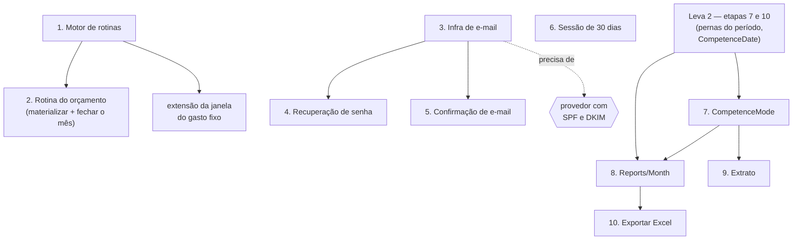

# Plano de desenvolvimento — leva 3: o que depende de infra ou de decisão

Terceiro documento da sequência, depois do [1. ROADMAP- MVP.md](1.%20ROADMAP-%20MVP.md) (a leva do
MVP, fechada) e do
[2. Plano de Desenvolvimento - Leva 2.md](2.%20Plano%20de%20Desenvolvimento%20-%20Leva%202.md) (o
que sobe junto com o MVP).

As etapas desta leva têm **numeração própria**, como as das outras — "etapa 3 da leva 3" e
"etapa 3 da leva 2" são coisas diferentes. Daí a regra que vale em todo o `docs/`: **um documento
nunca cita a etapa de outro.** Referência cruzada é sempre de **leva**, e o que precisa ser dito
sobre a etapa se diz pelo nome do que ela entrega — que não muda de número. Foi a renumeração de
2026-09-07 que cobrou isso: ela quebrou quarenta e poucos apontamentos espalhados por quatro
documentos, cada um deles apontando em silêncio para a etapa errada. Aqui dentro, "etapa 3" sem
qualificação é sempre desta leva.

Aqui estão as pendências que **não dependem de escrever código primeiro**: elas dependem de
o projeto ganhar algo que ainda não tem — envio de e-mail, motor de rotinas, geração de planilha
— ou de alguém decidir uma coisa que ninguém decidiu. Duas dessas três **nascem aqui dentro**: o
motor de rotinas é a etapa 1 e a infra de e-mail é a etapa 3. O que continua sendo dependência
externa é o **provedor** de e-mail, com SPF e DKIM publicados, e a biblioteca de planilha. Estão levantadas em
[Pendencias Backend.md](../Pendencias%20Backend.md), como as da leva 2.

**Este documento não é uma fila de trabalho pronta.** Ele fixa o desenho e a ordem para que
nenhuma das dez seja começada duas vezes ou do jeito errado, e registra, etapa a etapa, **o que
precisa ser decidido antes de a primeira linha ser escrita**.

---

## Onde estamos

Das 16 pendências levantadas, uma está aplicada, sete são a
[leva 2](2.%20Plano%20de%20Desenvolvimento%20-%20Leva%202.md) e seis são esta leva — a sétima,
notificações, saiu do MVP. Somam-se a elas **três demandas de produto** (as etapas 5, 7 e 9) e **a
infra que outras precisam** (as etapas 1 e 3), o que dá as dez etapas abaixo. **Elas estão
numeradas na ordem em que devem ser executadas** — ler de cima para baixo é a fila.

| Etapa | O que é | Pendência | O que a trava |
| --- | --- | --- | --- |
| **1** | [O motor de rotinas](#etapa-1--o-motor-de-rotinas) | — *infra* | nada; abre a leva, porque a etapa 2 roda dentro dela |
| **2** | [A rotina mensal do orçamento](#etapa-2--a-rotina-mensal-do-orçamento) | [4](../Pendencias%20Backend.md#4-rotina-mensal-de-orçamento) | a [etapa 1](#etapa-1--o-motor-de-rotinas) — é dentro do motor dela que a rotina roda |
| **3** | [A infra de e-mail](#etapa-3--a-infra-de-e-mail) | — *infra* | nada no código; o **provedor** com SPF/DKIM é externo |
| **4** | [Recuperação de senha](#etapa-4--recuperação-de-senha) | [6](../Pendencias%20Backend.md#6-recuperação-de-senha) | a [etapa 3](#etapa-3--a-infra-de-e-mail), que sobe junto |
| **5** | [Confirmação de e-mail](#etapa-5--confirmação-de-e-mail) | — *demanda de produto* | a etapa 3 |
| **6** | [Duração de sessão configurável](#etapa-6--duração-de-sessão-configurável) | [5](../Pendencias%20Backend.md#5-duração-de-sessão-configurável) | nada; só prioridade |
| **7** | [`CompetenceMode`: o cartão que conta como débito](#etapa-7--competencemode-o-cartão-que-conta-como-débito) | — *demanda de produto* | a leva 2, que grava a `CompetenceDate` na perna |
| **8** | [Agregados do mês](#etapa-8--agregados-do-mês) | [3](../Pendencias%20Backend.md#3-agregados-do-mês-para-o-dashboard) | a leva 2 (pernas do período, `CompetenceDate`) — **não mais o volume**, ver o saldo de abertura |
| **9** | [Extrato de conta e de cartão](#etapa-9--extrato-de-conta-e-de-cartão) | — *demanda de produto* | a [etapa 7](#etapa-7--competencemode-o-cartão-que-conta-como-débito), de quem é a decisão de por qual data o saldo corta |
| **10** | [Exportar para Excel](#etapa-10--exportar-para-excel) | [8](../Pendencias%20Backend.md#8-exportar-para-excel) | depende da etapa 8 |

**A numeração é a ordem de execução, e passou a ser em 2026-09-07.** Antes ela era ordem de
levantamento: a infra estava nos números mais altos sem ser a última da fila, o 4 tinha virado
buraco com a saída das notificações, e a seção seguinte precisava explicar em prosa uma fila que
a tabela contradizia. Agora as duas dizem a mesma coisa.

**Renumerar só foi possível porque nenhuma etapa desta leva foi executada.** O número vira
identidade no instante em que existir o primeiro commit `Fase #3 | Etapa N`, e a partir daí
congela: reordenar depois faria "etapa 4 da leva 3" querer dizer duas coisas conforme a data de
quem lê, e os commits apontariam para a errada. Se uma etapa nova nascer com a leva em curso, ela
entra no fim com o próximo número livre, mesmo que a ordem de execução seja outra — a partir do
primeiro commit, é a seção seguinte que passa a mandar na fila, não a numeração.

As notificações não voltam como número nenhum: elas saíram da leva, e o que se sabia sobre elas
está em *O que não entra nesta leva*.

**Três das dez poderiam começar hoje: a 1, a 3 e a 6** — e não é coincidência que duas delas sejam
a infra. As outras sete esperam uma etapa anterior: a 2 espera a 1, a 4 e a 5 esperam a 3, a 7 e a
8 esperam a leva 2, a 9 espera a 7 e a 10 espera a 8. O valor deste documento está em dizer
**qual**, para ninguém abrir a etapa errada por parecer a mais fácil — e a seção seguinte diz
**por quê**, que é o que sobrevive quando alguém quiser furar a fila.

---

## Ordem das etapas e por quê



- **1 antes de 2** — inversão de 2026-09-07, e é ela que reordenou a leva inteira. A rotina do
  orçamento vivia sem motor, por materialização preguiçosa no `GET`, e a razão era o projeto não
  ter agendador; como é esta leva que constrói o agendador, a premissa não sobrevivia ao próprio
  documento. A 2 volta a ser o que o nome dela sempre disse — uma rotina — e vira o primeiro
  consumidor da 1, imediatamente depois dela: infra sem consumidor continua sem ter como ser
  validada, e agora a fila é de um.
- **3 antes de 4 e de 5.** A infra de e-mail nasce uma vez só e sobe **junto com a etapa 4**, que
  é o primeiro consumidor: a 4 já tem desenho fechado e nenhuma decisão pendente, então é ela que
  valida a infra sem arrastar mais nada. A 5 vem depois, com a infra já provada.
- **6 não depende de ninguém.** Está aqui, e não antes, por fechar o bloco de autenticação: as
  três mexem no mesmo `POST /Users/login` e no mesmo cookie, e agrupá-las poupa reabrir o assunto
  três vezes. É a única posição desta lista que é conveniência, não dependência — e por isso é a
  única que se pode furar sem quebrar nada.
- **7 e 8 depois da leva 2** — as duas leem a `CompetenceDate` da perna, que nasce lá. Com ela gravada, a etapa 7 só muda **o que se escreve** na coluna e a 8 só soma o que
  já está escrito; sem ela, as duas teriam que recalcular a data na consulta.
- **8 depende ainda das pernas do período**, que também são da leva 2: com elas consultáveis, o
  agregado do mês é uma soma sobre o que já estará escrito.
- **9 depois de 7**, por menos independente do que parece. A 9 é a abertura linha a linha do
  `AccountBalance`, e era a etapa 7 que tinha em aberto **por qual data o saldo corta**. A 7
  fechou isso em 2026-09-07 (a perna ganhou `CashDate` ao lado da `CompetenceDate`), e a decisão
  chegou pronta na 9: o extrato da conta corta pela `CashDate`, como o saldo. Construir a 9 antes
  seria construí-la duas vezes. Ela também divide pasta com a 8, e quem chegar primeiro cria
  `routes/Reports/`.
- **10 depois de 8**: a planilha tem que sair com os mesmos números da tela, e a única forma de
  garantir isso é as duas lerem do mesmo lugar.

---

## Etapa 1 — O motor de rotinas

**Infra** — não sai de pendência nenhuma: sai de duas etapas que querem a mesma coisa ·
**Pasta nova:** `rotines/` · **Tabela nova:** `RotineRuns`

O projeto já tem **meia infra de rotina**, herdada da V3 e nunca usada: `Logs.insertRotineLog`
escreve em `Logs/rotines/<nome>/` (`Utils/Logs.ts`) e `constants.logs.rotine` liga e desliga esse
log. O que falta é o motor.

### O que vai rodar

| Rotina | Quando | De quem é |
| --- | --- | --- |
| Fechar o mês do orçamento (`Status='closed'`, `ClosedAt`) | todo dia 1º | etapa 2 |
| Materializar `BudgetPeriods` do mês | todo dia 1º | etapa 2 |
| Estender a janela do gasto fixo | mensal | leva 1: `Occurrences` gera 12 meses à frente e a corrente **acaba** |

As duas primeiras **são a etapa 2 inteira**, e é aqui que ela roda. Até 2026-09-07 a
materialização tinha um segundo caminho — nascer na leitura do `GET /Budgets` — e este documento
defendia os dois juntos, apoiado num consumidor que não existe mais: o aviso de "orçamento
estourado", que saiu com as notificações. Sem ele, **ninguém lê `BudgetPeriods` a não ser a
tela**, e dois escritores para uma linha congelada deixam de ser redundância barata e viram um
sorteio de qual teto virou história. A etapa 2 registra o desfecho; aqui basta saber que a rotina
é a **única** escritora do mês.

### Por que não é "timer + de quanto em quanto tempo"

O padrão herdado da V3 — uma pasta com um `index.ts` que registra tudo e um timer administrando de
quanto em quanto tempo cada uma roda — **acerta a forma e erra o relógio**. Ele expressa
*intervalo*, e as três rotinas acima são *calendário*. Três consequências, e a terceira é a que
mata:

1. **Deriva.** `setInterval(24h)` conta a partir do boot, não das 3h da manhã. Depois de um mês de
   uptime a rotina roda em horário aleatório.
2. **Reset no deploy.** Subir versão todo dia às 23h faz a rotina diária **nunca** rodar: o timer
   reinicia antes de completar.
3. **Não tem catch-up.** Servidor fora do ar no dia 1º e o mês não foi materializado — sem que
   ninguém fique sabendo. Numa rotina mensal, errar uma vez é perder o mês, e `BudgetPeriods` é
   justamente o que faz "qual era meu limite em março" ter resposta.

### DECIDIDO: tick de um minuto, agenda declarativa, e o registro da execução no banco

O tick só pergunta **o que venceu**; quem decide se roda é o banco.

```
rotines/
  index.ts                          — o registro: a lista, e nada mais
  section/RotineEngine.ts           — o tick, a reivindicação, o log, o try/catch
  RotineRuns.model.ts               — a tabela de execuções
  CloseBudgetMonth.rotine.ts
  ExtendRecurringExpenses.rotine.ts
```

`rotines/` na raiz, ao lado de `routes/`, porque é uma **segunda família de pontos de entrada** —
enterrá-la em `Utils/` a descreveria errado. E a grafia `rotine` (não `routine`) mantém coerência
com `Logs/rotines/` e `constants.logs.rotine`, que já existem escritos assim.

```ts
export interface Rotine {
    name: string
    schedule: { kind: "daily", hour: number }
             | { kind: "monthly", day: number, hour: number }
    run(ScheduledFor: string): Promise<void>
}
```

**O motor, a cada tick:**

1. calcula a **última ocorrência vencida** de cada rotina — `lastDueOccurrence(schedule, now)`;
2. tenta inserir `RotineRuns { Name, ScheduledFor }` com `onConflict().ignore()`;
3. roda só quem conseguiu inserir, e grava `FinishedAt`/`Status`/`Error` no fim.

Essa inserção é o mesmo truque que a **etapa 2 já decidiu** usar para o `BudgetPeriods`, e aqui
ela compra três coisas de uma vez:

- **Catch-up de graça.** Servidor caído no dia 1º e de pé no dia 2: a última ocorrência vencida
  *ainda é a do dia 1º*, ninguém a registrou, ela roda. O problema 3 morre sem uma linha de
  lógica de recuperação — a rotina nunca pergunta "que horas são", pergunta "o que venceu e não
  está registrado".
- **Idempotência.** Duas instâncias, ou um restart em loop, e o `unique(Name, ScheduledFor)` faz
  a segunda simplesmente não escrever e não rodar. Vale hoje, com instância única, e continua
  valendo no dia em que não for — que é o único jeito de escrever isso uma vez só.
- **Observabilidade.** Histórico de execução consultável, que hoje só existiria em arquivo de log.

**DECIDIDO: reivindica só a ocorrência mais recente, nunca um backlog.** Cinco dias fora do ar não
disparam cinco execuções da rotina diária. Rotina aqui é **convergente** — rodar de novo chega no
mesmo estado —, e é isso que torna o catch-up seguro. No dia em que alguma precisar processar cada
ocorrência perdida, ela não é rotina: é fila, e a discussão é outra.

**DECIDIDO: o registro das rotinas é código, não tabela.** `RotineRuns` guarda execuções; não
existe tabela `Rotines`. Um catálogo em banco permitiria desligar no banco uma rotina que o código
ainda acha que existe, e é assim que os dois divergem. Ligar e desligar, quando precisar, sai de
`constants.json`, que já é o mecanismo do projeto para flag ajustável em runtime.

**`RotineRuns` é a primeira tabela do projeto sem `IdWorkspace`** — desvio consciente da regra
"toda tabela de domínio é escopada por tenant", pela razão que a torna útil: ela não é de domínio,
é do sistema, e uma execução atravessa todos os workspaces. Colunas: `Name`, `ScheduledFor`,
`StartedAt`, `FinishedAt`, `Status` (`running` / `done` / `failed`), `Error`, mais o
`unique(Name, ScheduledFor)` que carrega a etapa inteira. Sem `Active`: o ciclo de vida vem do
`Status`, como manda a convenção.

### Descartados

- **`node-cron`.** Resolve só a metade fácil — o "venceu?" —, que com moment são dez linhas
  tipadas, e troca um `schedule` que o compilador confere por uma string que ninguém confere. A
  metade difícil (reivindicação, catch-up, registro de execução) ele não faz.
- **`pg-boss` ou fila de verdade.** Traz agendamento, retry e lock prontos, ao custo de um schema
  paralelo dentro do banco. Não se paga com três rotinas convergentes. **O gatilho para reabrir
  é o e-mail:** no dia em que o envio precisar de retry com backoff e visibilidade de falha por
  mensagem, aí é fila — e a fila engole o motor, não o contrário.

### Pontos de atenção

- **A rotina roda como o sistema, e `assertMember` não se aplica.** Ela itera os workspaces ela
  mesma: o escopo do tenant vem do laço, não de um token. O risco real não é a rotina quebrar — é
  alguém **afrouxar o `assertMember`** para aceitar um ator nulo, e abrir buraco nas rotas. A
  rotina chama as sections passando `IdWorkspace` direto, abaixo da camada de acesso.
- **A rotina delega, não reimplementa** — a mesma regra da etapa 8. Ela é um terceiro chamador ao
  lado do controller e do teste, e `BudgetPeriods/sections/POST/createForMonth.ts` já nasceu
  recebendo transaction e mês exatamente para isto.
- **Uma transaction por workspace, não por tick.** Um workspace com dado ruim não pode derrubar os
  outros quinhentos: cada unidade falha sozinha e vira uma linha de erro.
- **Fuso.** `moment` sem timezone usa a hora do servidor. Com o processo em UTC, uma rotina "dia 1º
  às 00:30" dispara às 21:30 do dia 31 no Brasil e materializa o mês errado — a mesma armadilha
  que o `CLAUDE.md` já documenta para as datas de calendário. `TZ=America/Sao_Paulo` no processo é
  a correção mais barata; escolher um horário de madrugada **não** resolve sozinho.
- **O motor não pode ligar em teste.** `npm run start:test` sobe a API contra o banco de teste, e
  uma rotina disparando no meio da suíte muda o banco debaixo de um teste que está rodando. Liga
  só no `index.ts`, e só fora de `NODE_ENV=test` — é o mesmo problema que o `memoryLog.stop()` já
  teve que resolver, e que custou uma falha aleatória para ser descoberto.
- **Sem disparo manual em produção, por enquanto.** A tentação é uma rota `POST /Rotines/:Name/run`
  ou um script de CLI; a primeira acrescenta superfície de autenticação para um caso de uso
  raríssimo, e o segundo é uma segunda entrada no webpack. Como a rotina é convergente e o
  catch-up já cobre a queda, a resposta em produção é **esperar o próximo tick**. Se um dia isso
  não bastar, o custo está medido aqui.

### Testes

O que sustenta a suíte é uma decisão de forma: **`lastDueOccurrence` é função pura de
`(schedule, now)`**. É ela que permite testar "1º de março às 3h" sem esperar março.

- a ocorrência vencida de uma agenda mensal em fevereiro, em mês de 30 e em mês de 31 dias — e com
  `day: 31`, onde o `Utils.setDayOfMonth` apara o dia (o `date()` do moment não apara sozinho);
- **reivindicação dupla no mesmo `ScheduledFor` roda uma vez só** — o teste da etapa;
- **catch-up:** relógio no dia 2, sem execução registrada do dia 1º, e a rotina roda com o
  `ScheduledFor` do dia 1º;
- **sem backlog:** cinco dias sem execução geram uma execução, não cinco;
- um workspace que estoura não impede os outros, e a falha fica gravada em `Error`.

**Contrato:** **nenhuma entrada** — é a primeira etapa do projeto que o front não enxerga de jeito
nenhum. As rotinas que o motor hospeda mudam número na tela, mas aí a entrada no changelog é de
cada rotina, não do motor.

---

## Etapa 2 — A rotina mensal do orçamento

**Pendência 4** — é a rotina que o ROADMAP da leva 1 deixou de fora por falta de agendador ·
**Pastas:** `routes/Budgets/`, `routes/BudgetPeriods/`, `rotines/` ·
**Depende da [etapa 1](#etapa-1--o-motor-de-rotinas)**

### DECIDIDO: é rotina de verdade, e não materialização preguiçosa no `GET /Budgets`

**Decisão revista em 2026-09-07.** A versão anterior desta etapa mandava o mês pedido nascer na
primeira leitura, dentro de transaction, e a justificativa era uma frase só: *"o projeto não tem
agendador"*. Ele passa a ter, na **etapa 1 desta mesma leva** — a premissa da alternativa barata
morre dentro do próprio documento que a escreveu. Enquanto a 8b esteve presa na leva 1 a leitura
preguiçosa era a saída; com o motor na fila, ela deixou de ser.

E o motivo para desfazer não é só que ficou desnecessária. **Ela estava errada para qualquer mês
que não fosse o corrente**, e de um jeito que o teste feliz não pega:

- `GET /Budgets?ReferenceMonth=2026-03` criaria março **com o teto de hoje** e o congelaria. Isso é
  exatamente o que o `BudgetPeriods` existe para impedir — a regra do `CLAUDE.md` é "nunca leia o
  teto de um mês passado no `Budgets`", e a leitura preguiçosa faz isso e ainda grava o resultado
  como se fosse história.
- No sentido futuro é a mesma coisa: abrir dezembro em setembro congela o teto de setembro em
  dezembro, e a rotina de 1º de dezembro encontra a linha lá e passa reto pelo
  `onConflict().ignore()`. O mês nasce errado e nada o corrige.
- E **dois escritores para uma linha congelada** só convergem enquanto o teto não muda entre os
  dois momentos. Se mudou, quem chegou primeiro decidiu qual valor virou história — cara ou coroa
  numa tabela cuja razão de existir é responder "qual era meu limite em março".

**A rotina não tem nenhum dos três problemas** porque ela roda no dia em que o mês começa: o teto
que ela congela é o que valia naquele dia, por definição, e ela é a única a escrever.

### O que a etapa entrega

Duas rotinas mensais, no dia 1º, registradas no motor da etapa 1 — e elas andam juntas porque são
a mesma coisa vista dos dois lados da virada:

| Rotina | O que faz |
| --- | --- |
| Materializar `BudgetPeriods` | cria o mês novo a partir das definições `Active` |
| Fechar o mês anterior | `Status='closed'`, `ClosedAt` |

O fechamento **estava adiado para a etapa 1** justamente por ser evento de tempo e não de leitura.
Com a materialização virando rotina também, a separação perde a razão: as duas passam a ser uma
etapa só, no mesmo tick.

**A janela entre cadastrar um orçamento e a virada do mês já está coberta:** `POST /Budgets` grava
a definição e materializa o mês corrente na mesma transaction, e isso já existe. A rotina cuida das
viradas seguintes; ninguém fica sem o mês em que cadastrou.

**Mês passado que a rotina nunca rodou não é materializado.** A resposta certa é "esse mês não tem
período" — e não um teto inventado agora. Se a rotina perdeu a virada por queda do servidor, quem
resolve é o catch-up da etapa 1, que roda a ocorrência vencida com o `ScheduledFor` do dia 1º.

**Pontos de atenção**

- **Só inserir o que falta, nunca atualizar.** A rotina não pode recriar o mês que o usuário
  cadastrou à mão nem sobrescrever o teto que ele ajustou: `BudgetPeriods` é o mês *congelado*, e
  o que faz "qual era meu limite em março" ter resposta é justamente ele não ser recalculado. O
  `unique(IdBudget, ReferenceMonth)` com `onConflict().ignore()` continua sendo o mecanismo.
- Reusa `BudgetPeriods/sections/POST/createForMonth.ts` sem tocá-lo — ele nasceu recebendo a
  transaction e o mês exatamente para isto, e agora tem os três chamadores previstos: a rota, a
  rotina e o teste.
- Só `Budgets.Active = true` entra. **É aqui que o `Active` finalmente passa a significar
  alguma coisa** — hoje nada o lê.
- **Uma transaction por workspace**, como a etapa 1 exige de toda rotina: um workspace com dado
  ruim não pode deixar os outros sem o mês.
- **O `GET /Budgets` não escreve mais nada** — e é bom que fique assim. A versão preguiçosa teria
  sido a única rota de leitura do projeto a gravar; a etapa acaba sem esse desvio, em vez de com
  ele documentado.

**Contrato:** 🟡 **Comportamento** na seção 13 — o mês passa a existir sozinho, e a tela para de
precisar do recado "seu teto de alimentação existe, mas não para este mês". **Não** há entrada
sobre o `GET` que escreve: essa rota nunca chegou a existir.

---

## Etapa 3 — A infra de e-mail

**Infra** — como a etapa 1, não sai de pendência: sai de três coisas que precisam mandar e-mail ·
**Arquivo novo:** `Utils/Connections/Mailer.ts` · **Pasta nova:** `Utils/Mail/templates/` ·
**Sobe junto com a [etapa 4](#etapa-4--recuperação-de-senha)**, que é o primeiro consumidor

O `nodemailer@10` já está instalado, e a classe de transporte já existe em `Utils/nodeMailer.ts` —
trazida pronta de outro projeto. Ela **traz os próprios tipos** (`dist/cjs/*.d.ts`), então não
precisa de `@types/nodemailer`, e traz o `jsonTransport`, que é o que resolve o teste.

### As três camadas

| Camada | Onde | Sabe o quê |
| --- | --- | --- |
| **Transporte** — a classe que já existe | `Utils/Connections/Mailer.ts` | SMTP, pool, timeout, `from`. Zero domínio |
| **Mensagem** | `Utils/Mail/templates/*.ts` | que existe um e-mail "recupere sua senha", e o que ele precisa receber |
| **Motivo** | a section que tem a razão de mandar | quando enviar, e nada de como |

**O transporte vai para `Utils/Connections/`**, onde já moram Knex e Socket — é a família das
conexões externas, e o e-mail é uma. Hoje o arquivo está solto em `Utils/`.

**Os templates ficam centralizados**, e não com a feature dona — o contrário do que o projeto faz
com os schemas Joi. A razão é que e-mail tem *chrome compartilhado*: cabeçalho, rodapé, cor,
assinatura. Um schema Joi não tem nada em comum com outro; três e-mails têm um layout em comum, e
é ele que decide onde os três moram.

### O que muda na classe que veio pronta

A forma está certa e fica. Sete ajustes, e **os três primeiros são de segurança**:

1. **`ignoreTLS: true` sai.** Ele desliga o STARTTLS, e como `secure` vem de env, o caso provável
   (porta 587, `secure=false`) é o login SMTP **e o corpo do e-mail** atravessando a rede sem
   cifra. Num "a rotina terminou" isso é aceitável; aqui o corpo **é** a credencial — quem lê o
   link troca a senha. Vai `secure: true` na 465, ou `requireTLS: true` na 587.
2. **`from: process.env.MAIL_USER` vira `MAIL_FROM` por `getEnv`.** Acesso direto ao `process.env`
   é contra a regra do projeto (e a própria classe já faz certo três linhas acima); o tipo
   `string | undefined` transforma a falta num `from` vazio em runtime, em vez de um erro no
   boot; e o remetente não é o login do SMTP — o provedor vai exigir endereço autorizado, e a
   tela quer ler `Gastos Mensais <nao-responda@…>`.
3. **`to: emails.join(", ")` vira um destinatário por chamada.** Como está, todo mundo aparece no
   mesmo cabeçalho `To` e cada destinatário vê a lista inteira. Nos três casos de hoje é sempre um
   só, então não dói **agora** — mas o primeiro envio em lote que aparecer vai chamar este método,
   e aí é vazamento de endereço entre usuários. Custa uma linha hoje e é invisível depois.
4. **Ganha `html`, além do `text`.** Os três casos carregam link; o `html` é o que o template
   renderiza e o `text` continua indo como alternativa.
5. **Vira instância única, com `pool: true`.** Knex e `cacheEngine` são instância única exportada;
   sem pool, cada envio abre TCP + TLS + auth do zero — e esse custo entra direto na latência do
   cadastro, pela razão da seção seguinte.
6. **A escolha do transporte vem antes da leitura das envs.** `getEnv(key, false)` estoura se
   faltar, então hoje qualquer ambiente sem configuração de e-mail quebra no instante em que a
   classe for construída — a suíte inclusive. Em `NODE_ENV=test` o `Mailer` nem chega a olhar para
   `MAIL_*`.
7. Menores: `sendMail` já devolve promise no nodemailer 10, então o `new Promise` em volta pode
   sumir; e `connectionTimeout`/`greetingTimeout`/`socketTimeout` explícitos, porque o default é
   longo e esse envio é aguardado dentro da requisição.

A assinatura que sai disso — e o `Mailer` não sabe o que está mandando:

```ts
class Mailer {
    public send(message: { to: string, subject: string, text: string, html?: string }): Promise<void>
}
```

### DECIDIDO: o envio pendura no `attachOnEnd`, que já existe

`KnexTransaction` passa um `TransactionEvents`, e o `fireOnEnd` roda **depois** que a transaction
resolveu (`Utils/Connections/Knex/KnexConnection.ts`). É exatamente a semântica que o e-mail de
cadastro precisa: o signup grava usuário, workspace e person numa transaction só, e o e-mail **não
pode sair de dentro dela** — um rollback depois do envio manda boas-vindas para uma conta que não
existe. E o `fireOnEnd` já engole o erro em `Logs.handleError`, então **SMTP fora do ar não derruba
o cadastro**, que é a falha que mais importa evitar: um provedor de e-mail impedindo alguém de
criar conta.

**A ressalva, que é real:** o `fireOnEnd` é *aguardado* antes da resposta. Ele não quebra a
requisição, mas soma a latência do SMTP nela. Aceito no cadastro e na recuperação — é uma vez por
conta, e o usuário está justamente esperando o e-mail — e é o único tipo de envio que esta leva
tem, pela decisão seguinte.

### DECIDIDO: um caminho só, porque os dois e-mails desta leva são transacionais

Os dois casos que existem — recuperação e confirmação — têm o usuário na tela esperando o e-mail,
e uma falha se recupera sozinha: ele pede de novo. Então o envio vai **direto**, com o reenvio
como rede de segurança, e **esta etapa não constrói fila nem outbox**.

**O que fica registrado é o critério de quando isso deixa de bastar**, porque ele já foi
levantado e seria redescoberto do zero: um e-mail que o *sistema* dispara sozinho não tem ninguém
olhando, e uma falha nele é indistinguível de "não havia nada a avisar" — esse precisa de
persistência. O dia em que existir um, o outbox **não precisará de tabela nova**: a `Notifications`
já tem `ScheduledFor`, `SentAt` e o índice `["ScheduledFor","SentAt"]` que a varredura pede, e a
rotina da etapa 1 lê o que venceu e não foi enviado, envia e carimba. Falta só `Attempts`/
`LastError`, se for retentar. Notificações saíram do MVP e esse dia não é agora.

Fila de verdade (`pg-boss`) continua descartada pelo mesmo motivo da etapa 1, agora com o gatilho
conhecido: quando o envio precisar de backoff e visibilidade de falha por mensagem.

### DECIDIDO: template é módulo TypeScript, não arquivo `.html`

Um `.html` lido do disco em runtime **não entra no bundle**: o `build:app` empacota `index.ts` em
`build/bundle.js`, e um `readFile("templates/reset.html")` procura um arquivo que ninguém copiou —
a mesma armadilha que fez as migrations serem compiladas à parte. Ou se acrescenta um passo de
cópia no webpack, ou o template é código.

E é código pelo motivo que sobrevive ao build: `renderResetPassword({ Name, Link })` faz o
compilador reclamar quando falta um parâmetro. Um `{{Link}}` que ninguém substituiu chega ao
usuário como `{{Link}}`.

### As envs, e a que se esquece

As cinco da classe entram no `exemple.env` com os nomes que já têm — `MAIL_SMTP`,
`MAIL_SMTP_PORT`, `MAIL_SMTP_SECURE`, `MAIL_USER`, `MAIL_PASSWORD`. Faltam duas:

- **`MAIL_FROM`**, pelo ajuste 2;
- **`APP_URL`**, que é a que se esquece. Hoje a API não sabe a própria URL pública, e **todo**
  e-mail destas etapas carrega um link. Sem essa env alguém monta o link com o `Host` da
  requisição — e um `Host` forjado vira um link de recuperação de senha apontando para o servidor
  de outra pessoa.

**O link do e-mail aponta para o front, não para a API.** `APP_URL/recuperar-senha?token=…`, e a
tela é que chama `POST /Users/resetPassword`. É o que a etapa 4 já desenhou ao receber o token no
corpo, e é o que impede o e-mail de virar um `GET` que muda estado.

### Pontos de atenção

- **Duas rotas públicas que disparam e-mail, e o projeto não tem rate limiting.** Já estava
  registrado na etapa 4; com o reenvio da etapa 5 viram duas. O remendo barato e nativo daqui é
  um cooldown no `cacheEngine`, que já é cache em memória com bucket por chave — não precisa de
  tabela nem de dependência nova.
- **Entregabilidade não é código.** Mandar como `@gastosmensais.com.br` por um SMTP não autorizado
  no SPF/DKIM cai em spam, e nenhuma arquitetura conserta isso. Escolher o provedor e publicar os
  registros DNS é dependência externa desta etapa — a mesma natureza do "travada por envio de
  e-mail" que a etapa 4 declarava.
- **O `Mailer` não loga o corpo.** O `text` de um e-mail de recuperação contém o token. `Logs`
  registra que saiu um e-mail, para quem e qual template — nunca o conteúdo. É a mesma regra do
  `Utils.redactSensitive` sobre o `req.body`.

### Testes

Em `NODE_ENV=test` o `Mailer` usa o **`jsonTransport`** do nodemailer: nada sai pela rede, e a
suíte afirma *"saiu um e-mail para este endereço, com este link"* sem mock nenhum. É o que mantém
a regra de não mockar nada e ainda testa o **conteúdo**, que é onde os bugs de e-mail moram — um
template com a variável errada passa em qualquer teste que só verifique "o envio foi chamado".

- o `Mailer` em teste não lê `MAIL_*` e não abre conexão;
- cada template renderiza com todos os parâmetros, e o link sai com o `APP_URL` configurado;
- **o e-mail sai depois do commit, nunca antes**: uma transaction que dá rollback não envia nada —
  o teste da etapa;
- SMTP quebrado **não** quebra a rota que o disparou.

**Contrato:** **nenhuma entrada por si.** A infra não tem rota; quem traz rota é a etapa 4, que
sobe junto.

---

## Etapa 4 — Recuperação de senha

**Pendência 6** · **Pasta:** `routes/Users/` · **Sobe junto com a [etapa 3](#etapa-3--a-infra-de-e-mail)**, como primeiro consumidor dela

| Rota | Auth | Corpo |
| --- | --- | --- |
| `POST /Users/forgotPassword` | público | `{ Email }` |
| `POST /Users/resetPassword` | público | `{ Token, NewPassword }` |

**DECIDIDO: o token é um JWT curto, sem tabela nova** — mesmo padrão do `ChallengeToken` da
biometria (`UsersAuth/sections/WebAuthnChallenge.section.ts`), que já resolve o mesmo problema no
projeto: provar que um dado veio da API e não do cliente, sem guardar estado entre duas
requisições.

**DECIDIDO: uso único sem tabela, por construção.** O token carrega
`{ IdUser, type: 'reset' }` **mais um prefixo do hash da senha atual**. Trocar a senha muda o
hash, e o token deixa de casar — ele morre no primeiro uso sozinho. É o que evita criar tabela e
rotina de limpeza para um fluxo que roda três vezes por ano.

**Pontos de atenção**

- **`forgotPassword` responde `200` sempre**, inclusive para e-mail inexistente. Sem isso a rota
  vira um verificador de quais e-mails têm conta — é a mesma razão pela qual o login usa a mesma
  `msg` para e-mail errado e senha errada.
- O `type` dentro do token é obrigatório pela mesma razão que na biometria: um token de outra
  finalidade não pode ser gasto aqui.
- Validade curta (15 a 30 minutos), não as 24h da sessão.
- **O projeto não tem rate limiting.** Uma rota pública que dispara e-mail é o primeiro lugar
  onde isso passa a doer — registrar como o que falta, não como parte desta etapa.
- `PasswordHasher` continua sendo o único lugar que hasheia (`bcrypt` custo 12), e a senha nova
  chega no **corpo**, nunca na URL.

**Contrato:** 🟢 **Adição** — duas rotas públicas na seção 4.

---

## Etapa 5 — Confirmação de e-mail

**Demanda de produto de 2026-09-07** · **Pasta:** `routes/Users/` · **Depois da etapa 3**

Hoje ninguém prova que o endereço cadastrado é seu. Duas consequências: uma conta pode nascer
sobre um e-mail com erro de digitação e o dono nunca receber recuperação de senha — fica trancado
para fora sem ter feito nada errado; e o endereço de outra pessoa pode ser usado no cadastro.

**DECIDIDO: o usuário não confirmado entra e usa o app normalmente.** `Users.EmailConfirmedAt`
nasce nulo, o login funciona, e a tela mostra uma faixa pedindo a confirmação. Bloquear o login
seria mais simples de raciocinar, e é o que custa cadastro: quem não recebe o e-mail — spam,
typo, provedor lento — fica trancado do lado de fora dependendo de o reenvio funcionar. Com a
coluna gravada, bloquear **alguma coisa específica** depois (convidar alguém para o workspace,
por exemplo) não precisa de migration nenhuma.

| Rota | Auth | Corpo |
| --- | --- | --- |
| `POST /Users/confirmEmail` | público | `{ Token }` |
| `POST /Users/resendConfirmation` | público | `{ Email }` |

**DECIDIDO: o token é o mesmo padrão da etapa 4** — JWT curto, sem tabela, com `type: 'confirm'`
dentro, pelo motivo que já vale na biometria e na recuperação: um token de outra finalidade não
pode ser gasto aqui. Ele carrega `{ IdUser, Email, type }`, e o `Email` é o que o torna **de uso
único por construção**: confirmar preenche `EmailConfirmedAt`, e trocar o endereço faz o token
antigo deixar de casar com o que está gravado.

### Pontos de atenção

- **Trocar o e-mail tem que limpar `EmailConfirmedAt` e reenviar.** `PUT /Users` altera `Email`
  hoje. Sem isso eu confirmo `a@x.com`, troco para `b@y.com` e continuo "confirmado" num endereço
  que nunca provei ser meu — o que anula a etapa inteira. É a linha mais fácil de esquecer aqui.
- **`resendConfirmation` responde `200` sempre**, inclusive para e-mail inexistente, pela mesma
  razão do `forgotPassword` da etapa 4: senão a rota vira um verificador de quais e-mails têm
  conta. E leva um cooldown por endereço.

**DECIDIDO (revisto na execução): o cooldown NÃO passa pelo `cacheEngine`.** O desenho acima
previa reaproveitá-lo — ele já é um cache em memória por chave, e seria a peça óbvia. O que
não tinha sido visto é que ele é **exposto por HTTP**: `GET /Cache/CacheName=:CacheName`
devolve o balde inteiro para qualquer sessão autenticada, e `POST /Cache` escreve nele.
Guardar ali a lista de quem pediu reenvio publicaria **exatamente** o que a resposta 200-sempre
existe para esconder — quais e-mails têm conta —, e um `POST /Cache` limparia o freio. Ele
virou um `Map` privado dentro de `MailCooldown.section.ts`, com a chave hasheada, que não tem
nenhuma das duas portas. As duas consequências aceitas são as mesmas de qualquer coisa em
memória: morre no restart, e afrouxa na proporção do número de instâncias — o dia em que isso
importar, o ponto de troca é aquele arquivo, que é o único que sabe onde a janela mora.
- **O disparo no cadastro pendura no `attachOnEnd`**, nunca dentro da transaction do signup — ver
  a etapa 3.
- **Confirmar duas vezes não é erro.** A segunda chamada encontra `EmailConfirmedAt` preenchido e
  responde `200` sem escrever: o usuário que clica no link de novo, ou o pré-carregador de link do
  cliente de e-mail, não podem ver uma tela de erro.

### Testes

- cadastro grava `EmailConfirmedAt` nulo e dispara **um** e-mail, depois do commit;
- o token confirma, e o segundo uso responde `200` sem reescrever;
- **trocar o e-mail derruba a confirmação e o token antigo para de valer** — o teste da etapa;
- token de outro `type` (reset, ou o `ChallengeToken` da biometria) é recusado;
- `resendConfirmation` responde igual para e-mail que existe e para e-mail que não existe.

**Contrato:** 🟢 **Adição** na seção 4 — duas rotas públicas — e 🟡 **Comportamento**: `getSelf`
passa a devolver `EmailConfirmedAt`, que é o que a faixa da tela lê para saber se aparece.

---

## Etapa 6 — Duração de sessão configurável

**Pendência 5** · **Pasta:** `routes/Users/`

**DECIDIDO: `RememberDevice` booleano opcional no `POST /Users/login`**, escolhendo entre 24h
(default) e 30 dias — os dois números que a tela de login já promete.

**Pontos de atenção — as duas armadilhas valem mais que a etapa**

- **`expiresIn` do token e `maxAge` do cookie são dois valores fixos no mesmo arquivo**
  (`AcessControl.section.ts:52` e `:69`), e hoje coincidem por sorte. Se um mudar sem o outro,
  sobra cookie vivo com token morto (401 com credencial na mão) ou cookie morto com token válido.
  Viram **uma constante só**, e as duas durações saem dela.
- **A duração precisa viajar dentro do token.** `POST /Workspaces/switch` reemite a credencial —
  se ele reemitir com o default, trocar de workspace rebaixa silenciosamente uma sessão de 30
  dias para 24h, e o usuário é deslogado sem entender por quê.
- **A biometria usa o mesmo booleano.** `authenticate` também termina em
  `AcessControl.startSession`, e é essa convergência que impede os dois caminhos de login de
  divergirem no que gravam. Default `false` nos dois.

**Contrato:** 🟢 **Adição** na seção 4 — um campo opcional no corpo do login, e o número que a
tela pode prometer sem mentir.

---

## Etapa 7 — `CompetenceMode`: o cartão que conta como débito

**Demanda de produto** (debate de 2026-09-04) · **Tabela:** `PaymentMethods` ·
**Pastas:** `routes/PaymentMethods/`, `routes/Expenses/`

Duas pessoas usam cartão de crédito de dois jeitos incompatíveis:

- **quem concentra o dia a dia** e paga a fatura inteira todo mês trata o cartão como débito: o
  que passou nele em agosto **é gasto de agosto**;
- **quem usa como reserva** passa no cartão justamente para pagar no mês seguinte: o gasto **é do
  mês da fatura**.

O sistema hoje atende só o segundo — `coalesce(DueDate, ExpenseDate)` joga toda compra de cartão
no mês do vencimento. E para o primeiro perfil isso produz **exatamente a mentira que o indicador
existe para evitar**: em 20 de agosto, com metade do salário já passada no cartão, o "posso
gastar" ainda mostra o mês quase inteiro disponível, porque nada daquilo entrou na conta. A
pessoa gasta em cima disso, e a fatura chega em setembro.

**DECIDIDO: um enum no cartão, `CompetenceMode: 'invoice' | 'purchase'`.** Enum e não booleano —
`IsEveryday: true` é ilegível em seis meses. Só em `Kind='credit_card'`; fora do cartão não há
defasagem entre consumo e pagamento para escolher.

**A coluna que ele governa já existe.** A leva 2 grava `ExpensePayments.CompetenceDate`
no lançamento, com o valor de hoje (`coalesce(DueDate, ExpenseDate)`). Esta etapa **só muda o que
se escreve nela**:

| Modo | `CompetenceDate` da parcela `n` |
| --- | --- |
| `invoice` (comportamento de hoje) | `DueDate` — que já avança um mês por parcela |
| `purchase` | `ExpenseDate` + (n−1) meses |

Ou seja: **modo `purchase` é "para efeito de contagem, trate este cartão como se não houvesse
fatura"** — e a fórmula é a mesma que `InvoiceDates.forInstallment` já usa para carnê e crediário
fora do cartão. O modo novo não inventa conceito nenhum.

**Pontos de atenção**

- **A armadilha do parcelamento, que a formulação ingênua não vê.** Se `purchase` significasse
  simplesmente `CompetenceDate = ExpenseDate`, uma compra de 600 em 6× jogaria **600 inteiros**
  no mês da compra e mataria a regra "600 em 6× custa 100 por mês". O avanço por parcela é o que
  impede isso, e é o teste que sustenta a etapa.
- **Descartado: ancorar em `ClosingDate`.** Preservaria as parcelas de graça, mas num cartão que
  fecha dia 3 uma compra de 20/08 cairia na fatura que fecha em 03/09 e contaria como setembro —
  o oposto do que o perfil pede. Ancorar na data da compra deixa o modo **independente do dia de
  fechamento**, que é uma coisa a menos para errar.
- **O saldo não pode mudar — e hoje ele mudaria.** A intenção está firme: o parâmetro responde
  "quanto eu gastei", nunca "quanto eu tenho", e misturar os dois faria a compra sair da conta
  antes de a fatura ser paga, que é o saldo plausível e errado que o projeto inteiro evita. Só
  que a frase "`AccountBalance` continua lendo `DueDate`" **deixou de ser verdade**: desde a
  leva 2, `sumPaidFrom` corta por `ExpensePayments.CompetenceDate`
  (`AccountBalance.section.ts`). Hoje é inofensivo, porque a coluna vale exatamente
  `coalesce(DueDate, ExpenseDate)` — mas no dia em que o modo `purchase` gravar
  `ExpenseDate + (n−1) meses`, uma compra de 20/08 quitada na fatura de 05/09 sai do saldo **de
  agosto**, e todo saldo de mês passado fica errado. **Esta etapa não pode subir sem resolver
  isso**, e havia duas saídas: ou o saldo volta a cortar pelo vencimento, ou a perna passa a ter
  duas datas — competência para contar, caixa para o saldo.

  **DECIDIDO em 2026-09-07: a perna passa a ter duas datas.** `ExpensePayments.CashDate` nasce
  com `coalesce(DueDate, ExpenseDate)` — que é o que a `CompetenceDate` valia até aqui — e o
  `AccountBalance` passa a cortar por ela; a `CompetenceDate` fica livre para o modo governar. É
  a saída que sobrevive ao `CompetenceMode`, já que é ele que separa os dois conceitos pela
  primeira vez: **`CompetenceDate` é quando a perna pesa, `CashDate` é quando o dinheiro sai.**
  Fora de um cartão `purchase` as duas são idênticas, e é por isso que a separação só fez falta
  agora.
- **Trocar o modo vale para o futuro.** Como a data é congelada na perna no lançamento, virar a
  chave em novembro não reescreve agosto. Se um dia alguém quiser recalcular um cartão inteiro,
  que seja uma ação **explícita**, nunca efeito colateral de editar o cadastro.
- **O padrão do cartão novo é `'purchase'`**, porque o padrão tem que servir a quem não vai
  configurar nada — e quem usa o cartão para adiar sabe que está adiando e vai procurar a opção.
  **Confirmado com o dono em 2026-09-07: não há base real.** O backfill gravou `'purchase'` em
  todos os cartões, e nenhum número mudou de significado para ninguém. (Se houvesse base, o
  backfill seria `'invoice'` e só cartão novo nasceria `'purchase'`.)

**Contrato:** 🟢 **Adição** na seção 6 (o campo no cadastro do cartão) e 🟡 **Comportamento** na
13 — o mesmo gasto passa a consumir o orçamento de outro mês, dependendo do cartão. É o tipo de
mudança que o changelog existe para anunciar: o número mantém o nome e muda de significado.

**Testes** (`Expenses.test.ts`)

- compra à vista num cartão `purchase` conta no mês da compra; no mesmo cartão em `invoice`,
  no mês do vencimento;
- **600 em 6× num cartão `purchase` dá 100 por mês, não 600 no primeiro** — o teste da etapa;
- trocar o modo do cartão não altera a `CompetenceDate` de perna já gravada;
- o `Balance` da conta é idêntico nos dois modos.

---

## Etapa 8 — Agregados do mês

**Pendência 3** · **Pasta nova:** `routes/Reports/` · **Demanda de produto de 2026-09-07**

| Rota | O que faz |
| --- | --- |
| `GET /Reports/Month?ReferenceMonth=YYYY-MM` | os números do Dashboard, somados no servidor |

**Os dois indicadores da tela, e por que eles discordam de propósito.** O produto mostra dois
números lado a lado — *"quanto ainda posso gastar"* e *"quanto tenho em conta"* — e eles não são
duas versões do mesmo fato: um é o mês que a pessoa está vivendo, o outro é o dinheiro que já
saiu. As quatro últimas escolhas abaixo foram fechadas no debate de 2026-09-04; a primeira
linha é a demanda de 2026-09-07:

| | Posso gastar | Tenho em conta |
| --- | --- | --- |
| **Abertura** | o saldo realizado no fim do mês anterior — ver abaixo | nenhuma: o saldo já é acumulado desde a abertura da conta |
| **Base de data** | competência — a `CompetenceDate` da perna, que a etapa 7 governa | caixa — o vencimento da perna, sempre, sem parâmetro nenhum (com a ressalva do ponto de atenção da etapa 7: o saldo hoje lê a `CompetenceDate`, e as duas só coincidem enquanto o `CompetenceMode` não existir) |
| **Base de estado** | comprometido: pendente **e** pago | realizado: só pago / recebido |
| **Entradas** | **as pendentes entram** — o indicador é de planejamento, e contar entrada só quando recebida com gasto já quando lançado o deixaria pessimista dos dois lados | só as recebidas |
| **Unidade** | a **perna**, nunca o `TotalValue` da compra | a perna paga |

A linha "unidade" é o que faz o indicador funcionar com parcelamento, e é por ela que esta etapa
depende da leva 2: o número certo soma **pernas com competência no mês**, não gastos
por `ExpenseDate`.

### O saldo que vem do mês anterior

**Demanda de 2026-09-07.** O cliente soma as entradas do mês para dizer quanto ainda dá para
gastar, e essa conta ignora o dinheiro que já estava na conta no dia 1º. Quem começa setembro com
1000 e recebe 3000 de salário vê **3000**, tendo 4000. O indicador principal do Dashboard está
errado hoje, com dois lançamentos no banco — não é um problema de escala.

**Descartado: lançar o saldo como uma entrada.** É a saída que se pensa primeiro, e ela quebra em
três lugares:

- **Dupla contagem no próprio saldo.** `AccountBalance` parte de `InitialBalance` e soma as
  entradas recebidas: uma entrada de 1000 numa conta com `InitialBalance = 1000` devolve 2000.
  Zerar a abertura para compensar joga fora o dado de origem que o `AccountMovement.section.ts`
  existe para congelar.
- **Ela se repetiria todo mês, e cada repetição é dinheiro novo.** O saldo que sobrou de agosto
  não é um fato de setembro: nada entrou. Como lançamento, o "quanto entrou no mês" passaria a
  contar dinheiro que nunca chegou — exatamente o erro contra o qual existe o filtro
  `Kind <> 'transfer'`. Saldo carregado é uma transferência do passado para o presente.
- **Não tem a quem atribuir.** `InflowPersons` divide a entrada entre pessoas, e a sobra do mês
  passado não é cota de ninguém.

Saldo é **posição**; entrada é **fato com data, conta e rateio**. O carregamento não tem nenhum
dos três, e o lugar dele é um termo da fórmula — nunca uma linha no razão.

**DECIDIDO: `OpeningBalance`, delegado ao `AccountBalance` com o mês anterior.** Não precisa de
consulta nova: o corte do saldo é meio aberto, então
`AccountBalance.getByAccounts(contas, <primeiro dia do mês pedido>)` é, por construção, o saldo no
fim do mês anterior. Mesma section, outro limite — que é a regra "delegam, não recalculam" logo
abaixo aplicada ao caso que mais tenta violá-la.

```
posso gastar = OpeningBalance
             + InitialBalances                   (contas abertas dentro do mês)
             + entradas com competência no mês   (pendentes + recebidas)
             − pernas   com competência no mês   (pendentes + pagas)
             + OverdueReceivable − OverduePayable
```

**DECIDIDO: o atrasado entra, dos dois lados.** Uma perna com competência em julho e ainda
pendente não está no saldo de julho (não foi paga) nem na janela de agosto: ela **some** do
indicador, e some justamente o compromisso que ninguém honrou. O mesmo vale para a entrada de
julho nunca recebida. A linha "Entradas" da tabela acima já decidiu que pendente conta, e manter
a simetria é o que impede o indicador de ficar pessimista de um lado só — então soma-se o
recebível vencido e subtrai-se a dívida vencida. **O custo está aceito de olhos abertos:** uma
entrada prevista que nunca chega infla o "posso gastar" para sempre. É por isso que os dois vão
**expostos à parte** na resposta (`OverdueReceivable`, `OverduePayable`): a tela mostra "R$ X
vencidos", o usuário recebe ou cancela o que ficou para trás, e o erro para de crescer calado em
vez de virar uma correção automática que o servidor faz sem contar a ninguém.

**DECIDIDO: só conta ativa entra no `OpeningBalance`** — o mesmo filtro do `GET /Accounts`, senão
a soma do Dashboard discorda da lista de contas na mesma tela.

**O paliativo, enquanto a etapa não sobe:** o cliente já consegue o termo somando os `Balance` de
`GET /Accounts?ReferenceMonth=<mês anterior>`, sem rota nova. Mas isso é mais uma regra de
agregação morando no cliente, que é a razão de ser desta etapa inteira: vale como remendo, não
como destino.

**O que isso muda na etapa.** Ela esperava volume — era otimização, e otimização espera. Passa a
ser **correção**, e correção não espera: sobe assim que a leva 2 estiver de
pé, que é a única dependência que sobrou.

**O que liga os dois números:** a fatura em aberto. O buraco que o "posso gastar" mostrou hoje é
o que o "tenho em conta" vai mostrar quando ela for paga. Vale expor esse terceiro número
(quanto do saldo já tem dono) — ele sai da mesma consulta.

**E a dupla contagem que não existe:** pagar a fatura **não cria lançamento**. `payInvoice` vira
booleano em perna que já existe, então a compra de agosto contada em agosto não volta a contar em
setembro. O modelo fechou essa porta quando decidiu que pagamento é mudança de estado, não
lançamento — mas é a primeira dúvida que aparece, e por isso está escrita aqui.

### O mês de estreia — correção de 2026-09-08

Uma pergunta que ficou de fora quando a etapa foi desenhada, e que estava **errada em produção**:
é o mesmo defeito que motivou o `OpeningBalance`, um mês antes dele.

**DECIDIDO: `InitialBalances` — a abertura da conta criada dentro do mês é fluxo, não posição.** O
front grava o `InitialBalanceDate` com o dia do cadastro, que é o certo. Então a conta aberta em
05/09 não existia em 01/09, o `OpeningBalance` de setembro não pode contê-la — e ela não entrava
em mais lugar nenhum. Quem começava a usar o app com 1500 e lançava 3000 de salário via **3000**,
tendo 4500: o buraco que o `OpeningBalance` fecha nos meses seguintes, escancarado no mês de
estreia, que é o primeiro mês que todo usuário novo vê.

O `AccountBalance` **está certo** e não foi tocado: cortado em 01/09 ele responde "quanto eu tinha
em 31/08", e naquele dia a conta não existia. Errada era esta fórmula, que usava aquela resposta
para outra pergunta. A correção é a regra que o **extrato** já aplicava com o mesmo filtro — a
linha `opening`, que existe exatamente porque sem ela o mês de estreia não fecha. Duas leituras do
mesmo `AccountBalance`, e só uma tinha percebido.

**O erro não passava com o mês:** quem abrisse setembro em janeiro continuaria vendo o mês de
estreia sem o dinheiro que tinha. História errada, não transiente — e é o que torna isto correção
e não melhoria.

**DECIDIDO: `routes/Reports/` é a primeira pasta sem tabela própria** — desvio consciente da
convenção "uma pasta por tabela", porque a feature é justamente a que lê de várias.

**DECIDIDO: as sections delegam, não recalculam.** `AccountBalance.section.ts` e
`BudgetSpent.section.ts` já contêm as regras; o `Reports` chama as duas. É o ponto inteiro da
etapa: hoje as quatro regras que **se contradizem de propósito** vivem replicadas no cliente, e
duas implementações da mesma pergunta terminam mostrando dois totais diferentes na mesma tela.

| Número | Regra que não vale para os outros |
| --- | --- |
| Quanto entrou | filtra `Kind <> 'transfer'` |
| Quanto gastou | soma **pernas**, não `TotalValue` de compra |
| Saldo da conta | **ignora** pendente |
| `Spent` do orçamento | **conta** pendente junto com pago |

**Ponto de atenção:** esta etapa vem **depois da leva 2**. Com as pernas do período já consultáveis, o
agregado é uma soma sobre a consulta que já estará escrita; antes dela, seria a mesma consulta
escrita duas vezes.

---

## Etapa 9 — Extrato de conta e de cartão

**Demanda de produto de 2026-09-07** · **Pasta:** `routes/Reports/` · **Substitui a conciliação**,
que saiu desta leva · **Depois da [etapa 7](#etapa-7--competencemode-o-cartão-que-conta-como-débito)**

A tela lista o extrato de cada conta e de cada cartão. O servidor devolve **tudo numa rota só** —
não uma por conta: a tela é uma, e uma requisição por conta multiplicaria ida e volta para montar
tela nenhuma a mais.

**O que esta etapa não é:** ela não importa arquivo de banco, não casa lançamento com lançamento e
não tem estado "conciliado". Isso é a conciliação, que saiu desta leva com as três perguntas dela
ainda sem resposta — ver *O que não entra nesta leva*. O extrato aqui é a **abertura do que o
sistema já calcula**, e é isso que o torna construível hoje.

Mora em `routes/Reports/`, junto com a etapa 8 — é a mesma natureza (leitura que atravessa várias
tabelas, sem tabela própria) e a mesma justificativa já registrada lá. Quem subir primeiro cria a
pasta.

### DECIDIDO: a resposta é a decomposição do saldo, não uma consulta nova

Essa é a regra que carrega a etapa, e vem direto da demanda: *o saldo no início do mês, menos o
que saiu, tem que dar o saldo que a tela já mostra em outro lugar*. Então o extrato não é uma
consulta paralela sobre as mesmas tabelas — ele é o `AccountBalance` **aberto linha a linha**:

```
OpeningBalance (saldo no fim do mês anterior)
  + entradas recebidas na conta, no mês
  − transferências recebidas que saíram da conta, no mês
  − pernas de gasto pagas da conta, no mês
  = ClosingBalance (o Balance que GET /Accounts devolve para este mês)
```

As três somas são exatamente as três consultas que o `AccountBalance.section.ts` já faz — a
diferença é que ali elas voltam agregadas por conta e aqui voltam com as linhas. **O
`ClosingBalance` continua vindo do `AccountBalance`**, nunca de somar as linhas: uma segunda
implementação da mesma pergunta é como as duas telas passam a discordar, que é a mesma razão da
etapa 8. O que garante que as duas concordam não é a boa vontade — é o teste da etapa, abaixo.

O `OpeningBalance` é o mesmo termo da etapa 8, e sai do mesmo lugar: `AccountBalance` chamado com
o primeiro dia do mês pedido, já que o corte é meio aberto.

**`ReferenceMonth=YYYY-MM`, e não `From`/`To`** como as listagens de movimento. Aqui o mês é a
unidade porque a conta que a demanda pede é mensal e as duas pontas são *posições*: um extrato de
15 de agosto a 3 de setembro não tem saldo de abertura que signifique alguma coisa.

### DECIDIDO: no extrato da conta, só entra o que já foi liquidado

Entrada recebida e perna paga. Pendente **não aparece** — é o que a demanda pede ao dizer "apenas
o que ele já usa para cálculo", e é o que faz a conta fechar: uma linha pendente no meio do
extrato quebraria a soma, e um extrato que não fecha é pior do que extrato nenhum.

**O custo está aceito:** quem abrir o extrato no dia 20 não vê a conta de luz que lançou para o
dia 25. O lugar dela é a listagem de movimento (`GET /Expenses`), que tem filtro de status
justamente para isso. Extrato é o que aconteceu; previsão é outra tela.

### DECIDIDO: a fatura entra como uma linha, e o detalhe fica no extrato do cartão

Um cartão pertence a uma conta (`PaymentMethods.IdAccount`), então quitar a fatura marca as pernas
como pagas e elas saem do saldo *daquela conta*. Listadas cruas, quarenta compras do cartão viram
quarenta linhas no extrato da conta — o que nenhum extrato bancário faz, e o que soterra as
linhas que importam.

Então as pernas de cartão saem **agrupadas por cartão e por vencimento**, uma linha por fatura, e
o detalhe é justamente o extrato do cartão que a tela já vai mostrar ao lado. A soma não muda: o
agrupamento é de exibição, e o total do grupo é o mesmo que as pernas somavam.

### DECIDIDO: o extrato do cartão é a fatura, e por isso inclui o que ainda não foi pago

**A assimetria é de propósito, e é a coisa mais fácil de conflatar aqui:**

| | Extrato da conta | Extrato do cartão |
| --- | --- | --- |
| O que é | caixa — o dinheiro que passou | a **fatura** — o que foi comprado |
| Estado | só liquidado | pago **e** pendente |
| Corte | `CashDate` da perna no mês — a mesma do saldo | **`DueDate`** no mês: a fatura é o par (cartão, vencimento) |
| Ordem | por data | por data |

Uma fatura existe antes de ser paga — é isso que a torna útil de olhar. Já o extrato da conta só
pode conter o que saiu, ou a soma não fecha. Os dois estão certos, e estão certos por motivos
opostos; é por isso que a tabela está escrita.

E não há dupla contagem entre eles: a compra aparece **detalhada** no extrato do cartão e
**agregada na fatura** no extrato da conta, no mês em que a fatura venceu. É a mesma perna, vista
dos dois lados — e continua valendo o que a etapa 8 já registrou: pagar a fatura não cria
lançamento nenhum.

### DECIDIDO: transferência aparece dos dois lados, com sinais opostos

E **aqui não se filtra `Kind = 'transfer'`** — o filtro que a regra "quanto entrou no mês" exige é
justamente o que não vale aqui, porque para o extrato a transferência é uma saída real de uma
conta e uma entrada real na outra. É a mesma armadilha que o `AccountBalance` já documenta, e
como o extrato é a abertura dele, ela vem junto.

### A resposta

```json
{
    "ReferenceMonth": "2026-09-01",
    "Accounts": [
        {
            "IdAccount": 1, "Name": "Conta corrente",
            "OpeningBalance": 1000.00, "ClosingBalance": 4300.00,
            "Entries": [
                { "Date": "2026-09-05", "Kind": "inflow",   "Description": "Salário",           "Value":  3000.00, "IdInflow": 12 },
                { "Date": "2026-09-10", "Kind": "transfer", "Description": "Para a poupança",   "Value":  -200.00, "IdInflow": 15 },
                { "Date": "2026-09-15", "Kind": "invoice",  "Description": "Fatura Nubank",     "Value":  -500.00, "IdPaymentMethod": 7 }
            ]
        }
    ],
    "Cards": [
        {
            "IdPaymentMethod": 7, "Name": "Nubank", "DueDate": "2026-09-15",
            "Total": 500.00,
            "Entries": [
                { "Date": "2026-08-20", "Description": "Mercado", "Value": 320.00, "IdExpense": 44, "Paid": true }
            ]
        }
    ]
}
```

**`Value` é assinado, e não duas colunas de débito e crédito.** Com sinal, a verificação é
literalmente a soma da lista — e é a soma que o teste faz. Com duas colunas, ela vira uma
subtração que alguém escreve ao contrário uma hora.

**`Kind` discrimina a origem** (`inflow`, `transfer`, `expense`, `invoice`) e cada linha carrega o
id do que a gerou, para a tela conseguir navegar do extrato até o lançamento.

### Pontos de atenção

- **Ela herdou a decisão de data da etapa 7, e por isso veio depois dela.** A 7 fechou em
  2026-09-07: a perna passou a ter duas datas, e o saldo corta pela `CashDate`. Como o extrato
  **é** a abertura do saldo, o extrato da conta corta pela `CashDate` também — e o do **cartão**
  corta pelo `DueDate`, porque ele é a fatura, e num cartão `purchase` a competência é o mês da
  compra: agrupar por ela partiria a fatura em pedaços que o emissor nunca cobrou. É também o que
  faz o total da fatura bater exatamente com a linha agregada no extrato da conta.
- **A abertura da conta é uma linha do extrato**, com `Kind: "opening"`, quando o
  `InitialBalanceDate` cai dentro do mês. Não estava previsto e apareceu ao escrever o teste da
  soma: sem ela, o mês em que a conta nasce tem `OpeningBalance` zero e `ClosingBalance` com o
  saldo inicial dentro, e nada explicando a diferença. É a única linha do extrato que não é
  lançamento nenhum — e é justamente por isso que precisa aparecer.
- **Nenhuma regra nova nasce aqui.** Toda linha sai de uma consulta que o `AccountBalance` já
  tem; se esta etapa precisar inventar um filtro, é sinal de que ela está divergindo do saldo — e
  aí a correção é no `AccountBalance`, para os dois lados mudarem juntos.
- **Conta arquivada continua tendo extrato.** `Active = false` quer dizer "não use mais", não "não
  existiu": o mês em que ela ainda tinha movimento tem que ser consultável. O mesmo vale para o
  cartão arquivado, exatamente como o `sumPaidFrom` já faz ao não filtrar `Active`.
- **A perna de gasto cancelado não aparece**, pela mesma razão de o `AccountBalance` juntar
  `Expenses` na consulta: cancelar um gasto quitado é o estorno dele.
- **Volume.** Um mês pesado são algumas centenas de linhas numa resposta só — a mesma ordem de
  grandeza que o Dashboard já puxa hoje. Se um dia incomodar, o corte é paginar por conta, não
  quebrar em várias rotas.

### Testes (`Reports.test.ts`)

- **`OpeningBalance` + soma de `Entries` === `ClosingBalance`, em centavos** (`Utils.toCents`) —
  **e o `ClosingBalance` é igual ao `Balance` que `GET /Accounts?ReferenceMonth=` devolve para o
  mesmo mês.** É o teste da etapa: ele é a demanda escrita como asserção, e é o único que percebe
  o extrato começando a divergir do saldo;
- uma transferência entre duas contas do workspace aparece nas duas, com sinais opostos, e a soma
  das duas não muda o patrimônio;
- um gasto pendente **não** aparece no extrato da conta, e **aparece** no extrato do cartão;
- quarenta compras num cartão viram **uma** linha no extrato da conta, com o total da fatura;
- gasto cancelado não aparece em lugar nenhum, e o mês em que ele foi cancelado fecha do mesmo
  jeito;
- conta arquivada continua devolvendo o extrato dos meses em que teve movimento.

**Contrato:** 🟢 **Adição** — uma rota nova, e uma seção própria descrevendo as duas assimetrias
(liquidado × fatura, linha agrupada × linha detalhada). Sem elas o front monta a tela achando que
os dois extratos seguem a mesma regra.

---

## Etapa 10 — Exportar para Excel

**Pendência 8** · **Pasta:** `routes/Reports/` · **Depois da [etapa 8](#etapa-8--agregados-do-mês)**

**DECIDIDO: o servidor gera o arquivo** (`GET /Reports/Export?From=&To=`). A planilha sai com os
mesmos números da tela porque lê do mesmo lugar; a alternativa (cliente gera) replica as regras
de agregação e cai no risco da etapa 8.

**DECIDIDO em 2026-09-07: a biblioteca é o `exceljs`.** Era a única decisão que faltava na leva
inteira. O candidato natural era o `json-as-xlsx`, que é o que o V3 usa, e ele foi descartado por
três razões que se somam: é um invólucro **de navegador** sobre o SheetJS (a API dele é "monta e
baixa o arquivo"); o `xlsx` do npm está parado numa versão com CVE conhecido, porque a atual só
sai do CDN próprio — o que quebraria um `npm ci`; e as fórmulas do resumo, que são o que faz a
planilha continuar certa depois de o usuário mexer nela, só saíam de lá com um pós-processamento
à mão sobre o workbook (está no `exportExcel.ts` do V3, o `xlsxFunction`). O `exceljs` escreve
direto no `res` e a fórmula é um valor de célula.

O preço está registrado: ele arrasta um `uuid` com advisory *moderate* (bounds check em `v3/v5/v6`
quando se passa `buf` — caminho que o exceljs não usa), e a correção do `npm audit` seria
**descer** para o exceljs 3.4.0. Fica como está.

**Pontos de atenção**

- **É a primeira rota do projeto que não responde JSON.** `joiController.validateResponse` não se
  aplica — o `AsyncHandler` continua igual, mas a resposta é um stream com `Content-Type` e
  `Content-Disposition`.
- Entra dependência nova de geração de planilha, a primeira desse tipo no projeto.
- O período usa `From`/`To`, como todas as listagens de movimento — não `ReferenceMonth`.
- **A data sai como texto `dd/MM/yyyy`**, não como data do Excel: as colunas `date` são dias de
  calendário e virar `Date` para o exceljs serializar traria de volta o fuso que os
  `pgTypeParsers` existem para tirar. O custo é o Excel não ordenar a coluna como data, e é o
  lado certo do erro.
- **A aba de gastos lista pernas**, não compras — a mesma unidade do `Spent` e da etapa 8.

---

## O que não entra nesta leva

| Item | Por quê |
| --- | --- |
| Gestão de membros (listar, trocar papel, remover, sair, transferir propriedade) | É o que sobra do compartilhamento de workspace do ROADMAP da leva 1: o convite e o aceite foram antecipados pela leva 2, o resto continua lá |
| `UserDevices`, `Plans`, `Subscriptions` | Tabelas de plataforma: push, cobrança e assinatura não fazem parte do fluxo de um mês. `UserDevices` só passa a fazer sentido junto com notificações, que também saíram |
| Faturas de cartão como entidade | As datas de fatura já vivem na perna (`ClosingDate`/`DueDate`), e a etapa 9 mostra a fatura sem precisar de tabela para isso. Uma entidade própria só se pagaria com conciliação, que também saiu |
| **Notificações** (pendência [9](../Pendencias%20Backend.md#9-notificações)) | **Fora do MVP, decidido em 2026-09-07.** Era a etapa 4 desta leva e o número foi aposentado. O que estava levantado e não se perde: falta *definir o que gera aviso* (parcela vencendo, orçamento estourado, entrada não recebida), e o enum `Type` da migration `20260731002100_notifications.ts` só tem `["system", "security"]` — todo aviso de domínio precisa de valor novo, o que no Postgres é mexer no `CHECK`. A tabela já tem `ReadAt`, `ScheduledFor`/`SentAt` e os dois índices que as consultas pedem |
| **Conciliação de extrato** (pendência [7](../Pendencias%20Backend.md#7-conciliação-de-extrato)) | **Fora do MVP, decidido em 2026-09-07** — a etapa 9 passou a ser o extrato manual, que é o que a tela precisa agora. As três perguntas que travavam a conciliação continuam sem resposta e ficam registradas aqui: **de onde vem o extrato** (upload de OFX/CSV, ou Open Finance — a diferença é entre um parser e uma integração com credencial e homologação); **o que é um item "a resolver"** (lançamento no extrato sem par no app, par no app sem extrato, ou os dois com valores diferentes); e **se conciliar cria lançamento ou só marca os existentes** — se cria, é migration em `Inflows` e `Expenses` para dizer que aquele lançamento nasceu do extrato |

---

## Como saber que a leva acabou

**Ela passou a ter critério de fim em 2026-09-07**, quando a última decisão em aberto foi tomada
— a biblioteca da etapa 10. Até ali não tinha, e não devia fingir que tinha: um critério escrito
antes daquela resposta seria chute com cara de compromisso.

O critério é o que sempre foi na prática: **as dez etapas executadas, cada uma com a sua suíte e a
sua entrada no changelog do contrato.** Não há nada além delas — o que ficou de fora está em *O
que não entra nesta leva*, com o porquê.

O que esta leva tem:

- **ordem** — desde 2026-09-07 ela é a própria numeração: 1 → 10, de cima para baixo. A seção
  [Ordem das etapas e por quê](#ordem-das-etapas-e-por-quê) guarda o **porquê** de cada posição,
  que é o que decide se uma inversão pontual é segura;
- **desenho fechado nas dez**, com o porquê registrado.

Cada etapa, quando for feita, entrega no mesmo padrão da leva 2: testes no arquivo da própria
feature (um `describe` por rota, na ordem do `.route.ts`) e a entrada no changelog do contrato,
no mesmo commit.

**Cada etapa concluída se anota em [Levas executadas.md](../Levas%20executadas.md)**, não aqui:
aquele documento é o registro do que foi feito e muda a cada etapa; este é o desenho, e só muda
quando uma definição muda.
