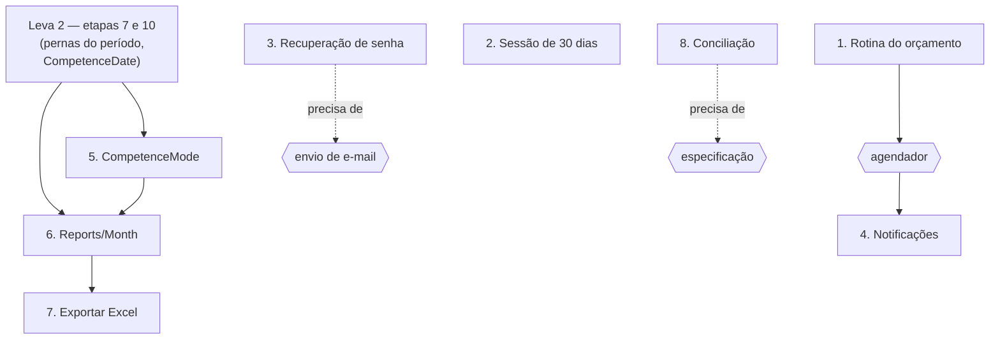

# Plano de desenvolvimento — leva 3: o que depende de infra ou de decisão

Terceiro documento da sequência, depois do [1. ROADMAP- MVP.md](1.%20ROADMAP-%20MVP.md) (a leva do
MVP, fechada) e do
[2. Plano de Desenvolvimento - Leva 2.md](2.%20Plano%20de%20Desenvolvimento%20-%20Leva%202.md) (o
que sobe junto com o MVP).

As etapas desta leva têm **numeração própria**, como as da leva 1 — "etapa 3 da leva 3" e
"etapa 3 da leva 2" são coisas diferentes. Aqui dentro, "etapa 3" sem qualificação é sempre desta
leva; toda referência a outra leva diz qual.

Aqui estão as pendências que **não dependem de escrever código primeiro**: elas dependem de
o projeto ganhar algo que ainda não tem — envio de e-mail, agendador, geração de planilha — ou de
alguém decidir uma coisa que ninguém decidiu. Estão levantadas em
[Pendencias Backend.md](../Pendencias%20Backend.md), como as da leva 2.

**Este documento não é uma fila de trabalho pronta.** Ele fixa o desenho e a ordem para que
nenhuma das sete seja começada duas vezes ou do jeito errado, e registra, etapa a etapa, **o que
precisa ser decidido antes de a primeira linha ser escrita**.

---

## Onde estamos

Das 16 pendências levantadas, uma está aplicada, sete são a
[leva 2](2.%20Plano%20de%20Desenvolvimento%20-%20Leva%202.md) e estas sete são esta leva.

| Etapa | O que é | Pendência | O que a trava |
| --- | --- | --- | --- |
| **1** | [A rotina mensal do orçamento](#etapa-1--a-rotina-mensal-do-orçamento) | [4](../Pendencias%20Backend.md#4-rotina-mensal-de-orçamento) | nada — é a mais pronta das oito |
| **2** | [Duração de sessão configurável](#etapa-2--duração-de-sessão-configurável) | [5](../Pendencias%20Backend.md#5-duração-de-sessão-configurável) | nada; só prioridade |
| **3** | [Recuperação de senha](#etapa-3--recuperação-de-senha) | [6](../Pendencias%20Backend.md#6-recuperação-de-senha) | **envio de e-mail**, que o projeto não tem |
| **4** | [Notificações](#etapa-4--notificações) | [9](../Pendencias%20Backend.md#9-notificações) | **agendador** + definir o que gera aviso |
| **5** | [`CompetenceMode`: o cartão que conta como débito](#etapa-5--competencemode-o-cartão-que-conta-como-débito) | — *demanda de produto* | a etapa 10 da leva 2, que grava a `CompetenceDate` |
| **6** | [Agregados do mês](#etapa-6--agregados-do-mês) | [3](../Pendencias%20Backend.md#3-agregados-do-mês-para-o-dashboard) | as etapas 7 e 10 da leva 2 — **não mais o volume**, ver o saldo de abertura |
| **7** | [Exportar para Excel](#etapa-7--exportar-para-excel) | [8](../Pendencias%20Backend.md#8-exportar-para-excel) | depende da etapa 6 |
| **8** | [Conciliação de extrato](#etapa-8--conciliação-de-extrato) | [7](../Pendencias%20Backend.md#7-conciliação-de-extrato) | **nada está especificado** |

Duas das oito (1 e 2) poderiam começar hoje. As outras seis esperam infra, código anterior ou
especificação — e o valor deste documento está justamente em dizer **qual** das três, para
ninguém abrir a etapa errada por parecer a mais fácil.

---

## Ordem das etapas e por quê



- **1 antes de 4** porque as duas querem agendador, e ele deve nascer uma vez só — a etapa 1
  consegue viver sem ele (materialização preguiçosa), a 4 não.
- **5 e 6 depois das etapas 7 e 10 da leva 2** — as duas leem a `CompetenceDate` da perna, que
  nasce lá. Com ela gravada, a etapa 5 só muda **o que se escreve** na coluna e a 6 só soma o que
  já está escrito; sem ela, as duas teriam que recalcular a data na consulta.
- **6 também depois da etapa 7 da leva 2** pela consulta: com as pernas do período já
  consultáveis, o agregado do mês é uma soma sobre o que já estará escrito.
- **7 depois de 6**: a planilha tem que sair com os mesmos números da tela, e a única forma de
  garantir isso é as duas lerem do mesmo lugar.
- **2 e 3 são independentes** de todo o resto; a ordem entre elas é de prioridade de produto.
- **8 não entra em ordem nenhuma** enquanto as três perguntas dela não tiverem resposta.

---
## Etapa 1 — A rotina mensal do orçamento

**Pendência 4** — é a **etapa 8b** do ROADMAP da leva 1, com o desenho fechado ·
**Pastas:** `routes/Budgets/`, `routes/BudgetPeriods/`

**DECIDIDO: materialização preguiçosa no `GET /Budgets`, dentro de transaction.** O projeto não
tem agendador, e a alternativa barata que o documento do front sugere é a certa aqui: o mês pedido
que ainda não existe nasce na primeira leitura, a partir das definições ativas.

**A corrida de dois dispositivos é resolvida pelo banco**, não por trava: o
`unique(IdBudget, ReferenceMonth)` já existe, então a inserção vai com `onConflict().ignore()` e
quem chegar segundo simplesmente não escreve.

**Pontos de atenção**

- **Um `GET` que escreve** é um desvio consciente. Ele é convergente — a segunda chamada não muda
  nada —, mas merece estar escrito no contrato, porque é a única rota de leitura do projeto que
  grava.
- **Só inserir o que falta, nunca atualizar.** A rotina não pode recriar o mês que o usuário
  cadastrou à mão nem sobrescrever o teto que ele ajustou: `BudgetPeriods` é o mês *congelado*, e
  o que faz "qual era meu limite em março" ter resposta é justamente ele não ser recalculado.
- Reusa `BudgetPeriods/sections/POST/createForMonth.ts` sem tocá-lo — ele nasceu recebendo a
  transaction e o mês exatamente para isto.
- Só `Budgets.Active = true` entra. **É aqui que o `Active` finalmente passa a significar
  alguma coisa** — hoje nada o lê.
- **O fechamento do mês anterior (`Status='closed'`, `ClosedAt`) fica de fora desta etapa.**
  Fechar é evento de tempo, não de leitura: ninguém abrindo a tela de setembro deve disparar o
  fechamento de agosto. Vai junto com o agendador da etapa 4.

**Contrato:** 🟡 **Comportamento** na seção 13 — o mês passa a existir sozinho, e a tela para de
precisar do recado "seu teto de alimentação existe, mas não para este mês".

---

## Etapa 2 — Duração de sessão configurável

**Pendência 5** · **Pasta:** `routes/Users/`

**DECIDIDO: `RememberDevice` booleano opcional no `POST /Users/login`**, escolhendo entre 24h
(default) e 30 dias — os dois números que a tela de login já promete.

**Pontos de atenção — as duas armadilhas valem mais que a etapa**

- **`expiresIn` do token e `maxAge` do cookie são dois valores fixos no mesmo arquivo**
  (`AcessControl.section.ts:52` e `:69`), e hoje coincidem por sorte. Se um mudar sem o outro,
  sobra cookie vivo com token morto (401 com credencial na mão) ou cookie morto com token válido.
  Viram **uma constante só**, e as duas durações saem dela.
- **A duração precisa viajar dentro do token.** `POST /Workspaces/switch` reemite a credencial —
  se ele reemitir com o default, trocar de workspace rebaixa silenciosamente uma sessão de 30
  dias para 24h, e o usuário é deslogado sem entender por quê.
- **A biometria usa o mesmo booleano.** `authenticate` também termina em
  `AcessControl.startSession`, e é essa convergência que impede os dois caminhos de login de
  divergirem no que gravam. Default `false` nos dois.

**Contrato:** 🟢 **Adição** na seção 4 — um campo opcional no corpo do login, e o número que a
tela pode prometer sem mentir.

---

## Etapa 3 — Recuperação de senha

**Pendência 6** · **Pasta:** `routes/Users/` · **Travada por envio de e-mail**

| Rota | Auth | Corpo |
| --- | --- | --- |
| `POST /Users/forgotPassword` | público | `{ Email }` |
| `POST /Users/resetPassword` | público | `{ Token, NewPassword }` |

**DECIDIDO: o token é um JWT curto, sem tabela nova** — mesmo padrão do `ChallengeToken` da
biometria (`UsersAuth/sections/WebAuthnChallenge.section.ts`), que já resolve o mesmo problema no
projeto: provar que um dado veio da API e não do cliente, sem guardar estado entre duas
requisições.

**DECIDIDO: uso único sem tabela, por construção.** O token carrega
`{ IdUser, type: 'reset' }` **mais um prefixo do hash da senha atual**. Trocar a senha muda o
hash, e o token deixa de casar — ele morre no primeiro uso sozinho. É o que evita criar tabela e
rotina de limpeza para um fluxo que roda três vezes por ano.

**Pontos de atenção**

- **`forgotPassword` responde `200` sempre**, inclusive para e-mail inexistente. Sem isso a rota
  vira um verificador de quais e-mails têm conta — é a mesma razão pela qual o login usa a mesma
  `msg` para e-mail errado e senha errada.
- O `type` dentro do token é obrigatório pela mesma razão que na biometria: um token de outra
  finalidade não pode ser gasto aqui.
- Validade curta (15 a 30 minutos), não as 24h da sessão.
- **O projeto não tem rate limiting.** Uma rota pública que dispara e-mail é o primeiro lugar
  onde isso passa a doer — registrar como o que falta, não como parte desta etapa.
- `PasswordHasher` continua sendo o único lugar que hasheia (`bcrypt` custo 12), e a senha nova
  chega no **corpo**, nunca na URL.

**Contrato:** 🟢 **Adição** — duas rotas públicas na seção 4.

---

## Etapa 4 — Notificações

**Pendência 9** · **Tabela:** `Notifications` (existe, sem rota) · **Precisa do agendador**

**O que precisa acontecer antes de qualquer rota:**

1. **Definir o que gera aviso** — parcela vencendo, orçamento estourado, entrada prevista não
   recebida. Sem essa lista, não há o que agendar.
2. **Ampliar o enum `Type`.** A migration `20260731002100_notifications.ts` cria a coluna com
   `["system", "security"]` apenas. Todo aviso de domínio precisa de um valor novo, e isso é
   migration — no Postgres o `enu` do Knex vira `text` + `CHECK`, então é o `CHECK` que muda.
3. **O agendador.** Nasce aqui ou na etapa 1, o que vier primeiro, e serve às duas — junto com o
   fechamento do mês (`Status='closed'`) que a etapa 1 deixou de fora de propósito.

A tabela já tem o que precisa: `ReadAt` para "marcar como lida", `ScheduledFor`/`SentAt` para o
agendador, e os índices `["IdUser","ReadAt"]` e `["ScheduledFor","SentAt"]` para as duas
consultas que vão existir.

---

## Etapa 5 — `CompetenceMode`: o cartão que conta como débito

**Demanda de produto** (debate de 2026-09-04) · **Tabela:** `PaymentMethods` ·
**Pastas:** `routes/PaymentMethods/`, `routes/Expenses/`

Duas pessoas usam cartão de crédito de dois jeitos incompatíveis:

- **quem concentra o dia a dia** e paga a fatura inteira todo mês trata o cartão como débito: o
  que passou nele em agosto **é gasto de agosto**;
- **quem usa como reserva** passa no cartão justamente para pagar no mês seguinte: o gasto **é do
  mês da fatura**.

O sistema hoje atende só o segundo — `coalesce(DueDate, ExpenseDate)` joga toda compra de cartão
no mês do vencimento. E para o primeiro perfil isso produz **exatamente a mentira que o indicador
existe para evitar**: em 20 de agosto, com metade do salário já passada no cartão, o "posso
gastar" ainda mostra o mês quase inteiro disponível, porque nada daquilo entrou na conta. A
pessoa gasta em cima disso, e a fatura chega em setembro.

**DECIDIDO: um enum no cartão, `CompetenceMode: 'invoice' | 'purchase'`.** Enum e não booleano —
`IsEveryday: true` é ilegível em seis meses. Só em `Kind='credit_card'`; fora do cartão não há
defasagem entre consumo e pagamento para escolher.

**A coluna que ele governa já existe.** A etapa 10 da leva 2 grava `ExpensePayments.CompetenceDate`
no lançamento, com o valor de hoje (`coalesce(DueDate, ExpenseDate)`). Esta etapa **só muda o que
se escreve nela**:

| Modo | `CompetenceDate` da parcela `n` |
| --- | --- |
| `invoice` (comportamento de hoje) | `DueDate` — que já avança um mês por parcela |
| `purchase` | `ExpenseDate` + (n−1) meses |

Ou seja: **modo `purchase` é "para efeito de contagem, trate este cartão como se não houvesse
fatura"** — e a fórmula é a mesma que `InvoiceDates.forInstallment` já usa para carnê e crediário
fora do cartão. O modo novo não inventa conceito nenhum.

**Pontos de atenção**

- **A armadilha do parcelamento, que a formulação ingênua não vê.** Se `purchase` significasse
  simplesmente `CompetenceDate = ExpenseDate`, uma compra de 600 em 6× jogaria **600 inteiros**
  no mês da compra e mataria a regra "600 em 6× custa 100 por mês". O avanço por parcela é o que
  impede isso, e é o teste que sustenta a etapa.
- **Descartado: ancorar em `ClosingDate`.** Preservaria as parcelas de graça, mas num cartão que
  fecha dia 3 uma compra de 20/08 cairia na fatura que fecha em 03/09 e contaria como setembro —
  o oposto do que o perfil pede. Ancorar na data da compra deixa o modo **independente do dia de
  fechamento**, que é uma coisa a menos para errar.
- **O saldo não pode mudar — e hoje ele mudaria.** A intenção está firme: o parâmetro responde
  "quanto eu gastei", nunca "quanto eu tenho", e misturar os dois faria a compra sair da conta
  antes de a fatura ser paga, que é o saldo plausível e errado que o projeto inteiro evita. Só
  que a frase "`AccountBalance` continua lendo `DueDate`" **deixou de ser verdade**: desde a
  etapa 10 da leva 2, `sumPaidFrom` corta por `ExpensePayments.CompetenceDate`
  (`AccountBalance.section.ts`). Hoje é inofensivo, porque a coluna vale exatamente
  `coalesce(DueDate, ExpenseDate)` — mas no dia em que o modo `purchase` gravar
  `ExpenseDate + (n−1) meses`, uma compra de 20/08 quitada na fatura de 05/09 sai do saldo **de
  agosto**, e todo saldo de mês passado fica errado. **Esta etapa não pode subir sem resolver
  isso**, e há duas saídas: ou o saldo volta a cortar pelo vencimento, ou a perna passa a ter
  duas datas — competência para contar, caixa para o saldo. A segunda é a que sobrevive ao
  `CompetenceMode`, já que é ele que separa os dois conceitos pela primeira vez.
- **Trocar o modo vale para o futuro.** Como a data é congelada na perna no lançamento, virar a
  chave em novembro não reescreve agosto. Se um dia alguém quiser recalcular um cartão inteiro,
  que seja uma ação **explícita**, nunca efeito colateral de editar o cadastro.
- **O padrão do cartão novo é `'purchase'`**, porque o padrão tem que servir a quem não vai
  configurar nada — e quem usa o cartão para adiar sabe que está adiando e vai procurar a opção.
  **Confirmar no momento da migration se existe base real:** pela etapa 2 da leva 2, o cadastro
  ainda não pode ir a produção, então provavelmente não existe, e o backfill pode gravar
  `'purchase'` em todos os cartões sem que nenhum número mude de significado para ninguém. Se
  houver base real, o backfill é `'invoice'` e só cartão novo nasce `'purchase'`.

**Contrato:** 🟢 **Adição** na seção 6 (o campo no cadastro do cartão) e 🟡 **Comportamento** na
13 — o mesmo gasto passa a consumir o orçamento de outro mês, dependendo do cartão. É o tipo de
mudança que a seção 18 existe para anunciar: o número mantém o nome e muda de significado.

**Testes** (`Expenses.test.ts`)

- compra à vista num cartão `purchase` conta no mês da compra; no mesmo cartão em `invoice`,
  no mês do vencimento;
- **600 em 6× num cartão `purchase` dá 100 por mês, não 600 no primeiro** — o teste da etapa;
- trocar o modo do cartão não altera a `CompetenceDate` de perna já gravada;
- o `Balance` da conta é idêntico nos dois modos.

---

## Etapa 6 — Agregados do mês

**Pendência 3** · **Pasta nova:** `routes/Reports/` · **Demanda de produto de 2026-09-07**

| Rota | O que faz |
| --- | --- |
| `GET /Reports/Month?ReferenceMonth=YYYY-MM` | os números do Dashboard, somados no servidor |

**Os dois indicadores da tela, e por que eles discordam de propósito.** O produto mostra dois
números lado a lado — *"quanto ainda posso gastar"* e *"quanto tenho em conta"* — e eles não são
duas versões do mesmo fato: um é o mês que a pessoa está vivendo, o outro é o dinheiro que já
saiu. As quatro últimas escolhas abaixo foram fechadas no debate de 2026-09-04; a primeira
linha é a demanda de 2026-09-07:

| | Posso gastar | Tenho em conta |
| --- | --- | --- |
| **Abertura** | o saldo realizado no fim do mês anterior — ver abaixo | nenhuma: o saldo já é acumulado desde a abertura da conta |
| **Base de data** | competência — a `CompetenceDate` da perna, que a etapa 5 governa | caixa — o vencimento da perna, sempre, sem parâmetro nenhum (com a ressalva do ponto de atenção da etapa 5: o saldo hoje lê a `CompetenceDate`, e as duas só coincidem enquanto o `CompetenceMode` não existir) |
| **Base de estado** | comprometido: pendente **e** pago | realizado: só pago / recebido |
| **Entradas** | **as pendentes entram** — o indicador é de planejamento, e contar entrada só quando recebida com gasto já quando lançado o deixaria pessimista dos dois lados | só as recebidas |
| **Unidade** | a **perna**, nunca o `TotalValue` da compra | a perna paga |

A linha "unidade" é o que faz o indicador funcionar com parcelamento, e é por ela que esta etapa
depende da etapa 7 da leva 2: o número certo soma **pernas com competência no mês**, não gastos
por `ExpenseDate`.

### O saldo que vem do mês anterior

**Demanda de 2026-09-07.** O cliente soma as entradas do mês para dizer quanto ainda dá para
gastar, e essa conta ignora o dinheiro que já estava na conta no dia 1º. Quem começa setembro com
1000 e recebe 3000 de salário vê **3000**, tendo 4000. O indicador principal do Dashboard está
errado hoje, com dois lançamentos no banco — não é um problema de escala.

**Descartado: lançar o saldo como uma entrada.** É a saída que se pensa primeiro, e ela quebra em
três lugares:

- **Dupla contagem no próprio saldo.** `AccountBalance` parte de `InitialBalance` e soma as
  entradas recebidas: uma entrada de 1000 numa conta com `InitialBalance = 1000` devolve 2000.
  Zerar a abertura para compensar joga fora o dado de origem que o `AccountMovement.section.ts`
  existe para congelar.
- **Ela se repetiria todo mês, e cada repetição é dinheiro novo.** O saldo que sobrou de agosto
  não é um fato de setembro: nada entrou. Como lançamento, o "quanto entrou no mês" passaria a
  contar dinheiro que nunca chegou — exatamente o erro contra o qual existe o filtro
  `Kind <> 'transfer'`. Saldo carregado é uma transferência do passado para o presente.
- **Não tem a quem atribuir.** `InflowPersons` divide a entrada entre pessoas, e a sobra do mês
  passado não é cota de ninguém.

Saldo é **posição**; entrada é **fato com data, conta e rateio**. O carregamento não tem nenhum
dos três, e o lugar dele é um termo da fórmula — nunca uma linha no razão.

**DECIDIDO: `OpeningBalance`, delegado ao `AccountBalance` com o mês anterior.** Não precisa de
consulta nova: o corte do saldo é meio aberto, então
`AccountBalance.getByAccounts(contas, <primeiro dia do mês pedido>)` é, por construção, o saldo no
fim do mês anterior. Mesma section, outro limite — que é a regra "delegam, não recalculam" logo
abaixo aplicada ao caso que mais tenta violá-la.

```
posso gastar = OpeningBalance
             + entradas com competência no mês   (pendentes + recebidas)
             − pernas   com competência no mês   (pendentes + pagas)
             + OverdueReceivable − OverduePayable
```

**DECIDIDO: o atrasado entra, dos dois lados.** Uma perna com competência em julho e ainda
pendente não está no saldo de julho (não foi paga) nem na janela de agosto: ela **some** do
indicador, e some justamente o compromisso que ninguém honrou. O mesmo vale para a entrada de
julho nunca recebida. A linha "Entradas" da tabela acima já decidiu que pendente conta, e manter
a simetria é o que impede o indicador de ficar pessimista de um lado só — então soma-se o
recebível vencido e subtrai-se a dívida vencida. **O custo está aceito de olhos abertos:** uma
entrada prevista que nunca chega infla o "posso gastar" para sempre. É por isso que os dois vão
**expostos à parte** na resposta (`OverdueReceivable`, `OverduePayable`): a tela mostra "R$ X
vencidos", o usuário recebe ou cancela o que ficou para trás, e o erro para de crescer calado em
vez de virar uma correção automática que o servidor faz sem contar a ninguém.

**DECIDIDO: só conta ativa entra no `OpeningBalance`** — o mesmo filtro do `GET /Accounts`, senão
a soma do Dashboard discorda da lista de contas na mesma tela.

**O paliativo, enquanto a etapa não sobe:** o cliente já consegue o termo somando os `Balance` de
`GET /Accounts?ReferenceMonth=<mês anterior>`, sem rota nova. Mas isso é mais uma regra de
agregação morando no cliente, que é a razão de ser desta etapa inteira: vale como remendo, não
como destino.

**O que isso muda na etapa.** Ela esperava volume — era otimização, e otimização espera. Passa a
ser **correção**, e correção não espera: sobe assim que as etapas 7 e 10 da leva 2 estiverem de
pé, que é a única dependência que sobrou.

**O que liga os dois números:** a fatura em aberto. O buraco que o "posso gastar" mostrou hoje é
o que o "tenho em conta" vai mostrar quando ela for paga. Vale expor esse terceiro número
(quanto do saldo já tem dono) — ele sai da mesma consulta.

**E a dupla contagem que não existe:** pagar a fatura **não cria lançamento**. `payInvoice` vira
booleano em perna que já existe, então a compra de agosto contada em agosto não volta a contar em
setembro. O modelo fechou essa porta quando decidiu que pagamento é mudança de estado, não
lançamento — mas é a primeira dúvida que aparece, e por isso está escrita aqui.

**DECIDIDO: `routes/Reports/` é a primeira pasta sem tabela própria** — desvio consciente da
convenção "uma pasta por tabela", porque a feature é justamente a que lê de várias.

**DECIDIDO: as sections delegam, não recalculam.** `AccountBalance.section.ts` e
`BudgetSpent.section.ts` já contêm as regras; o `Reports` chama as duas. É o ponto inteiro da
etapa: hoje as quatro regras que **se contradizem de propósito** vivem replicadas no cliente, e
duas implementações da mesma pergunta terminam mostrando dois totais diferentes na mesma tela.

| Número | Regra que não vale para os outros |
| --- | --- |
| Quanto entrou | filtra `Kind <> 'transfer'` |
| Quanto gastou | soma **pernas**, não `TotalValue` de compra |
| Saldo da conta | **ignora** pendente |
| `Spent` do orçamento | **conta** pendente junto com pago |

**Ponto de atenção:** esta etapa vem **depois da 7**. Com as pernas do período já consultáveis, o
agregado é uma soma sobre a consulta que já estará escrita; antes dela, seria a mesma consulta
escrita duas vezes.

---

## Etapa 7 — Exportar para Excel

**Pendência 8** · **Pasta:** `routes/Reports/` · **Depois da 6**

**DECIDIDO: o servidor gera o arquivo** (`GET /Reports/Export?From=&To=`). A planilha sai com os
mesmos números da tela porque lê do mesmo lugar; a alternativa (cliente gera) replica as regras
de agregação e cai no risco da etapa 6.

**Pontos de atenção**

- **É a primeira rota do projeto que não responde JSON.** `joiController.validateResponse` não se
  aplica — o `AsyncHandler` continua igual, mas a resposta é um stream com `Content-Type` e
  `Content-Disposition`.
- Entra dependência nova de geração de planilha, a primeira desse tipo no projeto.
- O período usa `From`/`To`, como todas as listagens de movimento — não `ReferenceMonth`.

---

## Etapa 8 — Conciliação de extrato

**Pendência 7** · **Sem rota proposta**

É a maior pendência em tamanho e **a menos especificada**. Não há desenho aqui de propósito: três
perguntas mudam completamente o que se constrói, e nenhuma tem resposta.

1. **De onde vem o extrato?** Upload de arquivo (OFX? CSV do banco?) ou Open Finance. A diferença
   é entre um parser e uma integração com credencial, prazo e homologação.
2. **O que é um item "a resolver"?** Lançamento no extrato sem correspondente no app,
   correspondente no app sem extrato, ou os dois com valores diferentes.
3. **Conciliar cria lançamento ou só marca os existentes?** Se cria, precisa de coluna nova para
   dizer que aquele lançamento nasceu do extrato — e isso é migration em `Inflows` e `Expenses`.

Enquanto essas três não tiverem resposta escrita, qualquer estimativa desta etapa é chute. O
front entrega a tela `08 - Contas` só com o frame A (visão geral com saldos), que não depende
disto.

---

## O que não entra nesta leva

| Item | Por quê |
| --- | --- |
| Gestão de membros (listar, trocar papel, remover, sair, transferir propriedade) | É o que sobra da **etapa 9 do ROADMAP da leva 1**: o convite e o aceite foram antecipados pela etapa 2 da leva 2, o resto continua lá |
| `UserDevices`, `Plans`, `Subscriptions` | Tabelas de plataforma: push, cobrança e assinatura não fazem parte do fluxo de um mês. `UserDevices` encosta na etapa 4 e pode ser puxada por ela, se o aviso virar push |
| Faturas de cartão como entidade | As datas de fatura já vivem na perna (`ClosingDate`/`DueDate`); uma tabela de faturas só se paga com conciliação, que é a etapa 8 |

---

## Como saber que a leva acabou

**Ela não tem critério de fim, e não deveria fingir que tem.** Três das oito etapas dependem de
decisões que não foram tomadas — qual serviço de e-mail, quais avisos existem, de onde vem o
extrato —, e um critério escrito antes dessas respostas seria chute com cara de compromisso.

O que esta leva tem, e é o que ela precisa ter agora:

- **ordem** — 1 antes de 4, as etapas 7 e 10 da leva 2 antes de 5 e 6, 6 antes de 7;
- **desenho fechado** nas cinco que já dá para desenhar (1, 2, 3, 5 e 6), com o porquê registrado;
- **o que decidir antes** nas três que não dá (4, 7 e 8).

Cada etapa, quando for feita, entrega no mesmo padrão da leva 2: testes no arquivo da própria
feature (um `describe` por rota, na ordem do `.route.ts`) e a entrada no changelog do contrato,
no mesmo commit.

**O critério de fim desta leva se escreve quando a primeira etapa dela começar** — e a candidata
natural é a 1, que não espera nada além de si mesma.
